# B-beach handoff — sand relief, grounded items, readable mess

Evidence record for the [beach terrain and litter pass](../plan/15-beach-terrain-pass.md), packets B00–B05. Following [AGENTS.md](../../AGENTS.md), each entry records what was shown working in the real game (`scenes/main.tscn` running a real seeded run), not only what exists in code.

**Status: B00–B06 done on this machine.** Physical-controller play on the new relief, GTX 980-class performance and an exported build remain open, as for FIN-10.

- **Build:** `main` at `768070b` plus this branch. Godot 4.6.1 Mono, Compatibility renderer, **`beach-content-9`** (was 8), beach version 9, generator `manifest-1`, save schema 1.
- **Saves:** content-8 saves are rejected with the existing incompatibility message and are not migrated. Keep **`768070b`** to play them.
- **Device:** Windows 11, Ryzen 5 5600, RTX 3070, 1920×1080 window, FOV 70 for the scenery captures, High preset for every capture and measurement.
- **Seed:** `first-shore` for every capture.
- **Probes:** these SceneTree scripts live under the ignored `builds/ui_pass/probes/` and are not committed:
  - `beach_views.gd` drives the real main scene: it starts a run, hides the HUD and viewmodel, and captures fixed camera views.
  - `relief_map.gd` draws the relief from above.
  - `layout_map.gd` draws the generated layout from above.
  - `layout_stats.gd`, `ground_probe.gd` and `time_beach.gd` measure.

| Packet | Status | Evidence |
|---|---|---|
| B00 Baseline captures | Done | [B00](#b00--baseline) |
| B01 Sand relief | Done | [B01](#b01--sand-relief) |
| B02 Items rest on the ground | Done | [B02](#b02--items-rest-on-the-ground) |
| B03 Litter layout | Done | [B03](#b03--litter-layout) |
| B04 Content version, saves, checks | Done | [B04](#b04--content-version-saves-and-checks) |
| B05 Evidence and performance | Done on this machine | [B05](#b05--performance) |
| B06 Sand detail and the swash | Done on this machine | [B06](#b06--sand-detail-and-the-swash) |

## Before and after

In every pair below, the left image is `768070b` and the right image is this branch.

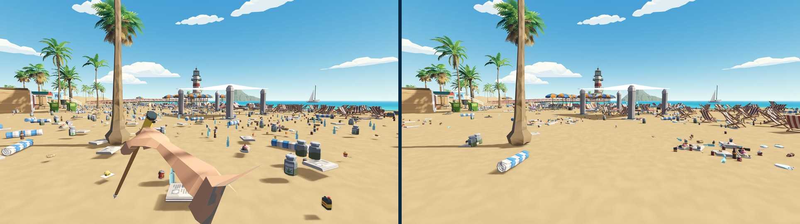

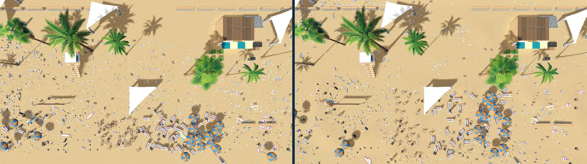

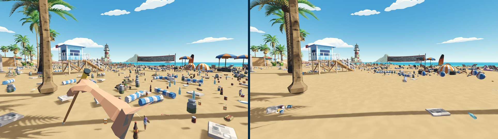

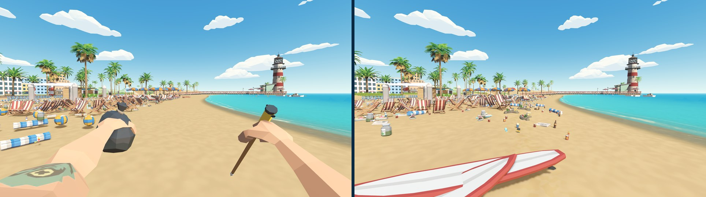

Further pairs are in `images/B-beach/`: `compare-aerial`, `compare-arrival`, `compare-sandplay`, `compare-pier`, `compare-top-arrival`, `compare-low-arrival` and `compare-low-lounges`.

## B00 — Baseline

- **Setup:** `768070b`, a new run on seed `first-shore`.
- **Actions:** eleven fixed views: aerial, arrival, sports, lounges, sandplay, shore, pier approach, two top-down and two grazing at 0.45 m.
- **Observed:**
  - Every item on land floats: jars, cans, rolled towels and chairs all show a gap between their base and a detached shadow. The grazing arrival view shows it most clearly.
  - From above, the litter is an even scatter across each 10.5 × 33.6 m section grid.
  - The foreshore between the grids and the water is empty.
  - Bottles and jars stand upright.
- **Diagnosis:** the causes are listed in the plan, §1:
  - Sand-pack items are authored at 0.150 m on sand at 0.012 m, and start frozen.
  - Pile layers sit 60–240 mm higher still.
  - Deck litter sits inside the deck, and reef litter hovers over the seabed.

## B01 — Sand relief

- **Setup:** `BeachRelief` (`scripts/world/beach_relief.gd`) adds relief in `Coastline.surface_y`. `ShoreDressing` builds a 1 m × 72-row sand mesh from it, which is also the collision. `tools/bake_beach_layout.gd` wrote `data/world/beach_layout.tres`: 27 level pads, 323 litter obstacles and 79 mess sources.
- **Actions:**
  - Rendered the relief map.
  - Raycast the running beach's sand collision at 5 m steps across five columns (`ground_probe.gd`).
  - Captured the eye-level and aerial views.
  - Ran the world, traversal, movement and pier checks.
- **Observed:**
  - Dunes run along the promenade. Crests are 1.0–1.4 m at x −60…20 and z −25, and fall to the beach by z −15.
  - Mounds of up to 0.4 m lie on the open beach, and the berm reaches 0.25–0.37 m about 7 m above the waterline.
  - The collision matches `Coastline.surface_y` to within 3 cm at every probed point; see Open issues for the worst gaps.
  - The steepest playable slope is **18.6°**; the player's limit is 46°.
  - All 21 zero pads read 0 at their centres (checked in `validate_world`). The huts, shop, pier approach, lookouts, shades, court, spawn and six recovery anchors stand on level sand.
  - Scenery is raised by the relief under it before the scenery batcher runs. This covers the palms on the dunes, the chair and lounger rows, the shelves and the spawn anchors.
  - Traversal still walks the 146.9 m route and enters all three huts. The lounges turtle corridor is a level pad.
  - Wet sand, water and seabed are unchanged, because the relief fades out 2 m above the waterline.
- **Departure:** the dunes did not read from eye level on their own, because evenly lit sand gives little shading. Three cues were added:
  - Synty `SM_Env_Grass_Clump_01`, staged as `foliage_grass_clump` (asset closure passes), in patches on the dunes: one shadowless batch that stops 2 m above the dune toe so it never hides litter.
  - A slight pale tint on high sand in `beach_sand.gdshader`.
  - A faint, broken band of darker sand along the old high-tide line, where the tideline litter lies.

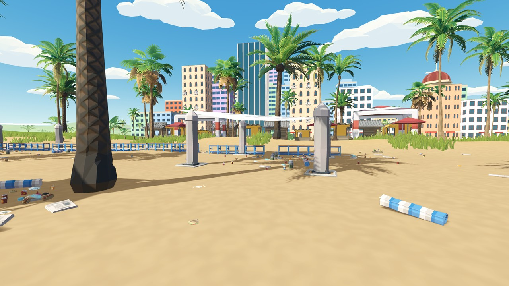

## B02 — Items rest on the ground

- **Setup:**
  - The generator authors each row's height from `BeachGround`: sand with relief, pier planks, the water plane for floating items, and the seabed.
  - `ItemRestPose` leans each loose item with the slope and gives small items a ±7° tumble from their ID.
  - `ItemRestPose` also lays the model onto the ground inside its body. `lying_chance` puts bottles (80–85 %), cans, cups and cartons (about 50 %), jars (55 %), the ice cream and loose paddles (100 %) on their side.
  - Near views and distant batches use the same transform.
- **Actions:**
  - Checked every loose single on dry sand against the ground in the generated manifest.
  - Took grazing close-ups of a towel heap and a bottle heap.
  - Ran the carry, tool-filter, buried, faint, save and save-physics checks, which wake, throw, dig and recover items.
- **Observed:**
  - All **2,662** loose dry-sand singles are authored within 2 cm of `Coastline.surface_y` (worst 0.5 mm). Against the real collision the median gap is 0, the 99th percentile 1.0 cm and the worst 2.8 cm.
  - In the grazing close-ups, shadows touch their items. Towels, bottles and cans lie on the sand, and heap members lean on each other.
  - The deck litter lies on the planks. The paddles, which used to stand 2.6 m upright, lie flat.
  - Reef and shallows litter lies on the seabed; floating litter sits on the water plane.
  - Recovered items and dug-up finds rest on the sand under them.

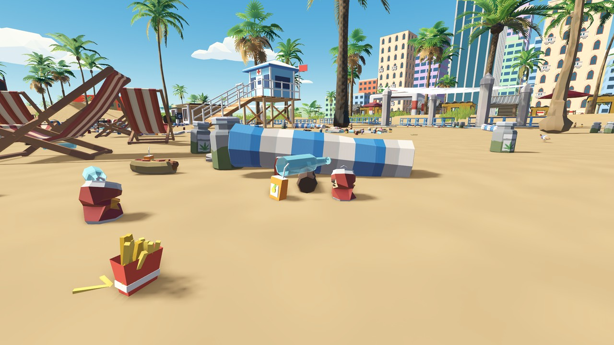

## B03 — Litter layout

- **Setup:** `LitterLayout` (`scripts/world/litter_layout.gd`) places the dry-sand and pier-deck sections:
  - Each section owns a territory (`spawn_anchors.tres` `territories`) from the dune foot to 3.2 m above the waterline. The empty strip at x 24–37 is shared by the sandplay hut and the pier approach.
  - Candidates are jittered 0.42 m points clear of service exclusions and obstacles.
  - Each category draws its exact quota by weighted sampling. The weights come from mess sources: tideline, dune drift, 2–3 seeded picnic spots, the court, a seeded 45 % of lounge rows, sandcastles, shades, lookouts and board racks.
  - The dominant source then biases the item type: bottles and bundled scrap at the tideline, paper and wrap at the dunes, food at picnics, cans around the court.
  - Piles are tight 4–6-item heaps with one raised member.
  - Props gather in 2–4 seeded groups per section and lean toward related scenery.
- **Actions:**
  - Drew the layout from above.
  - Measured it with `layout_stats.gd`.
  - Captured eye-level and top-down views.
  - Ran 100 release seeds and the content-economy check.
- **Observed (seed `first-shore`):**
  - 3,129 loose waste items lie on dry sand:
    - 427 on the tideline band;
    - 330 in the dune drift;
    - 653 around lounge rows;
    - 144 heaps;
    - 1,240 models lie on their side.
  - Of 478 4-m squares of dry beach, **138 are empty** and 95 hold 12 or more items. The old 0.7 m grids at 41–88 % fill left no 4 m square inside them empty.
  - The views show hotspots with clean sand between them:
    - a ring of cans and cups around the volleyball court;
    - towels and bottles by the lounge rows;
    - wind-blown paper at the foot of the dunes;
    - a broken line of bottles and scrap along the berm.
  - All quotas and subsets are exact:
    - 5,700 required and 40 optional;
    - 300 buried, 24 attachments, 120 residue, 60 dirty props;
    - per-section and per-family counts.
  - 100 release seeds are valid and distinct. The dry minimum stays at 3,321, and the economy check passes.
  - The starter section's six chairs now start clean, as [03](../plan/03-world-and-assets.md) specifies.

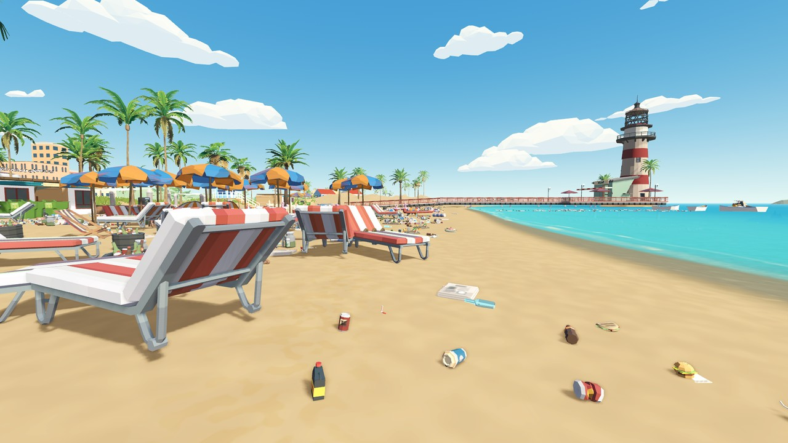

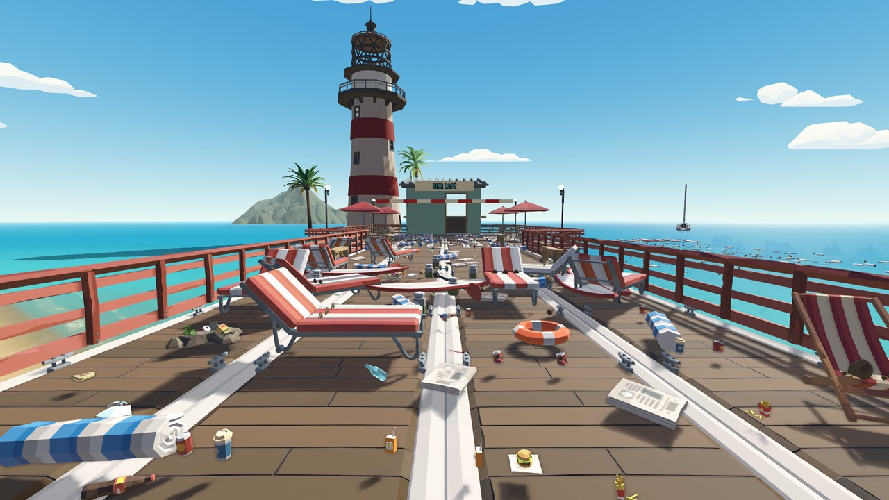

## B04 — Content version, saves and checks

- `CONTENT_VERSION`, `section_quotas.tres`, `spawn_anchors.tres` and `beach_layout.tres` are at `beach-content-9`, and `beach_01.tres` is at version 9.
- The content hash now also covers:
  - the territories, relief and layout data;
  - the ground constants;
  - the reef rock and seagrass exclusions (FIN-02).
- Pinned values in `tests/run_checks.gd`:

  | Pin | Old | New |
  |---|---|---|
  | Fixture content hash | `4712283664…` | `dc65a1e067…` |
  | Fixture manifest hash | `6d6a84fa…` | `7bb03dc0…` |
  | Unicode stream hash | `783412f8…` | `239b34ae…` |
  | Unicode stream seed | `541348052675312314` | `160356396074574203` |

  The separate-process probe agrees with the pins.
- **New written check** (in `validate_world`, `B_TERRAIN steepest=18.6 level_pads=21 grounded=2659`):
  - the layout data still matches the scene;
  - the playable slope is ≤ 20°;
  - zero pads are level;
  - loose dry-sand singles lie within 2 cm of the sand.
- **Fixes found while validating:**
  - `validate_faint` chose another anchor: litter now reached the shallows recovery anchor (x 28.75), which the old grids never covered. Recovery anchors and the spawn are now litter obstacles.
  - `validate_wildlife` found a reef item within 0.75 m of a seagrass bed after the reef grids reshuffled. The seagrass spots moved into `ReefDressing`, and reef litter now keeps 1 m from them as it does from rocks.
  - `validate_buried`'s stick click pressed and released within one process frame, because a slow first frame let physics steps catch up. The check now waits a process frame between them; the behaviour it checks is unchanged.
  - Heap members could land exactly on another item's spot. They now step aside by 11 mm, and a final pass guarantees unique poses.
  - Mooring props clamped onto the deck could merge. They are now scaled onto the deck instead.

### Checks run

Final code, run one at a time on an otherwise idle machine. Headless unless marked windowed (those use the Low preset).

| Check | Result |
|---|---|
| `run_checks` (boot, asset closure incl. the staged grass, ownership, input, manifest, separate-process hash) | pass |
| `validate_world` (with `B_TERRAIN steepest=18.6 level_pads=21 grounded=2662`) | pass |
| `validate_world_traversal` (146.9 m, 3 huts, shop, reefs 1,010 items / 0 overlaps, pier carry) | pass |
| `validate_movement`, `validate_interaction`, `validate_carry`, `validate_tool_filters`, `validate_c01_input` | pass |
| `validate_buried` (340 finds, dig surfaces, reveal, stick pickup, sale), `validate_scanner`, `validate_rescue` (12 sites / 24 cuts), `validate_faint` | pass |
| `validate_placement`, `validate_dirt`, `validate_sorting`, `validate_sealing`, `validate_payment`, `validate_purchases`, `validate_completion` | pass |
| `validate_save`, `validate_save_physics`, `validate_full_run` (5,400 waste + 300 props, reload, roam) | pass |
| `validate_wildlife`, `validate_ui` | pass |
| `validate_content_economy` (dry minimum 3,321) | pass |
| `validate_release_seeds` (100 valid, 100 distinct) | pass |
| `validate_physics` (windowed; nothing awake at start, largest heap 6, no streaming gaps) | pass |
| `validate_pier_art` (windowed) | pass |

## B05 — Performance

Measured with `tests/profile_views.gd` (real `main.tscn` run, seed `first-shore`, 1920×1080, High, vsync off) on `768070b` and on this branch, back to back on the same machine. Values are median frame time (ms) and draw calls.

| View | Before | After |
|---|---|---|
| spawn | 6.29 · 2,967 | 5.80 · 2,304 |
| lounge (densest) | 5.62 · 2,498 | 5.40 · 1,923 |
| along-shore | 5.13 · 2,245 | 5.60 · 2,703 |
| sea | 3.87 · 971 | 4.03 · 998 |
| pier | 4.81 · 1,637 | 4.81 · 1,605 |
| city | 3.20 · 288 | 3.29 · 295 |
| reef | 4.12 · 954 | 4.31 · 1,052 |
| aerial | 5.39 · 1,746 | 5.54 · 1,743 |

- **Per view:**
  - Spawn and lounge got cheaper: clustered litter leaves fewer small items in the near field.
  - Along-shore costs about 0.5 ms more, because the tideline litter now lies in that view.
  - The other views differ by 0.2 ms or less.
- **Streaming walk:**
  - Median 4.56 → 4.73 ms; p95 6.07 → 6.09 ms; p99 7.08 → 7.07 ms.
  - No frame over 16 ms.
  - The single worst frame was 8.39 ms on one run and 9.30 ms on another.
- **Memory:** static 254.7 → 273.1 MB, video 462.5 → 477.0 MB, nodes 8,750 → 8,926.
- **Physics:** `validate_physics` reports `physics_avg_ms` 3.08–3.09 before and 3.37–3.65 after (one outlier run at 11.5), with the same frame average of about 7.0 ms. The denser sand collision mesh is the likely cause.
- **Run start:** `run_ms` rose from 1,629 to 2,195 ms. Generating a manifest takes 1.36 s the first time in a process (0.24 s of that builds the cached candidate lists) and 1.12 s after that (was about 1.08 s). Run-state creation, which leans every resting item, takes about 0.26 s. The sand mesh (about 0.28 s), collision and grass are built once and shared between the title backdrop and the run.
- **Speed-ups made during this pass:**
  - Relief terms that depend only on x are computed once per sand column.
  - The grass placement tests patchiness before height.
  - Definition tables are built once per generation.
  - Seagrass spots are cached.
  - Category weights no longer look up dictionaries inside the per-candidate loop.
  - The generated manifest is identical before and after these changes; the pinned hashes did not move.

## B06 — Sand detail and the swash

- **Setup:**
  - `tools/build_sand_detail.gd` wrote the grain, slope and shell textures to `art/textures/sand/` in about 7 s. The same script always writes the same pixels.
  - `beach_sand.gdshader` reads them, and `shaders/beach_swash.gdshaderinc` drives the waves in both the sand and water shaders.
  - `RenderQuality` scales the sand detail distance (32 m) with View distance.
- **Actions:**
  - Captured the same views with the previous shaders and the new ones, on the current layout at a fixed wave phase.
  - Captured a top-down sequence through one wave, a live-time capture on Low, and a recorded clip.
  - Profiled the eight fixed views on High.
  - Ran the checks that load these shaders.
- **Observed:**
  - **Sand:** from standing height, it shows grain, pale shell grit, patches of wind ripples on dry sand, and scattered shells, pebbles, starfish and seaweed scraps.
  - **Shells:** there are more along the tideline and in the swash zone. They fade out with distance without shimmering; the aerial view is unchanged.
  - **Swash:** waves roll in as a line of white water, break at the shore, and push a foam-edged sheet up to about 3 m onto the sand. Each wave drains back and leaves dark, glossy sand that dries over a few seconds. The next wave reaches a different height, and the phase drifts along the beach.
  - **Litter:** no litter lies in the swash; litter starts 3.2 m above the waterline.
  - **Low preset:** the effect still shows, with the sand detail reaching 22 m (View distance 0.7).
- **Clip:** 17 s at 30 fps and 720p (`--write-movie`, probe `shore_clip.gd`), 52 MB. It was sent with the handoff rather than committed. A contact sheet of every 43rd frame shows the waves arriving and draining: `images/B-beach/sand-swash-clip-frames.jpg`.
- **Fixes found while validating:**
  - At first the sheet also covered the wet band below the waterline, where the water surface fades out, and left a visible seam between waves. It is now confined to sand above the waterline, fading in over its first 15 cm.
  - The surf's white water stopped abruptly as each wave landed; it now carries on from where the incoming line ended.
  - Pale shells were invisible from standing height at first. They are now 6–11 cm across, a little more saturated, and have a darker rim and contact shadow.
- **Checks:**
  - pass: `run_checks`, `validate_full_run` (freezes the water and sand time for its captures), `validate_wildlife`, `validate_ui`, `validate_world`;
  - pass, windowed on Low: `validate_physics`, `validate_pier_art`;
  - no shader errors at any preset used.

Before (left, previous sand and water shaders) and after (right), same layout, same wave phase:

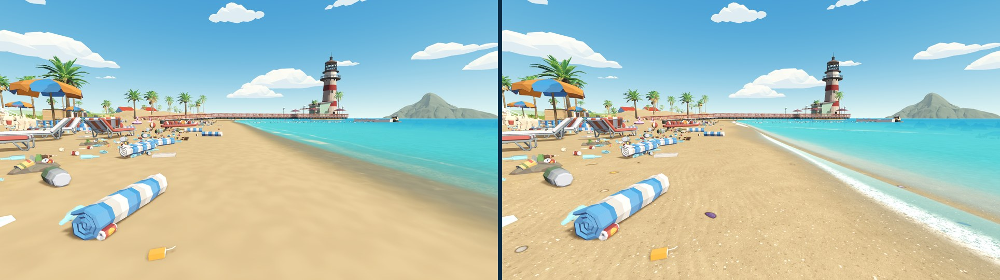

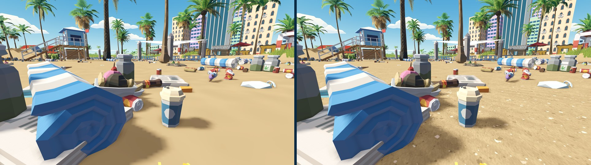

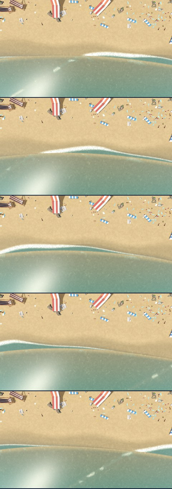

More in `images/B-beach/`: `compare-sand-tideline`, `compare-sand-shore`, `compare-sand-low-arrival`, `after-sand-close`, `after-sand-wrack` and `after-sand-swash-eye`.

**Graphics setting** (Graphics → *Beach detail*, added after the first B06 review):

- **Setup:** `BeachDetail.apply` sets the level on the shared sand and water materials whenever the setting or View distance changes. `SettingsStore` calls it, so it covers the title backdrop as well as the run.
- **Actions:** the local probe `beach_detail_probe.gd` drove the real settings menu in a running game:
  - picked each level with the option button and captured the shore at the same wave phase;
  - applied every preset;
  - saved and reloaded the settings.
- **Observed:** `BEACH_DETAIL failures=0`, with no script errors:
  - each level applies live;
  - the controller focus chain reaches the row;
  - Low, Medium, High and Ultra set Low, Medium, High and High;
  - changing the row alone shows the preset as Custom;
  - the value survives a save and reload.
- **Fix found while validating:** calling the render-quality script from `SettingsStore` pulled the run's scripts into the settings load. That broke loading of the item scene: views failed to spawn at run start, with 400 errors in `validate_ui`. The setter now lives in `BeachDetail`, which loads only the two materials. After the fix, all checks run with no errors.

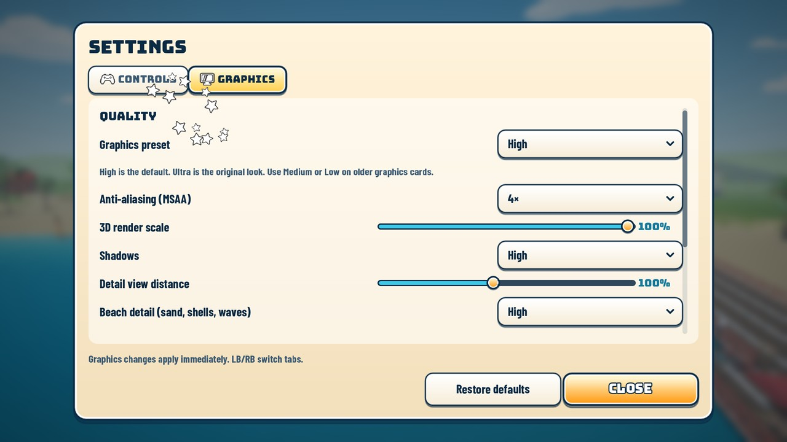

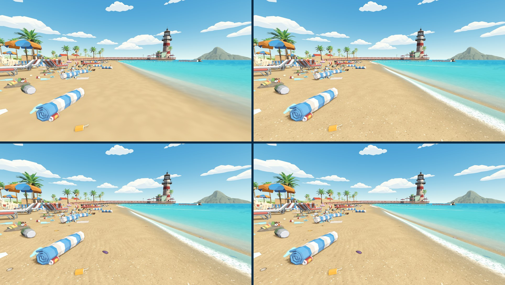

Cost per level on this RTX 3070 (High preset, 1920×1080, medians over 300 frames, GPU time in ms):

| View | Off | Low | Medium | High |
|---|---|---|---|---|
| shore | 2.19 | 2.23 | 2.31 | 2.37 |
| spawn | 3.27 | 3.28 | 3.39 | 3.40 |

**Performance** (High, 1920×1080; median frame time in ms, before → after):

| View | Frame | GPU |
|---|---|---|
| spawn | 5.80 → 6.03 | 3.16 → 3.36 |
| lounge | 5.40 → 5.58 | 2.14 → 2.22 |
| along-shore | 5.60 → 5.82 | 3.09 → 3.13 |
| sea | 4.03 → 4.22 | 1.76 → 1.89 |
| pier | 4.81 → 4.87 | 1.86 → 1.89 |
| city | 3.29 → 3.31 | 1.62 → 1.63 |
| reef | 4.31 → 4.46 | 1.87 → 1.98 |
| aerial | 5.54 → 5.75 | 2.36 → 2.53 |

The sand and water shaders cost about 0.1–0.2 ms of GPU time on this RTX 3070. Draw calls are unchanged. A GTX 980 will pay proportionally more; it is not measured.

## Open issues

- **Not tested here:** GTX 980-class hardware, an exported build, and physical-controller play over the new relief (FIN-10).
- **Sand fit:** the mesh follows the relief to within 1.8 cm on the berm and 3.7 cm on dune crests, where no litter lies. Against the real collision, 26 of 2,662 loose sand items sit more than 1 cm above it (worst 2.8 cm). The models' 1.2 cm sink hides most of this.
- **Heaps:** a heap's raised member leans on its neighbours' models. Where they are small, it can look propped rather than resting.
- **Deck:** items rest on the visible plank top (1.44 m), 4 cm above the deck collider. A woken item drops that far.
- **Aerial view:** small litter stops drawing beyond 35–55 m, as before, so the aerial shows props but not the clusters. The top-down captures are taken from 34 m.
- **Title backdrop:** its camera tour was not re-framed for the dunes or the new shoreline; it shows them as it passes.
- **Shells:** the shells are painted into the sand, not objects. They cannot be picked up, cast no shadow and read as flat at a grazing angle. Real 3D shell props would need models the packs do not have.
- **Swash timing:** the swash is not synchronised with the water's gentle normal-map motion, and it has no sound. Its 8.5 s period and 3 m reach are single constants in `beach_swash.gdshaderinc`.
- **Old saves:** content-8 saves are rejected. Use `768070b` to finish them.
