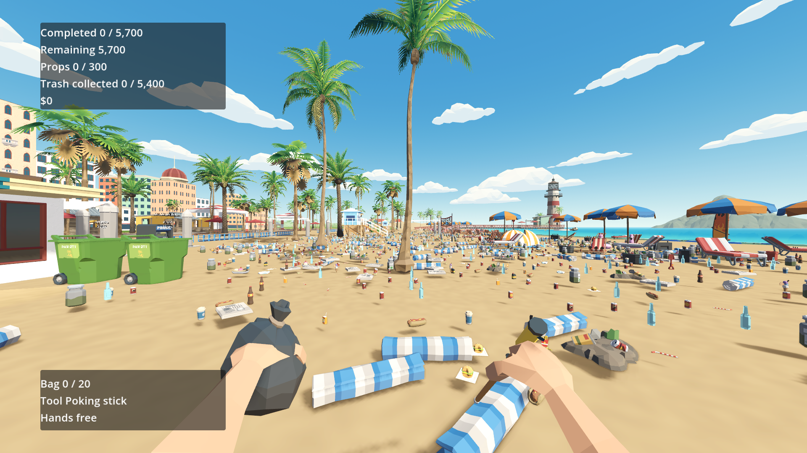
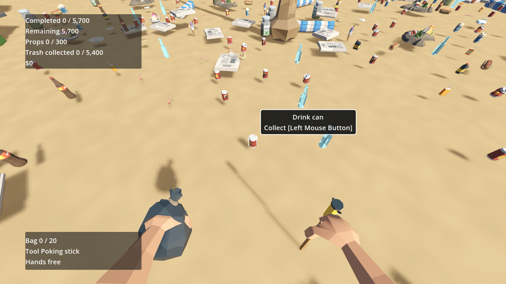
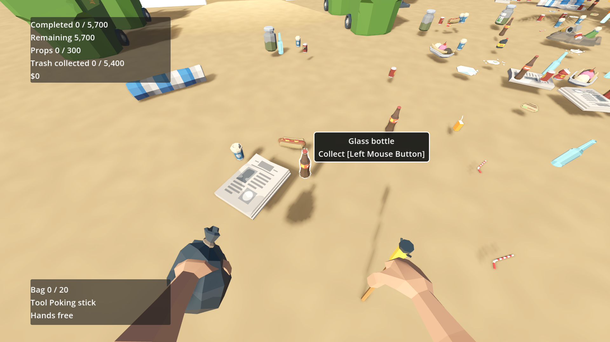
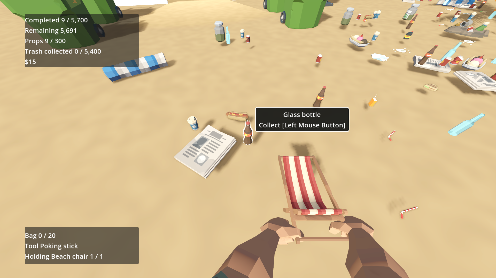
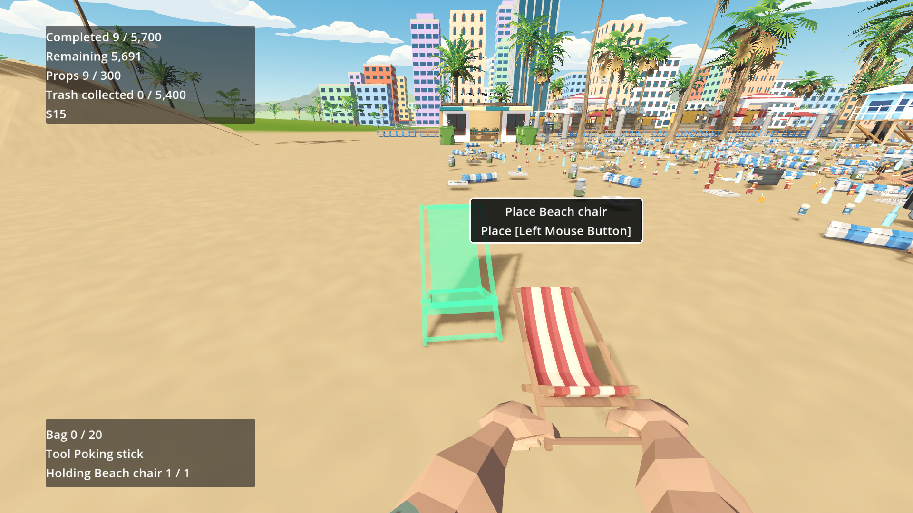
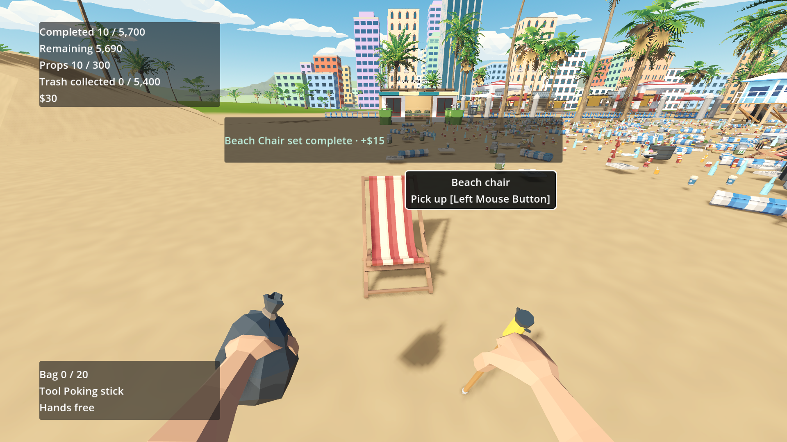

# J-feel handoff — hover, hands, placement, tools and completion

Evidence record for the [game-feel plan](../plan/12-game-feel.md), packets J00–J14. One section per packet, newest entries at the top of each section. Follow [AGENTS.md](../../AGENTS.md): record what was shown working in the real game or an existing lab. A tween existing in code is not evidence.

**Status: in progress.** The plan was written 24 September 2026 on `claude/game-feel-juice-plan` from `main` at `b190cea`. On 25 September 2026 the branch was rebased onto `main` at `e3883f4` before implementation, because `main` had replaced the hand rig (per-socket FOV `View` nodes and IK-driven Synty arms), the tool scenes and `restoration_section.gd`. Packets that touch those files follow the plan's intent on the current code; each entry states where the code departs from a packet listing and why.

| Packet | Status | Evidence |
|---|---|---|
| J00 Foundations and baseline | Done | [J00](#j00--foundations-and-baseline) |
| J01 Hover | Done | [J01](#j01--hover) |
| J02 Reticle and label | Done | [J02](#j02--reticle-and-label) |
| J03 Viewmodel | Done | [J03](#j03--viewmodel) |
| J04 Pickup and throw | Open | — |
| J05 Placement | Open | — |
| J06 Tools | Open | — |
| J07 Completion shine | Open | — |
| J08 Sorting table | Open | — |
| J09 HUD | Open | — |
| J10 Collection and money | Open | — |
| J11 Restoration | Open | — |
| J12 Finale | Open | — |
| J13 Rumble (optional) | Open | — |
| J14 Acceptance | Open | — |

## Entry template

Copy this for each packet entry:

- **Build:** commit, Godot 4.6.1 Mono Compatibility, `beach-content-8`, save schema 1
- **Scene / seed:** e.g. `scenes/main.tscn`, `first-shore`, or the lab name
- **Device / display:** GPU, resolution, FOV, UI scale, input device
- **Setup:** normal play, or staged, and exactly what was staged
- **Actions:**
- **Observed:** include stills and clips under `images/J-feel/`
- **Reduced motion:** observed behaviour
- **Checks run:** script and exit code, using isolated profiles
- **Profile:** only where the packet asks for one; compare with the baseline
- **Retained tuning:** `FeelTuning` fields changed from the defaults, and why
- **Open issues:**

Device for every entry unless stated: Windows 11, Ryzen 5 5600, RTX 3070 (driver 595.79), Godot 4.6.1 Mono, Compatibility renderer, 1920×1080 window, FOV 85, UI scale 100%, keyboard and mouse. Probes were temporary SceneTree scripts driving the real `scenes/main.tscn` or the existing labs; they were not committed.

## Baseline (J00)

Recorded on `cd20478` (plan commit rebased onto `e3883f4`) before any J code.

**Profile** — `tests/validate_physics.gd -- --profile --c04-dense`, 600 frames, two runs, both exit 0:

| Run | Median | Mean | p95 | Max draws | Nodes | Awake bodies | Physics mean |
|---|---|---|---|---|---|---|---|
| 1 | 7.24 ms | 8.90 ms | 18.43 ms | 3,659 | 9,577 | 0 | 1.06 ms |
| 2 | 7.27 ms | 8.97 ms | 18.58 ms | 3,659 | 9,577 | 0 | 1.05 ms |

Views 608, batch items 5,027, Godot static/video memory 176.4 / 1,610.0 MB.

**Stills** — `scenes/main.tscn`, seed `feedback-sequence`, 1920×1080, FOV 85, staged like `tests/record_feedback.gd` (nine starter props committed to slots, the last chair held and placed). These are the "before" images for J14:

| Beat | Still |
|---|---|
| Stick at rest and HUD |  |
| Hover on a can |  |
| Hover on a glass bottle |  |
| Holding a chair |  |
| Ghost over a chair slot |  |
| Group sweep, 0.3 s after it began |  |
| After placement |  |

Observed before any change: the can hover is a thin white hull; the placed chair gets no outline while targeted ("Pick up" label only); the old mint group band is already off the chair 0.3 s after it starts; the ghost is a flat green translucent chair.

## J00 — Foundations and baseline

- **Build:** `cd20478` + J00 working tree, Godot 4.6.1 Mono Compatibility, `beach-content-8`, save schema 1.
- **Scene / seed:** `scenes/main.tscn`, `first-shore`.
- **Setup:** normal start; a probe spawned one of each effect 2.2 m ahead of the player.
- **Actions:** spawned a 24-star SPARKLE burst, a 16-puff DUST burst, a `FeelRing` (0.2 → 1.2 m, 1.2 s) and a `FeelFloater` ("Clean!"); paused the tree 6 frames later; waited 0.35 s and 1.8 s under pause; unpaused; freed the test pools; called `player.play_cue(&"poke")`.
- **Observed:** stars face the camera and twinkle, dust puffs are soft and fade, the ring expands and fades, the floater rises and fades ([running](images/J-feel/j00-effects-running.png), [paused 0.35 s later](images/J-feel/j00-effects-paused.png)). Under pause the ring kept expanding, the floater kept rising, particles kept aging, and the ring and floater freed themselves. Node count: 8,632 at start, 8,635 with the two test pools, 8,635 after every effect freed, 8,632 after the pools were freed. `cue_played` emitted `poke`. No shader compile errors or warnings in the log.
- **Reduced motion:** nothing visible is enabled by J00; `FeelFloater.spawn(..., reduced)` fades in place.
- **Checks run:** `tests/run_checks.gd` (headless) exit 0 — boot, asset closure, ownership, input bindings, manifest. `tests/validate_wildlife.gd` (rendered) exit 0 — `P21_WILDLIFE ... failures=0`; BUBBLE and SAND bodies are byte-for-byte unchanged.
- **Departures from the packet:** `FeelMotion.travel` arcs along world up expressed in the travel space instead of the space's local +Y, so a hand socket on a pitched camera still lifts items upward in the world; it also keeps the last known `via` position if the tip node is freed mid-flight. Sparkle and ring shaders add `fog_disabled` per plan §4 rule 10. Pool bounds grow by the largest live quad instead of a fixed 0.1 m so large dust puffs are not culled early.
- **Retained tuning:** none (J00 defaults).
- **Open issues:** none.

## J01 — Hover

- **Build:** J00 commit + J01 working tree, Godot 4.6.1 Mono Compatibility, `beach-content-8`.
- **Scene / seed:** `scenes/main.tscn`, `first-shore`; `tests/scenes/interaction_lab.tscn` for timing and occlusion.
- **Setup:** normal start. Staged only where noted: one bucket committed to a free shelf slot for the slotted case; `bag_capacity` set to 0 for the full-bag case and restored; player and camera teleported to each target.
- **Actions:** hovered a can at 0.6, 1.2 and 1.8 m horizontal distance; the same can with a full bag; a glass bottle; a dirty chair's stain without the cloth; the staged slotted bucket; the S1 sorting table, hotline phone (hovered and not), PMD container and shop counter; shallow-water litter from below the surface. In the lab, sampled the visual root every frame for 450 ms after hover-in and after hover-out, with reduced motion off and on, and forced an outline on a can hidden behind the lab wall.
- **Observed:** [hover styles](images/J-feel/j01-hover-styles.png) — crisp white outline on a dark backing at the same screen width at every distance; the full-bag can switches to the amber dashed outline with no rim; the glass bottle and the stain outline cleanly. [Other targets](images/J-feel/j01-hover-targets.png) — the slotted bucket gets the white outline; stations get only the soft rim (the hotline is visibly brighter hovered than not); underwater litter reads against the seabed. Lab timing: the can pops to 1.066, settles at 1.06 and hops 15 mm in the first 0.1 s; the chair lifts to 1.02 with no hop; after hover-out both visual roots are exactly `ONE`, zero position and zero rotation. A forced outline behind the wall produced no outline pixels on screen. No shader errors on first hover.
- **Reduced motion:** outline at rest width immediately, no lift, hop or wiggle (peak scale 1.000, peak hop 0.000 m), rim breathing off; the blocked dashes remain.
- **Checks run:** `validate_interaction.gd` exit 0 (including the new blocked-style assertion), `validate_dirt.gd` exit 0, `validate_placement.gd` exit 0, `validate_carry.gd` exit 0. `validate_interaction.gd -- --capture` fails its later "held primary input emits one fresh action edge" check; the same failure reproduces on the J00 code, because saving the PNG stalls a frame before the input-edge sequence, so it is pre-existing and unrelated to hover.
- **Written check added:** `validate_interaction.gd` asserts that the full-bag glass is highlighted with a different overlay material from its actionable hover (the plan's optional "blocked never looks actionable" invariant).
- **Departures from the packet:**
  - `hover_outline.gdshader` uses `abs(PROJECTION_MATRIX[1][1])`. The Compatibility renderer flips Y in the projection for its render targets, so the packet's formula produced a negative width and shrank the hull inside the object (no visible outline, dark bands at creases). `VIEWPORT_SIZE` works in `vertex()`; the `viewport_px` fallback was not needed.
  - Rim-only ("see-through") is chosen per mesh from its material (`_is_transparent`), not from the `glass` tag. The glass bottle and jar use the opaque shared Synty atlas, so a hull cannot show through them and they now get the clearer outline.
  - `HoverHighlight` does not descend into nested physics objects, so a dirty chair's outline follows the chair while each stain keeps its own highlight.
  - A hovered stain grows its visual mesh and overlays, not its `Area3D`, so the target collider never scales (plan §4 rule 2).
- **Retained tuning:** none.
- **Open issues:** the disposal-bag-on-rack case is shown with J08, where sealed bags exist. FOV 70/110 hover stills are part of the J14 audit.

## J02 — Reticle and label

- **Build:** J01 commit + J02 working tree.
- **Scene / seed:** `scenes/main.tscn`, `first-shore`.
- **Setup:** normal start. Staged: `bag_capacity` 0 for the full-bag case; one clean bucket held through `try_hold` for the placement cases; the vacuum added to owned and equipped tools and the primary action pressed with `Input.action_press` for the spin (staged ownership).
- **Actions:** looked at open sky; aimed at a can and sent an accepted `poke` cue; filled the bag and clicked the can (a real `request_primary`); held the bucket over the nearest compatible shelf slot and over a chair-row slot; ran the vacuum; opened pause, the booklet and the S1 table and returned; resized to 1280×720 at 100% and 1920×1080 at 150% UI scale.
- **Observed:** [reticle and label sheet](images/J-feel/j02-reticle-label.png) — top row: idle dot, action ring on the can, amber dashes for the full bag, mint corner brackets over the valid slot, dashes over the incompatible slot. Rows 2–4 are frame strips: the ring contracts and springs back after the accepted cue; the dashed ring shakes and flashes after the rejected click; the vacuum ring spins. Bottom: the label takes an amber border for "Bag full" and "This slot does not accept bucket", and keeps the white border for "Place [Left Mouse Button]"; its text is unchanged. The blocked click sent `rejected`. The reticle hid under pause, in the booklet and at the table and came back after each. Its centre matched the viewport centre exactly at both sizes and scales.
- **Reduced motion:** the reticle snaps between states with no pop or shake; the amber flash, dashes and brackets remain; the label appears in place without rise, scale or follow smoothing and still switches border style.
- **Checks run:** `validate_interaction.gd` exit 0, `validate_c01_input.gd` exit 0, `validate_ui.gd` exit 0 (label text contracts and HUD unchanged).
- **Departures from the packet:** the reticle processes while paused (`PROCESS_MODE_ALWAYS`) so it can hide itself under pause, results and settings. Placement brackets run 45% of the half edge from each corner; the listed 45% of the full edge nearly closed the square. `PlayerInteractor.request_primary` now sends `whiff` and `rejected` (J04 step 6), so a real blocked click could be shown here.
- **Retained tuning:** none.
- **Open issues:** the success pop in the real collect flow appears once J04 adds the `poke` cue.

## J03 — Viewmodel

- **Build:** J02 commit + J03 working tree.
- **Scene / seed:** `tests/scenes/movement_lab.tscn` for gaits; `scenes/main.tscn`, `first-shore` for clips, tool switch, bag fill, held props, a chair and swimming.
- **Setup:** real player input through `Input.action_press` for walking, sprinting, crouching and jumping. Staged: the cloth added to owned and equipped tools for the switch; 20 real litter items collected through `try_collect` for the fill; two buckets and then a chair taken through `try_hold`; the player placed in the C08 shallows for swimming.
- **How it fits the current rig:** `main` now keeps gameplay sockets fixed and carries its view-model FOV correction on a `View` node under each socket, with IK-driven Synty arms. J03 therefore composes its motion into those same view nodes instead of re-parenting sockets under `Sway/LeftArm/RightArm`: `ViewmodelAnimator` computes the sway (bob, breathing, look lag, landing, swim float), a clip transform per arm about the packet's elbow pivots and the tool's working motion; `HandRig.apply_motion` applies `correction × sway × arm clip` to each View, the fallback hand anchors and the IK arm targets (`FirstPersonArms.set_motion` adds the clip after its goal smoothing, so palms stay on the tools during fast clips). Clips are sampled by the animator with `Tween.interpolate_value`, not SceneTree tweens, so a cue raised during physics moves the hands in the next rendered frame. Sockets, `socket_transform`, throws and placement sources are unchanged.
- **Observed — gaits (movement lab, sway translation in camera space):**

  | Gait | Mean speed | Horizontal p-p | Vertical p-p | Horizontal sway |
  |---|---|---|---|---|
  | Walk | 3.39 m/s | 24 mm | 13 mm | 1.0 Hz |
  | Sprint | 4.83 m/s | 31 mm | 20 mm | 1.25 Hz |
  | Crouch walk | 1.72 m/s | 12 mm | 10 mm | 0.5 Hz |
  | Idle | 0 | 0 | 8 mm (breathing) | — |
  | Carrying a chair (main scene) | 2.66 m/s | 25 mm | 15 mm | heavier bob |
  | Swimming, idle (main scene) | 0 | 14 mm | 24 mm | slow float |

  A jump dips the hands 54 mm on landing, about 1.08 s after take-off.
- **Observed — clips and states:** [clip sheet](images/J-feel/j03-clips.png) — each row is rest, then three moments of poke, reach (both arms), place, toss, wipe, slash, dig, sift, recoil, choke, reject (left arm), the cloth rising after a switch from the stick, the bag catch squash, the full-bag wobble and a reduced-motion poke. [Rest, held props and bag](images/J-feel/j03-rest-held-bag.png) — top: the rest view at FOV 70, 85 and 110 keeps main's framing; middle: with two buckets, the selected one lifts and gets the soft rim, and cycling moves it; bottom: the bag at 0, 10 and 20 items. Right after each switch the tool `View` held exactly one child while the old tool fell away under the rig. Across every clip frame, the closest tool tip, socket or palm stayed 220 px from the screen centre at 1080p (the two-arm reach), so nothing crosses the aim point.
- **Tool tips:** [measured working ends](images/J-feel/j03-tool-tips.png) (magenta) on main's new tool models; retained in `feel_tuning.tres` (table below).
- **Reduced motion:** sway, landing and breathing stay exactly at identity in every gait and at idle; clips play at 50% with no overshoot; bag fill still follows the fill level; no bag squash or roll; the tool swap has no drop animation.
- **Checks run:** `validate_movement.gd`, `validate_carry.gd`, `validate_purchases.gd`, `validate_release_pack.gd`, `validate_dirt.gd`, `validate_tool_filters.gd`, all exit 0.
- **Departures from the packet:** motion is composed into the View nodes and IK targets as above rather than a `Sway/LeftArm/RightArm` node tree; clips are sampled procedurally; the look sway lags the view (turning right swings the hands left) where the packet's signs would lead it; the detector sweep fades out with its activity instead of persisting at 60%; the held-prop soft rim no longer restarts the hovered target's outline-width pop.
- **Retained tuning:** `tool_tips` for all six tools (below).
- **Open issues:** the plan's 10-second video clips are replaced by frame sheets and numeric traces, following the earlier C07/FIN handoffs; a single recording is part of J14.

## Retained tuning

Keep a running table: field, J00 default, retained value, reason.

| Field | J00 default | Retained | Reason |
|---|---|---|---|
| `tool_tips[&"stick"]` | (0, −0.32, −0.34) | (0.13, −0.61, −0.88) | Measured spike end of main's `tool_poking_stick.glb` in the tool View (J03) |
| `tool_tips[&"cloth"]` | (0, −0.02, −0.06) | (−0.10, 0.03, −0.05) | Leading edge of `tool_cloth.glb` |
| `tool_tips[&"knife"]` | (0, 0.02, −0.12) | (−0.05, 0.14, 0) | Blade tip of the rescue knife as held |
| `tool_tips[&"detector"]` | (0, −0.20, −0.62) | (0.09, −0.37, −0.82) | Coil of `tool_metal_detector.glb` |
| `tool_tips[&"sand_cleaner"]` | (0, −0.10, −0.20) | (−0.04, −0.54, −0.95) | Scoop of `tool_sand_cleaner.glb` |
| `tool_tips[&"vacuum"]` | (0, −0.02, −0.46) | (0.08, −0.26, −0.66) | Nozzle of `tool_vacuum.glb` |
