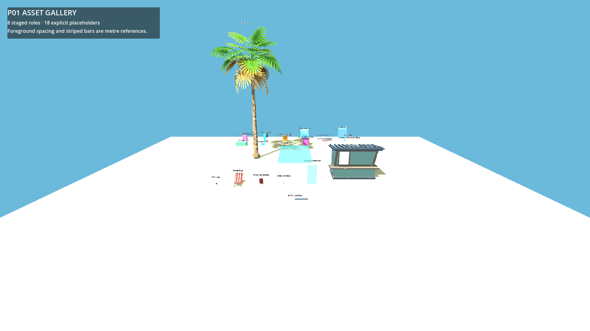
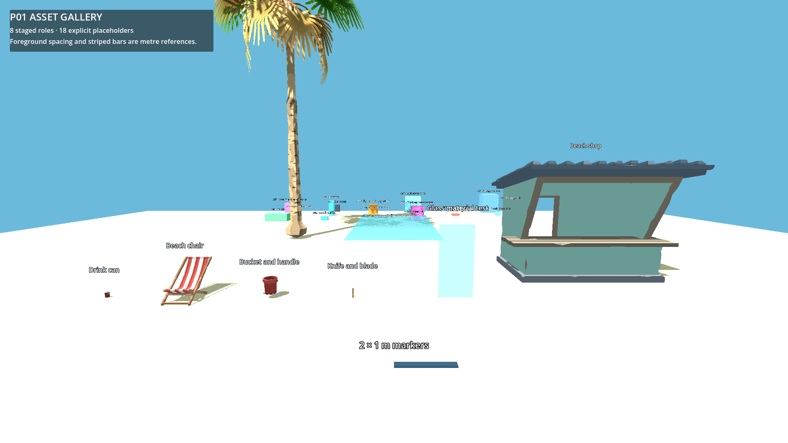

# P01 — Stage supplied assets and register gaps

Status: complete on 22 September 2026.

## Outcome

- `tools/stage_assets.gd` reads the committed whitelist, follows every declared `ext_resource`, rejects unknown or escaping roots, copies binary resources unchanged, and rewrites only recognized resource declarations into `res://art/synty/`.
- Eight logical wrappers stage from the supplied local pack: drink can, beach chair, bucket plus handle, knife plus blade, palm, beach shop, glass test, and Compatibility water test.
- Generated licensed files remain ignored and reproducible; the committed manifest, tool, wrapper metadata, shader globals, and gallery are sufficient for another authorized checkout with the same supplied source.
- Eighteen unresolved art roles retain labelled, coloured cube placeholders and explicit replacement requests.

## Files changed

- `.gitignore`
- `project.godot`
- `data/asset_manifest.json`
- `tools/stage_assets.gd`
- `art/placeholders/missing_asset.tscn`
- `scripts/items/missing_asset.gd`
- `tests/scenes/asset_gallery.tscn`
- `tests/scenes/asset_gallery.gd`
- `tests/run_checks.gd`
- `docs/asset_requests.md`
- `docs/handoffs/images/P01-gallery-wide.png`
- `docs/handoffs/images/P01-gallery-close.png`
- `docs/handoffs/P01.md`

Generated local output under `art/synty/` contains 29 staged source/dependency files plus eight generated wrappers and `stage_hashes.json`; it is intentionally not committed.

## Commands and results

```powershell
$beachGodot = 'C:\Users\Home\Downloads\Godot_v4.6.1-stable_mono_win64\Godot_v4.6.1-stable_mono_win64_console.exe'
& $beachGodot --headless --path 'C:\Users\Home\Documents\beach' --script res://tools/stage_assets.gd
& $beachGodot --headless --path 'C:\Users\Home\Documents\beach' --editor --import
& $beachGodot --headless --path 'C:\Users\Home\Documents\beach' --script res://tests/run_checks.gd
& $beachGodot --headless --path 'C:\Users\Home\Documents\beach' res://tests/scenes/asset_gallery.tscn --quit-after 3
```

- Stager: exit 0, `STAGED 37 files`, closure SHA-256 `c640fa5ad19d649f6ac455fef054eb0f705755b923764d112fe57814677b706d`.
- Idempotence: two consecutive staging runs produced identical `stage_hashes.json` hashes.
- Broken closure: a temporary `DOES_NOT_EXIST.tscn` manifest entry produced `Missing source dependency` and exit 1; the entry was removed and the normal manifest restaged successfully.
- Root import: exit 0. Twelve selected textures imported; the nested conversion project and documentation remained excluded.
- Native checks: exit 0 with `PASS: boot, asset_closure`; every staged file hash matched and every wrapper loaded and instantiated.
- Gallery headless launch and Compatibility movie capture: exit 0 with no GDScript, missing-resource, or shader compile errors.

## Gallery evidence





Setup: the gallery uses metre-sized striped markers and manifest-authored positions with Compatibility/OpenGL on an NVIDIA GeForce RTX 3070.

Actions: inspected a wide view, then a close view of the selected candidates; verified the can/chair/bucket/knife scale against the metre markers, shop and palm ground pivots, leaf cutout edges, material independence, glass translucency, and the water material in the same scene.

Observed: selected meshes retained textures and separate materials. Bucket body/handle and knife body/blade align at shared source coordinates. The source `Glass_01` conversion rendered opaque, so only the wrapper applies a transparent project-owned StandardMaterial override; the copied source remains unchanged. The water candidate renders in Compatibility without a shader error, but final shoreline/depth quality remains P25 work.

## Source audit

The conversion's sole missing material name is `Lit`. Mapping inspection ties it to:

- `SM_Env_Drawbridge_Base_01`
- `SM_Prop_Counter_01_Door_L`
- `SM_Prop_Counter_01_Door_R`
- `SM_Prop_Ferris_Wheel_01_Compartment_01_Glass_02`
- `SM_Prop_Street_Sign_02`
- `SM_Veh_Hot_Dog_Cart_01`

None is part of the P01 closure. Character FBX files exist, but no suitable first-person hand rig was established; A17 remains a cube rather than claiming unverified hand art.

## Known gaps

- All A01–A18 requests remain open as documented in `docs/asset_requests.md`; implementation continues with placeholders.
- P01 validates a representative whitelist, not the final bulk catalog. Later packets extend the manifest only with candidates actually needed and inspected.
- Water appearance, replacement art, final collision profiles, and final visual fidelity remain owned by their later packets.

No shared gameplay contract changed.
