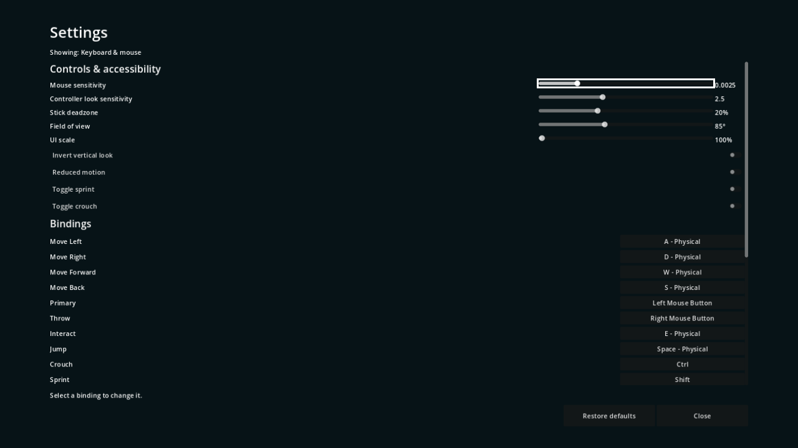

# P03 — Native input, remapping and settings

Status: complete on 22 September 2026.

## Outcome

- Native InputMap actions cover world movement/look, object and tool actions, table navigation, and modal UI navigation with physical-key and generic gamepad defaults.
- `InputReader` exposes context-filtered intents. Mouse motion is an accumulated per-frame delta; right-stick look is angular velocity multiplied by frame delta.
- `SettingsStore` owns application settings, prompt-device detection, context-aware binding conflicts, ConfigFile persistence, default restoration, and controller-disconnect pausing.
- The main menu now opens a fully focused settings modal with sensitivity, deadzone, invert-Y, FOV, UI scale, reduced-motion, sprint/crouch modes, and remapping.

## Files changed

- `project.godot`
- `scripts/player/input_reader.gd`
- `scripts/ui/settings_store.gd`
- `scripts/ui/settings_menu.gd`
- `scenes/ui/settings_menu.tscn`
- `scripts/main.gd`
- `scenes/main.tscn`
- `tests/run_checks.gd`
- `docs/handoffs/images/P03-settings.png`
- `docs/handoffs/P03.md`

## Action names

World actions:

- `move_left`, `move_right`, `move_forward`, `move_back`
- `look_left`, `look_right`, `look_up`, `look_down`
- `primary`, `throw`, `interact`, `jump`, `crouch`, `sprint`
- `switch_tool`, `select_held_prop`, `booklet`, `scanner_pulse`, `pause`

Table actions:

- `table_bin_previous`, `table_bin_next`, `table_bin_1` through `table_bin_4`
- `table_focus_left`, `table_focus_right`, `table_focus_up`, `table_focus_down`, `table_select`

Modal actions:

- `ui_left`, `ui_right`, `ui_up`, `ui_down`, `ui_accept`, `ui_cancel`

Input contexts are selected with `InputReader.set_context()`. `WORLD` accepts only world actions, `TABLE` accepts table plus modal navigation, and results/booklet/modal contexts accept modal navigation. Returning to `WORLD` blocks every currently held action until release, preventing a cancel press from leaking into gameplay.

## Remapping and conflict policy

A remap replaces bindings only for the captured device family on that action: keyboard/mouse changes retain controller bindings and controller changes retain keyboard/mouse bindings. Exact duplicate inputs are removed from other actions only inside the same context. Reusing A between `jump`, `table_select`, and `ui_accept`, or Escape between `pause` and `ui_cancel`, is therefore intentional.

The capture accepts physical keys, mouse buttons/wheel, gamepad buttons, and signed axes. Key echoes and stick values below the configured deadzone are ignored. The menu reports any same-context actions it replaced. Escape cancels capture; Restore defaults and Close remain separate focused controls. Reset restores both UI accept and cancel routes.

## Settings file

Settings persist to `user://settings.cfg` using `ConfigFile`:

- `[settings]`: `mouse_sensitivity`, `controller_sensitivity`, `deadzone`, `invert_y`, `fov`, `ui_scale`, `reduced_motion`, `sprint_toggle`, and `crouch_toggle`.
- `[bindings]`: one Array of small Dictionaries per action. Event dictionaries contain only type and portable values: physical key plus modifiers, mouse button index, gamepad button index, or axis index/sign. Device numbers and hardware paths are not stored.

`SettingsStore` reads project defaults directly from `ProjectSettings`, so Restore defaults is independent of current runtime overrides.

## Modal and prompt integration

- Call `SettingsMenu.open_menu(settings_store)` to pause, reveal the cursor, build the current-device binding labels, and assign the first focus target.
- `SettingsMenu.close_menu()` saves, hides the modal, restores the previous pause state and mouse mode, and emits `closed`.
- Other UI packets should set their player's `InputReader` context before showing a screen and restore it only after the release edge. Settings already owns this transition for its own modal.
- `SettingsStore.prompt_device_changed` fires only for a pressed keyboard/mouse/button event or stick movement at/above deadzone. Prompt widgets can call `binding_text(action)`.
- If the most recent meaningful device is a controller and it disconnects, `SettingsStore` pauses the tree and emits `controller_disconnected`. It does not move focus, so reconnecting retains the focused control.

## Verification

```powershell
$beachGodot = 'C:\Users\Home\Downloads\Godot_v4.6.1-stable_mono_win64\Godot_v4.6.1-stable_mono_win64_console.exe'
& $beachGodot --headless --path 'C:\Users\Home\Documents\beach' --editor --import
& $beachGodot --headless --path 'C:\Users\Home\Documents\beach' --script res://tests/run_checks.gd
& $beachGodot --headless --path 'C:\Users\Home\Documents\beach' --quit-after 2
```

Observed native check: `PASS: boot, asset_closure, ownership, input_bindings`, exit 0.

The check opened the real main/settings scenes, confirmed modal pausing and assigned focus, moved focus with a D-pad button event, exited with controller B, verified every required action/default, rejected stick drift as a prompt change, saved primary/movement/UI-accept remaps, reconstructed a new store, retained the opposite-device bindings, and restored accessible defaults. Keyboard/mouse rendering and focus were inspected on Windows. Controller navigation used real `InputEventJoypadButton` events through InputMap and the native focus system; no physical controller was connected for this packet.



Setup: Compatibility/OpenGL renderer on an NVIDIA GeForce RTX 3070 at a 1280×720 verification window (the project viewport remains 1920×1080 and uses canvas-item stretch).

Actions: opened Settings from the actual main scene, inspected all option rows and the scrollable binding list, and confirmed the focused mouse-sensitivity slider has a geometry outline in addition to its colour state.

Observed: the modal fully obscures the menu beneath it, binding labels remain readable, focus is unambiguous, and the controls fit without horizontal clipping.

## Known gaps

- A physical controller compatibility pass remains useful when hardware is available; engine-level generic button/axis mappings and virtual controller events are verified now.
- Per-action glyph artwork is intentionally deferred. Prompt consumers receive binding text and the active device; later UI packets can replace text with icons without changing persistence.
- P04 must instance `InputReader` under the player and apply FOV to its Camera3D. P03 stores and exposes FOV but does not own a camera.

No approved requirement changed.
