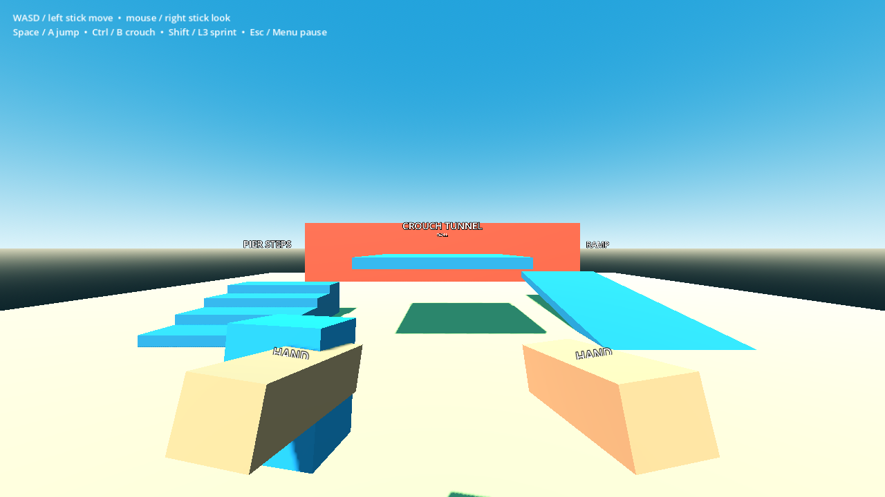
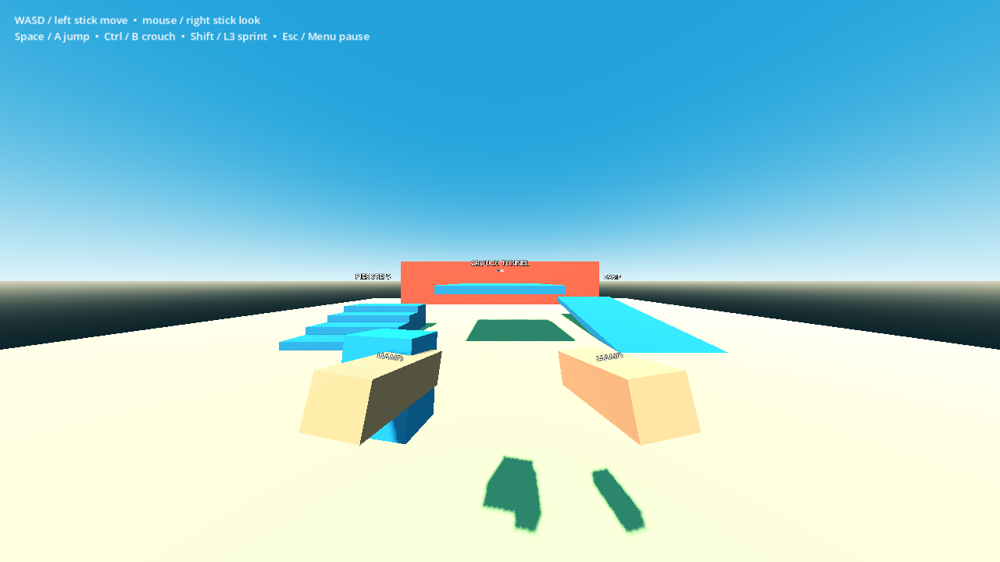

# P04 — First-person player and hand presentation

Status: complete on 22 September 2026.

## Outcome

- `BeachPlayer` composes the existing `InputReader`, a concrete `PlayerMovement`, and `HandRig` under one `CharacterBody3D`.
- Movement owns velocity, gravity, jumping, floor snap, swimming velocity, capsule height, and ceiling-safe standing. Player only wires sampled intents and applies yaw/pitch.
- The playable movement lab contains a wall, a walkable ramp, pier-height visual steps with an authored traversal ramp, and a low roof that accepts crouching but refuses standing.
- A reusable first-person rig exposes separate bag, tool, left/right small-prop, and centered two-hand sockets. The unverified hand-art request remains honest: this packet uses labelled skin-coloured block hands.

## Files changed

- `scripts/player/player.gd`
- `scripts/player/movement.gd`
- `scripts/player/hand_rig.gd`
- `scenes/player/player.tscn`
- `tests/scenes/movement_lab.gd`
- `tests/scenes/movement_lab.tscn`
- `tests/validate_movement.gd`
- `docs/handoffs/images/P04-movement-lab.png`
- `docs/handoffs/images/P04-hands-fov110.png`
- `docs/handoffs/P04.md`

## Movement contract

| Value | Default |
|---|---:|
| Capsule radius | 0.35 m |
| Standing / crouched height | 1.80 / 1.20 m |
| Standing / crouched eye height | 1.65 / 1.05 m |
| Walk speed | 3.50 m/s |
| Sprint multiplier | 1.45 |
| Crouch multiplier | 0.50 |
| Two-hand carry hook | `set_carry_speed_multiplier(0.8)` |
| Swim speed | 2.50 m/s |
| Jump velocity | 5.20 m/s |
| Gravity | project 3D default, currently 9.8 m/s² |
| Floor snap | 0.30 m |
| Maximum floor angle | 46° |
| Ground / air acceleration | 24 / 8 m/s² |

Horizontal velocity approaches its target as one vector, so diagonals do not receive faster acceleration. Crouching smoothly changes both capsule and eye height. Standing queries only the volume being added above the current capsule and excludes the player body; a roof cannot be bypassed by releasing crouch.

Yaw rotates the body. Pitch rotates the Head and clamps to ±88°. Mouse look applies raw accumulated motion once, while controller look remains radians/second multiplied by physics delta. FOV follows `SettingsStore` immediately across the supported 70–110° range. There is no compulsory head bob, shake, stamina, or hidden camera multiplier.

## Hand sockets

All values are local to the Camera3D-owned `HandRig`:

| Socket | Position (x, y, z) m |
|---|---|
| Bag | `(-0.43, -0.38, -0.78)` |
| Active tool | `(0.37, -0.34, -0.72)` |
| Left small prop | `(-0.31, -0.27, -0.73)` |
| Right small prop | `(0.31, -0.27, -0.73)` |
| Two-handed prop | `(0.00, -0.22, -0.90)` |

`HandRig` provides `show_bag`, `set_tool_scene`, `set_small_prop_scenes`, `set_large_prop_scene`, `clear_tool`, and `clear_carry_visuals`. These methods replace presentation children only; they never update ownership or infer inventory. The camera near plane is 0.03 m, and the placeholders remain on the intended side of the frame at 70°, 85°, and 110°.

## Swimming and pause entry points

- `BeachPlayer.enter_swimming()` / `exit_swimming()` delegate to movement and switch floor snap off/on.
- `BeachPlayer.set_swim_speed(value)` applies owned flipper tuning later.
- While swimming, the same normalized movement vector accepts held jump/crouch as vertical input. P18 still owns water detection, air, fainting, and recovery.
- `BeachPlayer.set_paused(value)` releases/captures the cursor, changes the InputReader context, and works while the tree is paused because the player processes always while its physics method explicitly stops.

## Play and validation evidence

```powershell
$beachGodot = 'C:\Users\Home\Downloads\Godot_v4.6.1-stable_mono_win64\Godot_v4.6.1-stable_mono_win64_console.exe'
& $beachGodot --path 'C:\Users\Home\Documents\beach' res://tests/scenes/movement_lab.tscn
& $beachGodot --headless --path 'C:\Users\Home\Documents\beach' --script res://tests/validate_movement.gd
& $beachGodot --headless --path 'C:\Users\Home\Documents\beach' --script res://tests/run_checks.gd
```

Observed movement validation: `P04_VALIDATION straight=3.235 diagonal=3.273 jump_peak=1.424 ramp_peak=0.766 stair_peak=0.770 failures=0`, exit 0. The small straight/diagonal distance difference is below 1.2% across the one-second acceleration sample; terminal velocity is exactly normalized.

Setup: the validator instantiates the playable lab, uses the real InputReader/Movement/CharacterBody3D and Jolt world, and advances normal physics frames.

Actions and observed results:

- held forward and forward+right for equal durations; diagonal displacement stayed normalized;
- walked into the solid wall for two seconds; the capsule stopped outside it;
- jumped in open floor space; the root rose 1.424 m and returned to the floor;
- traversed the ramp and pier steps without jumping; both routes gained about 0.77 m;
- crouched below the 1.35 m roof underside, released crouch, and remained at 1.20 m until moved clear;
- drove movement with a left-stick axis event, then paused/resumed with controller Menu;
- applied FOV 70 and 110, checked socket sides, then entered/exited swimming and observed floor snap switch.





Compatibility/OpenGL rendered both captures on an NVIDIA GeForce RTX 3070 at 1280×720. The block hands and bag are deliberately conspicuous placeholders, not final art.

## Geometry constraints for P05

- Beach stairs should use a continuous walkable collision ramp at or below 46°, with visible step meshes above it. Raw vertical box risers are not treated as climbable walls.
- The lab's ramp bottom is sunk flush into the floor; exposed vertical lips can stop a CharacterBody before it reaches the slope.
- A crouch-only passage needs at least 1.20 m clear capsule height plus authored physics margin. The lab roof underside is 1.35 m.
- Player collision mask is world layer 1 plus fixed/large-interactive layer 4. Tiny loose items on layer 3 are intentionally ignored by movement.

## Known gaps

- A physical controller traversal remains part of the later full controller gate. This packet verified generic stick/button events through InputMap and the native player flow.
- P05 must instance/configure this player in the beach blockout; the current main run still stops at its authoritative placeholder state.
- P08/P09 will supply actual tool and carry visuals. P01 request A17 remains open for suitable first-person hand art.

No approved requirement changed.
