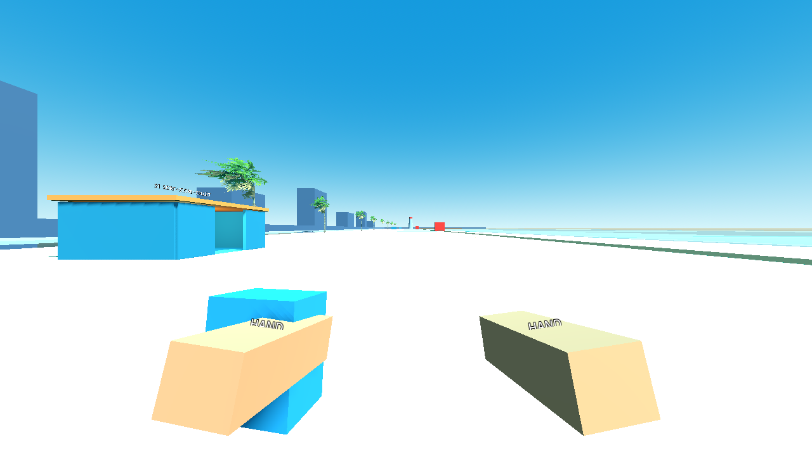
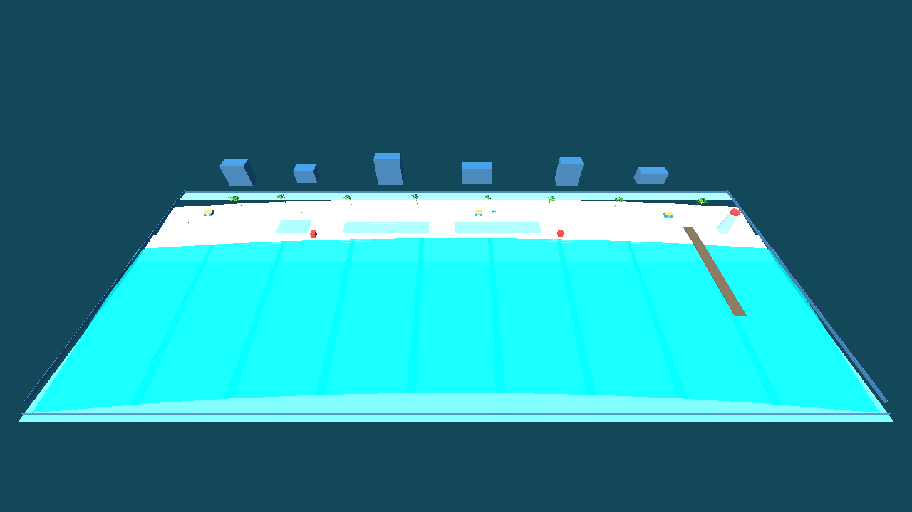
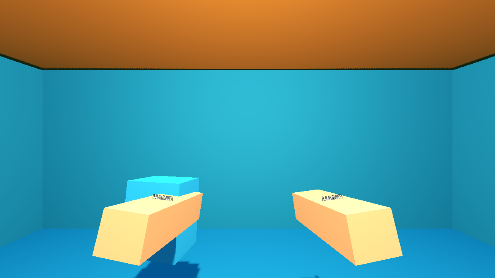

# P05 — Full handcrafted beach blockout and authoring data

Status: complete on 22 September 2026.

## Outcome

- The main Start button now enters a complete 600 m-class walkable beach instead of the placeholder run screen, instancing the P04 player at S1.
- Native blockout geometry provides nine gently turned beach segments, curved water segments, sloped shore, bounded seabed, promenade, city boundary, pier, lighthouse, court, lounger/sand-play terraces, three enterable service huts, two lifeguard towers, and bounded reef water.
- Supplied staged Palm City shop and palm scenes establish scale and art direction; unresolved structural detail remains honest blockout for P25.
- Eight stable zones contain 18 authored sections, restoration roots, spawn anchor packs, six dry recovery anchors, shared and family-specific storage pools, reef swim lanes, and turtle-route markers.

## Files changed

- `scenes/world/beach.tscn`
- `scenes/world/service_hut.tscn`
- `scenes/world/zones/{arrival,sports,lounges,sandplay,pier,shallows,reef_west,reef_east}.tscn`
- `scripts/world/section.gd`
- `scripts/world/spawn_anchor.gd`
- `scripts/world/placement_slot.gd`
- `scripts/world/recovery_anchor.gd`
- `scripts/data/beach_definition.gd`
- `data/world/beach_01.tres`
- `scripts/main.gd`
- `tests/validate_world.gd`
- `tests/validate_world_traversal.gd`
- `docs/handoffs/images/P05-arrival.png`
- `docs/handoffs/images/P05-elevated.png`
- `docs/handoffs/images/P05-hut-interior.png`
- `docs/handoffs/P05.md`

## Zone map and budgets

| Zone | Approximate authored origin | Sections | Waste | Props |
|---|---|---|---:|---:|
| `arrival` | `(-260, 0, 0)` | `arrival:start`, `arrival:dunes` | 650 | 30 |
| `sports` | `(-175, 0, 0)` | `sports:courts`, `sports:snack_edge` | 750 | 40 |
| `lounges` | `(-75, 0, 0)` | `lounges:west`, `lounges:central`, `lounges:east` | 950 | 100 |
| `sandplay` | `(45, 0, 0)` | `sandplay:cove`, `sandplay:hut` | 650 | 80 |
| `pier` | `(200, 0, 0)` | `pier:approach`, `pier:deck`, `pier:moorings` | 800 | 30 |
| `shallows` | `(115, 0, 40)` | `shallows:west`, `shallows:east` | 600 | 20 |
| `reef_west` | `(30, -3, 105)` | `reef_west:outer`, `reef_west:coral` | 500 | 0 |
| `reef_east` | `(175, -3, 120)` | `reef_east:outer`, `reef_east:coral` | 500 | 0 |

The section rows in `data/world/beach_01.tres` are the budget authority for P06. The starter section is exactly 80 exposed waste and 10 clean props. Section and zone totals independently reconcile to 5,400 waste plus 300 props.

Service coordinates are S1 `(-275, 0, -8)`, S2 `(25, 0, -8)`, and S3 `(235, 0, -5)`. The player starts at `(-292, 0.05, 7)` facing east toward the rest of the beach. The equipment shop is next to S2 at `(42, 0, -10)`. Each hut has a 3 m front opening and an 8×6 m clear interior.

## Route measurement

The committed route in `BeachDefinition.starting_state.walk_route` has 13 world-space points from `(-292, 0, 7)` to `(300, 0, 8)`. Its polyline length is 634.7 m, which is 181.3 seconds at the 3.5 m/s baseline before pauses or detours.

Controller traversal through the real player/physics path covered 631.1 m across all waypoints without leaving the terrain, then entered all three huts through their front doors. That traversal uses eight-times simulation speed only to shorten the verification run; movement tuning and physics components are unchanged.

## Authoring conventions

- Zone and section IDs are lowercase stable names. Section IDs use `zone:section`; moving a marker must never rename it.
- `BeachSection` stores zone/section IDs and exact budgets and references a separate restoration visual root. Restoration dressing belongs under that root, never under the objective marker.
- `SpawnAnchor.anchor_id` uses `spawn:zone:section:role`. Tags are semantic, not visual names. Current required tags are `sand`, `pile`, `water_surface`, `seabed`, `buried`, and `attachment`; anchors may add `single`, `starter`, `food`, or place-specific tags.
- Clearance classes are SMALL, MEDIUM, and LARGE with an explicit radius. P06 may generate only a definition whose collision class fits that anchor.
- `PlacementSlot` represents one authored uniform pool. Individual stable IDs are derived as `pool_id:000`, `pool_id:001`, and so on; `local_slot_transform(index)` spaces them along the pool front. Later placement logic must not derive IDs from child indices or scene node names.
- `RecoveryAnchor` IDs use `recovery:zone`. These six markers are dry, grounded, standing-capsule clear, and stored in `BeachDefinition.recovery_anchors` as world coordinates.
- Spawn exclusion Area3Ds reserve S1/S2/S3. Later generation must also treat paths, hut interiors, slot footprints, and pier access as excluded geometry when it expands anchor packs.
- Reef scenes reserve one swim lane and one turtle route each. Their marker children are presentation paths, never objective IDs.

P25 may replace meshes, materials, foliage and skyline silhouettes but must not silently move zone roots, sections, service points, spawn/recovery anchors, slot pools, water bounds, player spawn, or the measured route.

## Storage capacity

| Pool | Capacity | Requirement represented |
|---|---:|---:|
| 20 interchangeable six-slot shelves | 120 | 96 shared small-family props |
| Beach chairs | 72 | 70 |
| Loungers | 54 | 50 |
| Parasols | 24 | 20 |
| Coolers | 18 | 16 |
| Surfboards | 18 | 16 |
| Portable inflatables | 14 | 12 |
| Lifebuoys | 10 | 8 |
| Portable tents | 6 | 4 |
| Small rowboats | 6 | 4 |
| Paddles | 6 | 4 |
| **Total authored capacity** | **348** | **300 props** |

All shared shelf sections have exactly six spaces and accept the same five logical families: bucket, spade, beach ball, volleyball, and speaker. This preserves the P10 feasibility rule rather than relying on one lucky fill order.

## Validation evidence

```powershell
$beachGodot = 'C:\Users\Home\Downloads\Godot_v4.6.1-stable_mono_win64\Godot_v4.6.1-stable_mono_win64_console.exe'
& $beachGodot --headless --path 'C:\Users\Home\Documents\beach' --script res://tests/validate_world.gd
& $beachGodot --headless --path 'C:\Users\Home\Documents\beach' --script res://tests/validate_world_traversal.gd
& $beachGodot --headless --path 'C:\Users\Home\Documents\beach' --script res://tests/run_checks.gd
```

Observed:

- `P05_WORLD sections=18 anchors=28 pools=44 slots=348 route=634.7m walk=181.3s failures=0`
- `P05_TRAVERSAL waypoints=13 distance=631.1m huts=3 failures=0`
- `PASS: boot, asset_closure, ownership, input_bindings`

The world validator also checks unique section/anchor/pool/derived-slot/recovery IDs, complete section anchor coverage, all required tags and clearances, section/data budget agreement, service/shop/exclusion counts, water bounds, reef paths, grounded capsule-clear recoveries, player spawn clearance, and each hut's interior/door volume against the actual Jolt world.







Captures use Compatibility/OpenGL on an NVIDIA GeForce RTX 3070 at 1280×720. They document layout and clearance, not P25 final visual fidelity.

## Known gaps

- The Synty shop and palms are staged; pier, lighthouse, towers, stations, terraces, city and water remain deliberate native blockout. P25 owns visual dressing and final shoreline/water quality.
- Spawn anchors are authored packs and semantic coverage, not 5,700 final transforms. P06 expands them deterministically and must add bounded collision/exclusion validation.
- Service huts, shop, storage and restoration roots are places only. Their actual sorting, buying, placement, collection and restoration behavior belongs to later packets.
- The controller route used generic controller events through InputMap. A physical controller is still required by the final full-flow gate.

No approved requirement changed.
