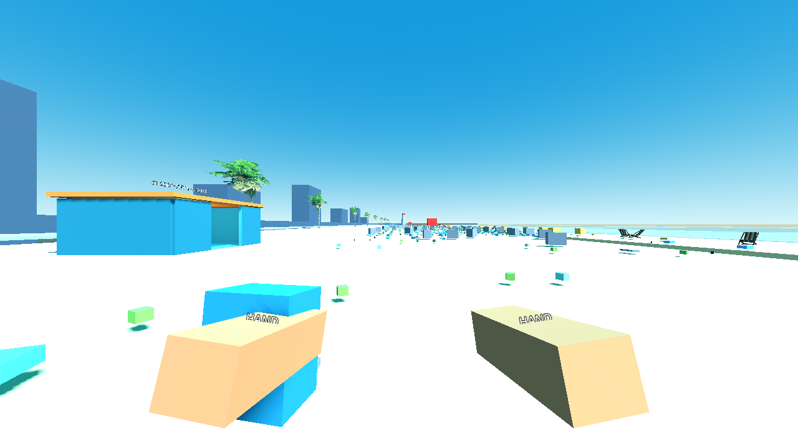

# P07 — Physical items, piles and safe recovery

Status: complete on 22 September 2026.

## Outcome

- A single reusable `RigidBody3D` scene now presents every manifest record currently in `WORLD`; identity and objective state remain exclusively in `RunState`.
- The playable beach starts with 5,376 mapped item views. The 300 buried waste records, 24 attached rescue records, and 40 buried valuables remain logical-only until their reveal/release packets.
- Throws, item-to-item collision, sleeping, moving/resting snapshot synchronization, shared fallback visuals, and safe out-of-bounds recovery are working through `ItemViewManager`.
- Recovery keeps the original ID, definition, dirt, home section, required denominator, and wallet. It only selects a clear authored recovery pose and resets unsafe physics motion.
- Manifest floating objects now begin at the authored water surface; large bundled objects are excluded from close pile patterns and aquatic packs are excluded from dry pile layouts.

## Files changed

- `scenes/items/world_item.tscn`
- `scripts/items/world_item.gd`
- `scripts/items/item_view_manager.gd`
- `scripts/world/recovery_bounds.gd`
- `tests/scenes/physics_lab.tscn`
- `tests/validate_physics.gd`
- `scripts/core/run_session.gd`
- `scripts/main.gd`
- `scripts/world/manifest_generator.gd`
- `project.godot`
- `tests/run_checks.gd`
- `docs/handoffs/images/P07-full-layout.png`
- `docs/handoffs/P07.md`

## Collision profiles and layers

| Profile | Primitive fallback size | Mass | Player behavior | Fast-body CCD |
|---|---:|---:|---|---|
| Small | 0.22×0.18×0.22 m box | 0.35 kg | ignored | enabled |
| Large | 1.15×0.90×0.80 m box | 3.0 kg | blocks | disabled |
| Flat | 0.72×0.08×0.42 m box | 0.35 kg | ignored | disabled |
| Floating | 0.44×0.18×0.44 m box | 0.35 kg | ignored | disabled |

Physics layers follow the architecture contract: 1 world, 2 player, 3 loose items, 4 fixed interactives, 5 slot/bin triggers, 6 water, and 7 rescue targets. Every loose body uses layer 3. Large furniture additionally uses layer 4, the only item layer currently included in the player's mask. The physics lab moves the real P04 player through a can and into a chair to verify that distinction.

Fallback meshes, materials, and shapes are shared per profile/category instead of being recreated for thousands of placeholder definitions. Staged can, bucket, and chair wrappers retain shared imported resources. Imported visual scenes are children of a separate `VisualRoot`; collision is always the explicit primitive shape and never a rendered collision mesh.

## Body and view lifecycle

1. `ItemViewManager` sorts stable item IDs and creates a view only for a `WORLD` record.
2. The body is restored from the record's current transform, velocity, angular velocity, and sleep state. Initial resting views remain frozen/asleep, avoiding a 5,000-body settling burst and preventing supported piles from separating at startup.
3. Throw/physics activation unfreezes only that body. Small active bodies use continuous collision detection. Floating definitions receive bounded buoyancy below the 0.08 m water plane; sinking definitions use ordinary gravity.
4. Thirty low-motion physics frames explicitly return an active body to sleep. The sleeping-state signal writes the final pose and velocities back to its record and disables that item's processing.
5. `synchronize_at_physics_boundary` captures every instantiated WORLD view before a snapshot. Record-location signals reconcile views at the following physics boundary; removing a view never removes or completes its item record.
6. If an active item crosses the authored beach bounds, the manager first synchronizes its current record, then `RecoveryBounds` chooses the nearest clear recovery-anchor offset, zeros motion, restores the same view, and publishes one ordinary state revision.

The same manager path is the intended P13 path for WORLD disposal bags; no second physics ownership system was introduced.

## Physics-lab evidence

Setup: `tests/scenes/physics_lab.tscn` with real Jolt bodies, a static floor/catch wall, actual catalog definitions, the P04 player scene, a 4-can supported pile, and an authored lab recovery point.

Actions exercised:

- threw a can, floating ball, and large chair;
- drove one active can into another;
- moved the real player through tiny litter and into blocking furniture;
- captured a snapshot after a throw advanced, rebuilt views from it, and compared the restored pose;
- woke the supported pile, let it settle, and captured a later resting snapshot;
- moved a record-backed can below the lower bound and observed recovery.

Observed:

- all thrown profiles advanced through physics and the collision target moved;
- the moving snapshot contained the advanced pose and nonzero velocity, not the launch pose;
- rebuilt motion started at the captured pose; the later snapshot retained the final resting pose;
- all four pile bodies returned to sleep;
- recovery retained item count, required count, wallet, location, stable ID, and all domain invariants;
- `P07_PHYSICS_RECOVERY failures=0`.

## Earliest full-scale measurement

Command:

```powershell
$beachGodot = 'C:\Users\Home\Downloads\Godot_v4.6.1-stable_mono_win64\Godot_v4.6.1-stable_mono_win64_console.exe'
& $beachGodot --path 'C:\Users\Home\Documents\beach' --resolution 1280x720 --script res://tests/validate_physics.gd
```

Machine: Windows, AMD Ryzen 5 5600 (6 cores), NVIDIA GeForce RTX 3070, NVIDIA 595.79 OpenGL driver, Godot Compatibility renderer at 1280×720.

Observed after the playable main scene built the complete fixture and ran 120 visible frames:

| Metric | Observation |
|---|---:|
| WORLD views | 5,376 |
| Awake bodies at rest | 0 |
| Mesh instances | 7,010 |
| Largest pile | 6 items |
| View build | 6,803.5 ms |
| Static memory monitor | 201.2 MB |
| Video memory monitor | 442.6 MB |
| Scene nodes | 26,805 |
| Mean wall-frame time | 9.30 ms |
| 95th-percentile wall-frame time | 12.09 ms |
| Mean physics time | 2.05 ms |
| Maximum visible draw calls | 11,093 |
| Maximum active physics bodies | 0 |

This stronger-than-target GPU and 720p development run is not evidence of GTX 980/1080p compliance. The steady visible frame result is encouraging, but the 6.8 s synchronous view build and 11,093 draw calls are already concrete reasons for P28 to implement distant per-cell batching/promotion and staged startup. Logical IDs must remain in `ItemStore` while that happens.

Post-P13 Synty visual expansion raised the headless full-layout view build to 16.5 s, with 10,455 meshes, 38,696 nodes, 642.6 MB reported memory and 3.22 ms mean physics time; the check still passed. The original figures below remain the pre-expansion baseline. P28 should address startup/view batching before the final performance gate.



## Validation commands

```powershell
& $beachGodot --headless --path 'C:\Users\Home\Documents\beach' --script res://tests/validate_physics.gd
& $beachGodot --headless --path 'C:\Users\Home\Documents\beach' --script res://tests/run_checks.gd
```

Observed:

- `P07_SCALE views=5376 awake=0 meshes=7010 largest_pile=6 build_ms=6750.3 memory_mb=503.9 video_mb=0.0 nodes=26805 frame_avg_ms=6.74 frame_p95_ms=7.53 physics_avg_ms=2.17 draw_calls_max=0 active_bodies_max=0`
- `P07_PHYSICS_RECOVERY failures=0`
- `PASS: boot, asset_closure, ownership, input_bindings, manifest`

The headless memory monitor includes server allocations not reported identically by the visible renderer; the visible-device values above are the performance baseline. The written physics check is deliberately one integrated scene flow, consistent with the project verification rule.

## Known gaps

- P08/P09 own targeting, collecting, carrying, and player-driven throwing. P07 exposes activation/throw/freeze/restore primitives but does not add gameplay input paths early.
- P13 must reuse this synchronization/recovery path for sealed disposal bags.
- P28 must address the measured startup and draw-call costs before release profiling.
- Physics trajectories are intentionally not deterministic. Only the P06 initial manifest is versioned and reproducible.

No approved requirement changed.
