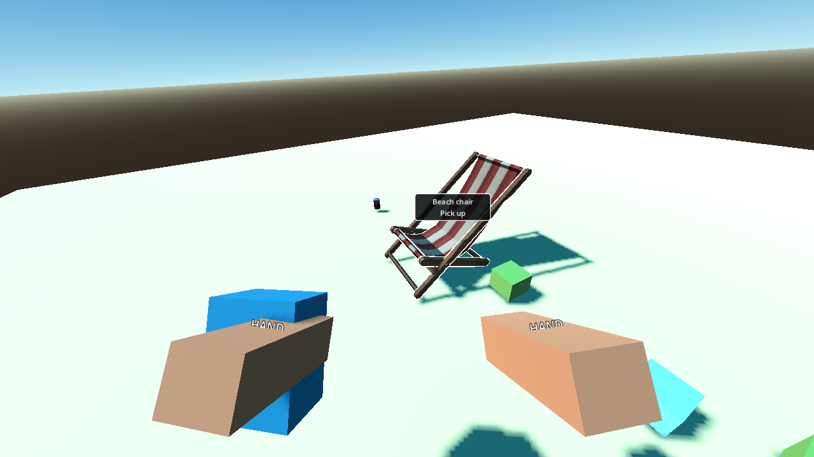

# P08 — Targeting, outlines and contextual actions

Status: complete on 22 September 2026.

## Outcome

- The P04 player now has one camera-centre `PlayerInteractor` for items and future station targets.
- Exact ray hits stop at the first world/target surface. A 0.22 m capsule tolerance is used only for small litter after the centre ray has no eligible result, and every tolerance candidate must pass its own world-occluded line-of-sight ray.
- The selected item alone receives a white inverted-hull overlay. Its nearby UI label uses the authored display name and a player-facing action or reason.
- `primary`, `interact`, and `throw` are routed once from `InputReader`'s WORLD-context edge state. P08 exposes signals and does not perform speculative P09–P15 mutations.

## Files changed

- `scripts/player/interactor.gd`
- `scripts/player/player.gd`
- `scenes/player/player.tscn`
- `scripts/ui/target_label.gd`
- `scenes/ui/target_label.tscn`
- `shaders/hover_outline.gdshader`
- `scripts/items/world_item.gd`
- `scripts/main.gd`
- `scenes/main.tscn`
- `tests/scenes/interaction_lab.tscn`
- `tests/validate_interaction.gd`
- `docs/handoffs/images/P08-interaction-lab.png`
- `docs/handoffs/P08.md`

## Target result contract

`PlayerInteractor.current_target` and action signals carry a small dictionary:

| Field | Meaning |
|---|---|
| `id` | Stable item/station ID; never a node instance ID |
| `kind` | `item` or `station` |
| `hit_point` | Frontmost visible world-space surface point |
| `distance` | Camera-to-hit distance in metres |
| `actions` | Permitted semantic actions such as `collect`, `hold`, or `interact` |
| `reason` | Player-facing blocker/context, e.g. `Bag full` or `Needs Knife` |
| `display_name` | Authored English display name |
| `collider` | Transient view reference for presentation only; never serialized |

The default reach is 2.5 m from the camera. The mask includes world, loose items, fixed interactives, slot/bin triggers, and rescue targets; the player RID is excluded. Held/viewmodel objects have no world collision and therefore cannot steal the ray.

For an exact collision, a valid item or station is returned immediately. A non-target world hit is still respected by the tolerance pass: the small candidate's dedicated line ray must hit that candidate first, so a wall, chair, table, or terrain surface continues to occlude it.

## Context and action precedence

`BeachPlayer` samples `InputReader` once per physics step, performs movement/look, refreshes the target, then routes the three fresh WORLD edges:

1. primary → `primary_requested(target)` only when the target has a permitted action; otherwise `action_blocked(reason)`;
2. interact → `interact_requested(target)` for future station/alternate actions;
3. throw → `throw_requested()` independent of the aimed target.

There is no parallel `_input` action path. Pause changes `InputReader` to MODAL and clears the target; its existing held-action block requires a new button edge after returning to WORLD. Future booklet/shop/table/results contexts retain the architecture's higher priority by changing that same input context.

## Outline and label lifecycle

- `WorldItem.set_highlighted` creates overlay meshes lazily for every currently visible submesh beneath that one view's `VisualRoot`.
- Overlays share one immutable white shader material but have per-view visibility, so targeting one staged can/chair cannot highlight its shared-resource siblings.
- Switching targets hides every overlay on the old view before showing the new one. Deleting/demoting a view deletes its child overlays; the next target refresh clears the label.
- The label has an opaque dark backing and white border/text for bright sand. Its screen position follows the projected hit point and clamps inside a 12 px viewport margin.
- Closed staged chair meshes and thin registered flat boxes both pass the Compatibility-renderer lab. P27 still owns broad visual checks against final thin/open art.

## Validation evidence

Setup: the existing P04 player, P07 item bodies/manager, actual catalog definitions, bright sand, a dark world occluder, small glass, thin net, registered cube, staged multi-part chair, overlapping items, one far item, and the real target-label scene.

Actions and observations:

- aimed at glass, net, cube, and chair; each stable ID and authored display name resolved;
- switched glass → net and observed only the net highlighted;
- aimed through the occluder and received no target;
- aimed at two collinear eligible items and received the front item;
- aimed outside 2.5 m and received no target;
- missed a small cube by 0.19 m and acquired it only through the tolerance/LOS pass;
- filled the logical bag and kept the glass label with `Bag full` and no permitted action;
- held primary and observed one request, then released/re-pressed and observed exactly one more;
- supplied right-stick input and observed the same camera-centre ray move;
- collected the currently labelled glass through the real `ItemStore`, then observed its view, outline, and label clear.

Commands:

```powershell
$beachGodot = 'C:\Users\Home\Downloads\Godot_v4.6.1-stable_mono_win64\Godot_v4.6.1-stable_mono_win64_console.exe'
& $beachGodot --headless --path 'C:\Users\Home\Documents\beach' --script res://tests/validate_interaction.gd
& $beachGodot --path 'C:\Users\Home\Documents\beach' --resolution 1280x720 --script res://tests/validate_interaction.gd -- --capture
```

Observed:

- `P08_INTERACTION target_format=id/kind/hit_point/distance/actions/reason reach=2.5m failures=0`
- visible Compatibility-renderer run completed with the same zero failures.



## P27 visual/accessibility follow-up

- Repeat outline/label validation on final thin/open meshes, all imported submeshes, dark hut interiors, direct bright sand, water-surface glare, and from a submerged camera.
- Recheck label clamping and UI scale at 1280×720, 1920×1080, and 4K; ensure reason text remains readable without color dependence.
- Tune outline width and label offset with final meshes. If any open mesh produces unacceptable inverted-hull artifacts, retain the same target API and replace only its presentation with a target-local silhouette/halo.

## Known gaps

- P09 connects `collect`, `hold`, and throw requests to authoritative store/carry methods. P08 deliberately does not mutate inventory or hands.
- P10–P19 add station, slot, tool, buried, and rescue action providers through the same result format.
- A future target reason may add `Wrong shelf`; the label already renders arbitrary player-facing reasons.

No approved requirement changed.
