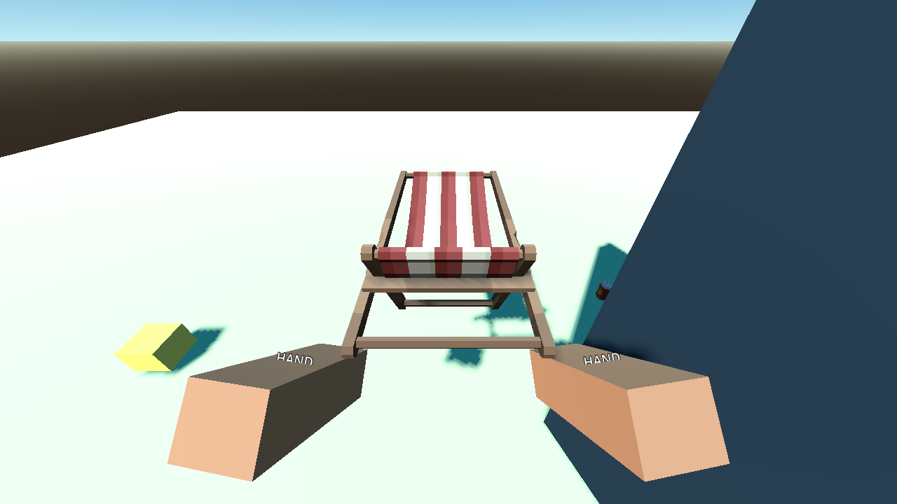

# P09 — Bag inventory, hands and LIFO throws

Status: complete on 22 September 2026.

## Outcome

- Primary collection now transfers eligible waste and valuables into one shared-capacity, ordered bag. The authoritative record changes owner before its world view travels to the bag and disappears.
- Reusable props occupy two ordered hand units: small props cost one unit and large props cost both. Any held prop stows the bag and tool presentation; large props apply the authored 0.8 movement multiplier.
- Right-click throws the newest held prop, regardless of the selected placement item, then the newest trash-bag item, then the newest valuable. A blocked spawn leaves ownership and presentation unchanged.
- The original stable item ID, properties, required-count state, discoveries, and money survive pickup/throw cycles. Tool switching is rejected while hands are occupied.
- P18 has one atomic `try_release_all_items` path that validates every release pose before changing any owner.

## Files changed

- `scripts/core/action_result.gd`
- `scripts/core/item_store.gd`
- `scripts/core/run_state.gd`
- `scripts/items/item_view_manager.gd`
- `scripts/items/world_item.gd`
- `scripts/player/carry.gd`
- `scripts/player/interactor.gd`
- `scripts/player/player.gd`
- `scenes/player/player.tscn`
- `scripts/main.gd`
- `tests/validate_carry.gd`
- `docs/handoffs/images/P09-large-carry.png`
- `docs/handoffs/P09.md`

## Authoritative and animated lifecycle

1. The fresh P08 target result supplies the stable ID, visible hit, distance, reach, and permitted action.
2. `ItemStore.try_collect` or `try_hold` validates that proof, current ownership, category, required tool, and available capacity. It commits the item to `BAG` or `HELD`, records definition/material discovery, and publishes the changed stable ID.
3. Only after a successful commit does `PlayerCarry` detach that ID's existing view from `ItemViewManager`. The temporary view has no collision and travels to the bag or hand socket; it is presentation only and never owns the item.
4. A throw first checks a ray and profile-sized box at the camera-forward spawn pose. On success `ItemStore.try_throw` commits the same record back to `WORLD`, then the manager restores one active physical view with the recorded launch velocity.
5. Throwing or releasing during pickup travel kills the temporary tween safely. Reconciliation sees one authoritative location and therefore creates at most one world view.

The bag's `trash_bag` and `valuable_bag` arrays retain insertion order and share `bag_capacity` (20 by default). `held_objects` retains pickup order. `selected_held_index` is a separate placement selection; cycling it never reorders `held_objects`, and throwing deliberately reads the array tail. The index is included in snapshots and validated against the held array.

`try_release_all_items(player_id, world_transforms)` gathers held, trash, and valuable IDs; validates every finite safe pose and referenced record first; then clears all three owner lists and publishes one state transaction. A missing pose rejects the whole request without a partial release.

## Player feedback

- A full shared bag leaves the item in `WORLD`; the target label displays `Bag full` with no collection action.
- A wrong tool is rejected by the store with `TOOL_REQUIRED` and no mutation.
- Occupied hands reject tool switching with `Place or throw the carried object first`.
- A blocked throw reports `Not enough room to throw`; the item remains held or bagged.
- Throwing with no carried item reports `Nothing to throw`.

## Playable validation evidence

Setup: the existing interaction lab, P04 player and hand rig, P07 physical item manager, P08 targeting, actual catalog definitions, two staged Synty props, registered fallback props, a world occluder, and a real `RunSession`/`RunState`.

Actions and observed results:

- collected A, B, and C while their pickup animations overlapped; the bag retained A/B/C and throws released C then B;
- threw a prop while its pickup tween was still running and observed one active world body with the same ID;
- filled the shared bag and rejected both ordinary waste and an optional valuable without mutation;
- held two small props, selected the older prop, and still threw the newest prop;
- rejected a third small prop and a two-unit large prop while hands were occupied;
- released every carried reference through the atomic P18 hook, then picked up the large chair with both hands and observed the 0.8 movement multiplier;
- aimed the chair throw into the lab wall and retained the held owner, then aimed clear and restored one physical world body;
- confirmed required totals and money were unchanged and all one-owner invariants remained valid.

Commands:

```powershell
$beachGodot = 'C:\Users\Home\Downloads\Godot_v4.6.1-stable_mono_win64\Godot_v4.6.1-stable_mono_win64_console.exe'
& $beachGodot --headless --path 'C:\Users\Home\Documents\beach' --script res://tests/validate_carry.gd
& $beachGodot --path 'C:\Users\Home\Documents\beach' --resolution 1280x720 --script res://tests/validate_carry.gd -- --capture
& $beachGodot --headless --path 'C:\Users\Home\Documents\beach' --script res://tests/validate_interaction.gd
& $beachGodot --headless --path 'C:\Users\Home\Documents\beach' --script res://tests/run_checks.gd
```

Observed:

- `P09_CARRY_LIFO bag=A/B/C throws=C/B hands=2 large_cost=2 failures=0`
- visible Compatibility-renderer run completed with the same zero failures;
- `P08_INTERACTION target_format=id/kind/hit_point/distance/actions/reason reach=2.5m failures=0`;
- `PASS: boot, asset_closure, ownership, input_bindings, manifest`.



## Known follow-ups

- P10 consumes the selected-held item for placement while preserving the pickup-order array used by throws.
- P13 reuses the same bag ordering and world-view restoration for disposal bags.
- P14 supplies real tool selection; P09 only enforces the occupied-hands gate and active-tool check.
- P18 calls the shared release-all transaction when save/load or disconnect recovery requires it.

No approved requirement changed.
