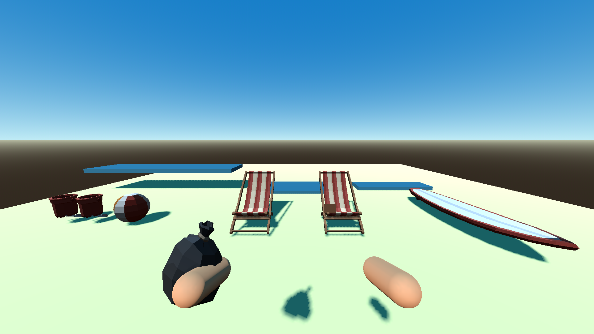
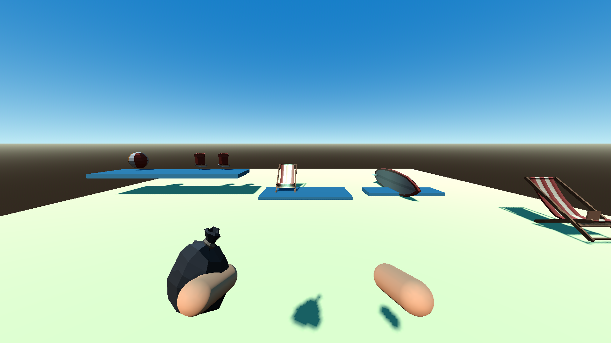

# P10 — Shelf claims, snapping and reversible sorting groups

Status: complete on 22 September 2026.

## Outcome

- The 44 authored P05 placement-pool markers now expand into 348 stable physical slots; no second authoring model was introduced.
- Nearby empty slots validate the currently selected held prop and display a translucent green object-shaped ghost without mutating state. Primary commits the prop first, then travels its visual to the authored slot front and pulses only the visual root.
- The first occupant claims its physical pool by logical sorting family. Variants share a family, mixed families and occupied slots are refused, and removing the last occupant clears the claim synchronously.
- A real world body overlapping a slot trigger follows the same validation/commit path. Dirty or incompatible throws continue as ordinary world physics and receive no sorting credit.
- Logical groups are keyed by immutable home section plus family, independently of the physical shelf used. Their current counts reverse on pickup; one `group_completed` event is emitted for each false-to-true transition. P10 never changes money or claims a reward.

## Files changed

- `scripts/items/placement_service.gd`
- `scenes/items/placement_slot.tscn`
- `shaders/placement_ghost.gdshader`
- `scripts/world/placement_slot.gd`
- `scripts/core/run_session.gd`
- `scripts/core/run_state.gd`
- `scripts/core/item_store.gd`
- `scripts/player/interactor.gd`
- `scripts/main.gd`
- `tests/scenes/placement_lab.tscn`
- `tests/validate_placement.gd`
- `docs/handoffs/images/P10-placement-before.png`
- `docs/handoffs/images/P10-placement-after.png`
- `docs/handoffs/P10.md`

## Slot and claim contract

Each P05 `PlacementSlot` marker remains one physical pool/section. It provides:

- stable `pool_id`;
- accepted logical families;
- uniform pool capacity and spacing;
- row, shelf, upright, or mooring layout;
- derived stable slot IDs (`<pool_id>:<three-digit-index>`);
- front transform and trigger size.

Runtime pool state lives in `RunState.container_records[pool_id]`:

| Field | Meaning |
|---|---|
| `kind` | `placement_pool` |
| `accepted_families` | Authored compatible family domain |
| `capacity` | Number of derived physical slots |
| `claim` | Current family, empty only when the pool has no occupants |
| `occupants` | Stable slot ID → stable item ID |

`ItemRecord.slot_id` must agree with exactly one occupancy entry whenever the record is `SLOTTED`. Run-state validation checks this agreement, pool capacity, claim presence/reset, unique ownership, and occupant-family consistency.

The 20 shared small-shelf pools retain the P05 six-slot uniform layout and common family domain: `bucket`, `spade`, `beach_ball`, `volleyball`, and `speaker`. Before an empty shared pool is claimed, the service subtracts remaining free capacity in already claimed pools, computes the additional uniform sections each family still needs, and rejects a claim that would strand the remaining arrangement. The prompt is `Use an existing [family] section with room.`

## Placement, capture, and pickup lifecycle

1. `preview_slot(player_id, slot_id)` reads the selected held ID and validates ownership, clean state, occupancy, reach, accepted/claimed family, shared-shelf feasibility, and profile-sized physical clearance. It never changes a record or claim.
2. A valid preview reuses the prop's authored mesh resources under the shared translucent ghost material and aligns them to the pool front. Upright layouts rotate their object basis and offset the rotated bounds back onto the authored ground line.
3. `try_place` repeats every check, removes the selected hand entry without reordering the remaining pickup list, commits the record and pool occupancy/claim, updates its logical group, and finalizes one revision. A 0.25 s presentation then travels to the already committed destination and pulses 1.00→1.08→1.00 over 0.25 s.
4. `try_capture` requires the actual `WorldItem` to overlap the layer-5 slot trigger and requires an unobstructed entry segment to the slot front. It then uses the same family, dirt, occupancy, feasibility, and clearance validation as click placement. No valid overlap means no pull or teleport.
5. A slotted prop has one fixed collision/presentation view owned by the placement service. Aiming at that view targets its stable item ID. `ItemStore.try_hold` delegates slotted pickup to `try_remove`, which clears occupancy immediately, clears the pool claim if it was last, updates current group progress, and appends the same item to the ordered hands.

Removing a slotted view disables its collision layer before deferred node deletion, so immediate re-placement cannot see a one-frame phantom obstruction. Interrupted travel never owns or reserves anything: a committed slot rebuilds its terminal view, while a rejected action leaves the original owner unchanged.

## Logical group event

Group IDs use `<immutable-home-section>/<sorting-family>`, for example `home:sand/bucket`. `RunState.group_states[group_id]` retains required/current counts, current completion, transition count, `reward_claimed`, and `restored_once`.

`group_completed(payload)` is emitted once after each false-to-true transition with:

| Field | Meaning |
|---|---|
| `group_id` | Stable logical group ID |
| `home_section_id` | Immutable objective-credit section |
| `family_id` | Logical family, not visual variant |
| `item_id` / `slot_id` | Prop and physical slot that completed the transition |
| `current_count` / `required_count` | Fully committed group counts |
| `transition_count` | Monotonic celebration/replay count |
| `reward_claimed` | Existing one-time reward latch; unchanged by P10 |

Picking an item back up changes `complete` to false and decrements `current_count`, but does not clear reward/restoration latches. P20 will perform one-time payment and permanent restoration within the action finalization boundary.

## Playable validation evidence

Setup: the existing P04 player/hand rig, P07 physical item manager, P08 target ray, P09 ordered hands, actual bucket/chair art, registered fallback ball/board art, two shared shelf sections, a chair row, an upright board row, and real `RunSession` records. Red and blue test definitions deliberately share the authored `bucket` family.

Actions and observations:

- aimed at a nearby empty slot while holding a red bucket; observed a green bucket-shaped ghost and `place` action while state and claim remained unchanged;
- placed the bucket and observed the first `bucket` claim;
- tried to claim the other empty shelf with another bucket while the first shelf still had room; feasibility validation refused the unsafe split;
- aimed a ball at the bucket shelf and received a mixed-family refusal;
- physically moved the thrown ball through the second shelf trigger and observed one committed `SLOTTED` owner;
- refused an occupied slot, then placed a blue bucket variant into the first bucket pool;
- removed/re-placed buckets repeatedly; current completion reversed, the empty pool released its claim, and three false-to-true transitions emitted exactly three group events;
- refused a dirty chair through both click and physical trigger paths while leaving it in `WORLD`;
- placed a clean chair and an upright surfboard, waited through travel/pulse, and observed the visual root return exactly to scale 1;
- confirmed required count and money were unchanged and all occupancy/ownership invariants passed.

Commands:

```powershell
$beachGodot = 'C:\Users\Home\Downloads\Godot_v4.6.1-stable_mono_win64\Godot_v4.6.1-stable_mono_win64_console.exe'
& $beachGodot --headless --path 'C:\Users\Home\Documents\beach' --script res://tests/validate_placement.gd
& $beachGodot --path 'C:\Users\Home\Documents\beach' --resolution 1280x720 --script res://tests/validate_placement.gd -- --capture
& $beachGodot --headless --path 'C:\Users\Home\Documents\beach' --script res://tests/validate_world.gd
& $beachGodot --headless --path 'C:\Users\Home\Documents\beach' --script res://tests/validate_carry.gd
& $beachGodot --headless --path 'C:\Users\Home\Documents\beach' --script res://tests/run_checks.gd
```

Observed:

- `P10_SLOTS claims=bucket/beach_ball variants=shared group_events=3 captures=valid+dirty_reject failures=0`;
- `P05_WORLD sections=18 anchors=28 pools=44 slots=348 route=634.7m walk=181.3s failures=0`;
- `P09_CARRY_LIFO bag=A/B/C throws=C/B hands=2 large_cost=2 failures=0`;
- `PASS: boot, asset_closure, ownership, input_bindings, manifest`.





## Known follow-ups

- P11 removes authored furniture dirt patches and thereby makes dirty props placement-eligible.
- P20 consumes the group state/event during action finalization to latch the one-time reward and permanent restoration without double payment.
- P25 may dress racks and shelves around these stable markers, but collision must keep the authored trigger opening and placement volume clear.
- P27 tunes ghost opacity, travel curves, pulse size, and final art bounds without changing ownership or claims.

No approved requirement changed.
