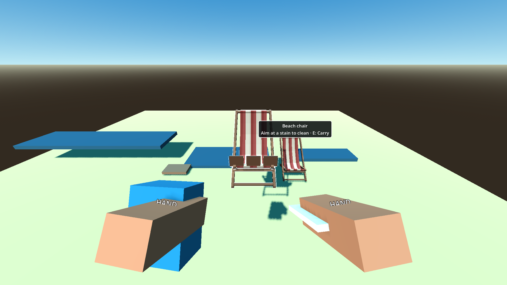
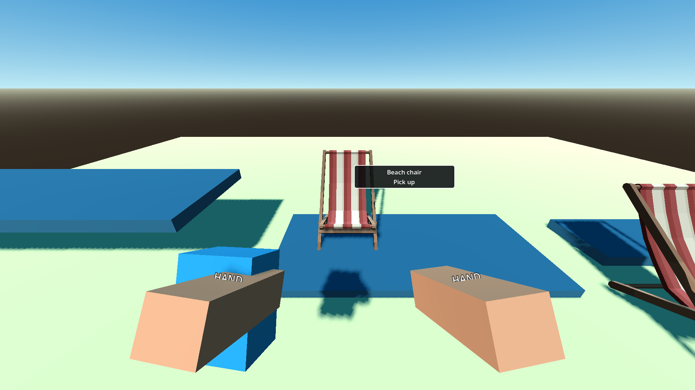

# P11 — Cloth and dirty surfaces

Status: complete on 22 September 2026.

## Outcome and contract

- Dirty chair/lounger definitions have three local-space, front-facing anchors on their movable visual root. The authored manifest chooses which stable `patch_1`–`patch_3` IDs remain on each instance; the scene never rolls random dirt in `_ready()`.
- Each patch is a small brown cube marker at the front seat edge (`+Z`, just beyond the large-body collision face) so its Area3D can be aimed at without the furniture collider intercepting the ray. It follows the same world item through pickup, hand presentation and throw. The last successful cloth wipe removes the final patch and makes that same prop placement-eligible; no dirt waste ID is spawned.
- Aiming at a patch takes precedence over the furniture body. Equipped, owned cloth makes primary clean exactly one patch; otherwise primary says it needs cloth. `E: Carry` remains available on dirty furniture. The P10 click and physical-capture paths both reject partly cleaned furniture.
- Standalone residue is an existing required waste item, not a patch. Cloth permits collecting that original ID into the shared bag; a full bag reports `Bag full` and leaves its world body and record untouched. Bagged residue remains unfinished until later truck collection.
- `data/tools/cloth.tres` supplies the shop-owned definition and a placeholder handheld cube. P15 still needs to wire normal purchase/equip; this packet's playable fixture grants ownership directly.

## Playable evidence

Setup: the existing placement lab with real `RunSession`, item records, beach-chair art, world physics, P09 carry/hand rig, P10 placement row and P08 target ray. One required chair begins with three dirt IDs, one clean chair is a control, and a separate residue ID is required. The player starts without a cloth.

Actions and observed results: aiming without cloth advertised `E: Carry` and primary did not move or clean the chair; carrying and throwing preserved all three patch visuals. After granting and equipping the cloth, LMB removed only the targeted first patch. The two-patch chair still failed slot preview, and snapshot/rebuild restored exactly `patch_2` and `patch_3`. With zero bag capacity residue remained visible in `WORLD`; with one cell it entered `BAG` under the same ID. Two further cloth clicks removed the remaining patches, after which the chair entered the authored slot. Required count stayed two and all ownership invariants passed.

Commands and results:

```powershell
$beachGodot = 'C:\Users\Home\Downloads\Godot_v4.6.1-stable_mono_win64\Godot_v4.6.1-stable_mono_win64_console.exe'
& $beachGodot --headless --path 'C:\Users\Home\Documents\beach' --script res://tests/validate_dirt.gd
& $beachGodot --path 'C:\Users\Home\Documents\beach' --script res://tests/validate_dirt.gd -- --capture
& $beachGodot --headless --path 'C:\Users\Home\Documents\beach' --script res://tests/validate_interaction.gd
& $beachGodot --headless --path 'C:\Users\Home\Documents\beach' --script res://tests/validate_carry.gd
& $beachGodot --headless --path 'C:\Users\Home\Documents\beach' --script res://tests/validate_placement.gd
& $beachGodot --headless --path 'C:\Users\Home\Documents\beach' --script res://tests/run_checks.gd
```

Observed `P11_DIRT patches=3->2->0 residue=world/full->bag required=2 failures=0`, the P08/P09/P10 passes, and `PASS: boot, asset_closure, ownership, input_bindings, manifest`.





## Follow-ups

Authored dirt anchors are now part of the generator content hash, so the P06 fixture has been intentionally repinned to content `eaedb239f009ed56c9376104607537eec758439ccd026217f5b89636946fd2f6` and manifest `ba6cdadc94f9d47a6b2fe9a08eae79e1448fb8aaebbaa1b31ec545c637f7dca0`. Existing saves should retain their original content version; migration/compatibility belongs to P24.

The later Synty asset pass changed definition visual paths and repinned the current fixture again; see P06 for the current hashes.

The temporary cube markers are not final stain or cloth art. A10 and A15 remain in `docs/asset_requests.md` and `data/asset_manifest.json`; swapping their visuals must preserve the patch's stable ID, front-facing interaction volume and existing residue record.
