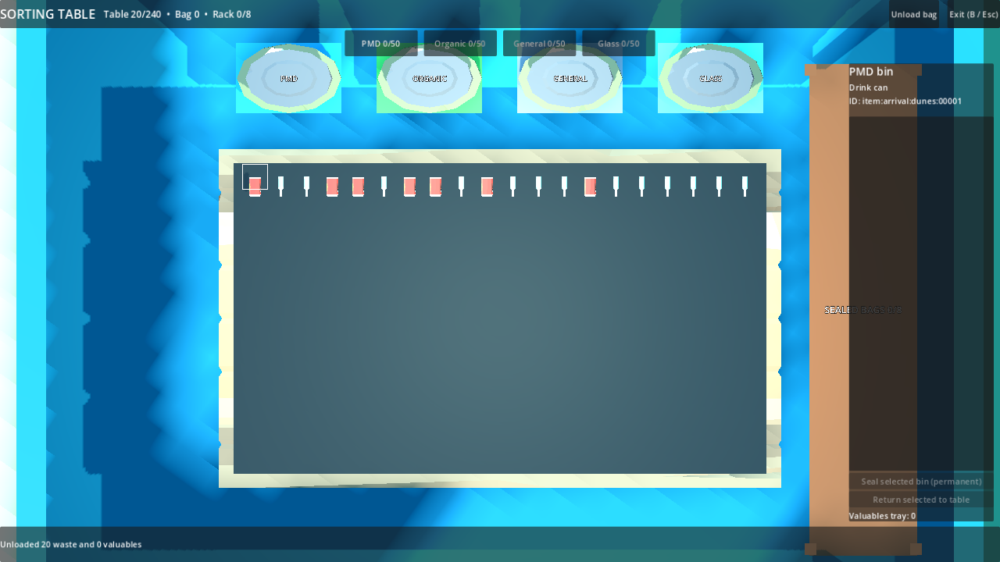

# P12 — Physical sorting table and bird's-eye interaction

Status: implemented and exercised in the playable full beach on 22 September 2026. A human-held controller pass remains part of the later manual input gate.

## State and identities

Each of the three authored service huts now has a physical table, open-top category bins and an overhead camera. Station IDs are `sorting:S1`–`sorting:S3`. A station owns 240 stable row-major cells, `cell:000`–`cell:239` (20 columns × 12 rows), in `RunState.table_records[station_id].cells`; its optional-valuable IDs live in `.tray`. Four `bin_records[station_id:category]` hold ordered item IDs and capacity 50 for `pmd`, `organic`, `general` and `glass`. A TABLE record names its station and cell, a BIN record names its bin, and a VALUABLE_TRAY record names its station. Invariant validation cross-checks every list against exactly one item owner. Snapshot rows carry these same stable IDs; UI focus and drag previews are transient.

`try_unload` validates the entire ordered player bag before changing anything. Waste takes first free cells in bag order; valuables go directly to the tray. If the waste count exceeds the free cell count, the bag and table remain unchanged and the message states the shortage. `try_sort` accepts a TABLE item, an unsealed BIN item being corrected, or a real WORLD body descending through a matching open-top bin trigger; all use the same capacity/category transfer. A wrong category is accepted with explicit feedback, not destroyed or paid. `try_unsort` returns one bin item to the first free cell; bin-to-bin correction remains possible with zero free cells. P13 now seals category contents when a bin reaches capacity and the rack has room.

## Controls and presentation

E on the tabletop enters table context: player movement/world actions stop, handheld visuals stow, pointer releases, hut roof hides and the station's overhead camera takes over. Exit restores the exact world camera, hand visibility, movement context, roof and pointer capture. World throw cannot run while the table is open.

- Mouse: click a cell to sort into the selected bin, or drag its temporary name preview to a labelled bin. An invalid drop returns visually and logically to the cell. Click a bin to inspect it, select an item in the list, then click another bin or Return to table.
- Controller/keyboard: D-pad/arrows move cell focus, A/Enter sorts, LB/RB or 1–4 select the destination bin, Y/I toggles bin inspection. In inspection, D-pad chooses an item, A selects it, LB/RB chooses another bin, and A moves it; B returns the selected item to a free cell, backs out of inspection, cancels a transient drag, or exits one level at a time. Mouse wheel/controller triggers zoom; middle drag/right stick pan. Cell focus survives emptied cells and reentry.
- Each occupied cell renders a scaled copy of its item art, or a category-coloured cube where the asset is still a placeholder. The side panel displays the selected item's name and stable ID. Physical bins have labelled coloured open tops and collision walls; side approaches cannot bypass the opening.

## Playable evidence

Setup: a full generated `sorting-fixture` beach run with its real `RunSession`, three service huts, player, `ItemStore`, world physics and item views. The validation selects existing manifest waste IDs and collects them through `ItemStore`; the buried optional valuable is granted directly to the test bag because detector revelation belongs to P17.

Actions and observed results: aimed at S1's real tabletop and pressed E; unloaded 20 then 180 waste and saw 20 then 200 stable occupied cells. Tried 41 bag items with only 40 cells left; rejection preserved the ordered bag. Sorted a wrong item, corrected directly between bins and returned it to a cell. D-pad focus plus A sorted a cell; inspection plus bin cycling corrected it without mouse input. Mouse drag sorted another item; B cancelled an in-flight drag before a second B exited. Reentry preserved every committed item and focus. A downward WORLD throw entered the glass opening, while a side throw bounced off the bin wall and remained WORLD. Filled all 240 cells, rejected unsort with no free cell, but corrected bin-to-bin anyway. A directly granted optional valuable moved to the tray despite a full waste table. With P13 active, the fiftieth item sealed into a rack bag and the next deposit entered the newly empty bin; full-rack rejection is covered in P13. No money or required denominator changed; ownership validation passed.

Commands:

```powershell
$beachGodot = 'C:\Users\Home\Downloads\Godot_v4.6.1-stable_mono_win64\Godot_v4.6.1-stable_mono_win64_console.exe'
& $beachGodot --headless --path 'C:\Users\Home\Documents\beach' --script res://tests/validate_sorting.gd
& $beachGodot --path 'C:\Users\Home\Documents\beach' --resolution 1280x720 --script res://tests/validate_sorting.gd -- --capture
& $beachGodot --headless --path 'C:\Users\Home\Documents\beach' --script res://tests/run_checks.gd
```

Observed `P12_TABLE cells=20->200->240 unload=atomic sort=wrong/correct controller=sort/correct mouse=drag catch=physical bin=50->sealed tray=valuable failures=0` in headless and visible runs, plus the P04/P05/P08/P09/P10/P11 regression passes and `PASS: boot, asset_closure, ownership, input_bindings, manifest`.




## Follow-ups

P13 now seals category bins into transportable bags and provides the output rack. P14 pays by the final category at collection, not at sorting. P17 reveals buried valuables and sells tray contents. P24 restores station records from on-disk saves; P27/P29 should perform a human-held controller pass and tune 1280×720 text/zoom if needed. No approved requirement changed.
