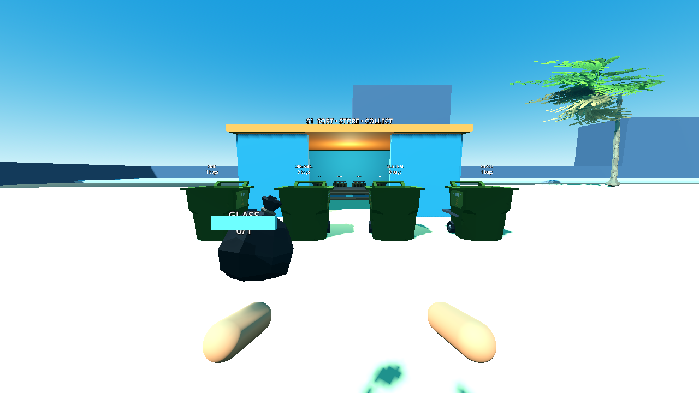
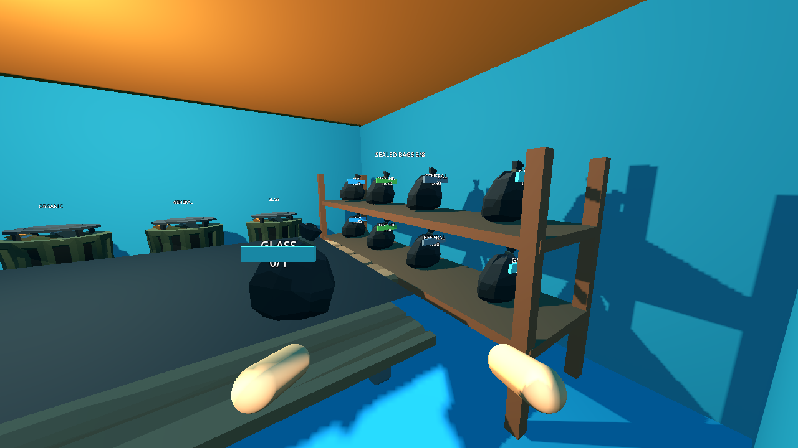
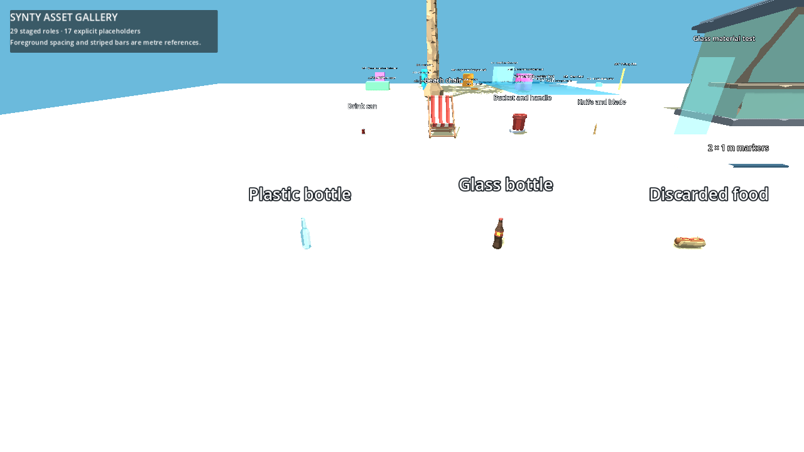
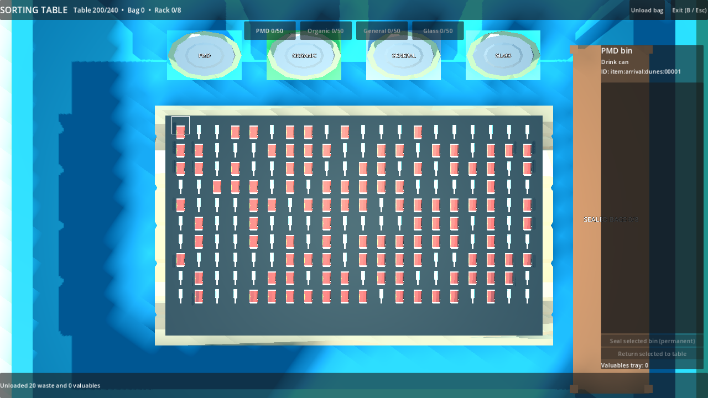

# P13 — Sealed disposal bags and large containers

Status: implemented and exercised in the playable full beach on 22 September 2026. This is the pause point before P14 collection/payments.

## State and lifecycle

Each of the three service stations has an eight-position output rack and four large category containers. A category bin holds at most 50 original item IDs. Its fiftieth deposit seals automatically when a rack position is free; a full rack leaves the full bin untouched and rejects item 51. Removing a rack bag immediately retries waiting full bins in PMD, organic, general, glass order. A bin corrected down to 49 no longer auto-seals. The sorting UI also exposes a permanent manual Seal action for any nonempty bin; empty-bin and full-rack attempts change nothing.

Sealing creates a monotonic run-local ID such as `bag:000003`. `RunState.bag_records[bag_id]` stores declared category, immutable ordered `item_ids`, frozen `correct_count`, source `station_id`, location, rack slot/holder/container ownership and world pose/velocities. Every contained item moves from BIN to SEALED with that bag ID as owner; it is never replaced by a generic count. Bags move RACK → HELD → WORLD or CONTAINER, with pre-collection CONTAINER → HELD allowed. Bag views are created or removed from those records and do not own the contents. `RunState.validate_invariants` cross-checks sealed items, rack slots, hands, world bags and container membership; snapshots retain bag IDs and ownership. Transport does not pay or complete required items.

Bag visuals use declared-category colour, label and frozen correct/total count. Each bag costs one hand unit; two can be held and world throw is LIFO. A WORLD bag persists its physics pose and recovers in bounds with the same ID and sealed contents after falling out. A matching container accepts a carried bag by interaction or a real descending bag through its open top. Mismatch rejection leaves the bag where it was. Containers retain unbounded logical bag lists while showing a capped fill height, and their top bag remains retrievable until P14 collects it. Sealed contents cannot be reopened or corrected; the UI says sealing is permanent before the player presses Seal.

## Playable evidence

Setup: the generated `sealing-fixture` beach, its real S1 sorting station, player, `ItemStore`, bag/physics views and category containers. The check collects its first two existing manifest items through the ordinary item-store and table-unload path. To exercise rack saturation without hundreds of repetitive pickups, it stages further existing WORLD waste IDs directly into free table cells, then runs every sort/seal/transport/container transition through the live components.

Actions and observed results: pressed the table's visible Seal button on a one-item bin and confirmed the source item became SEALED in a physical labelled rack bag. Empty manual seal failed. Sealed a second category, held both bags, threw the top bag, recovered it after an out-of-bounds fall, rejected a wrong container, deposited and retrieved it from the matching container, then threw it through that container's physical opening. Four 50-item deposits auto-sealed, then four more filled all eight rack positions. Two further bins reached 50 and waited without loss; item 51 and a partial manual seal were rejected. Taking one rack bag immediately sealed only the first waiting bin; correcting the other to 49 prevented an automatic seal on the next slot release. A 49-item manual seal succeeded. All item IDs had unique owners, snapshot round-trip passed, required total stayed 5700 and wallet stayed $0.

Representative P14/P24 handoff record from the live run: `bag:000003`, declared `pmd`, 50 item IDs, `correct_count=50`, location `RACK`. P14 must compute pay from the authoritative item definitions and final declared category at collection, not from a caller-supplied total or the bag visual; this record alone is not eligible while still on the rack.

Commands:

```powershell
$beachGodot = 'C:\Users\Home\Downloads\Godot_v4.6.1-stable_mono_win64\Godot_v4.6.1-stable_mono_win64_console.exe'
& $beachGodot --headless --path 'C:\Users\Home\Documents\beach' --script res://tests/validate_sealing.gd
& $beachGodot --path 'C:\Users\Home\Documents\beach' --resolution 1280x720 --script res://tests/validate_sealing.gd -- --capture
& $beachGodot --headless --path 'C:\Users\Home\Documents\beach' --script res://tests/run_checks.gd
```

Observed `P13_SEAL manual=1+49 auto=8 rack=8 waiting=ordered bags=held/world/container/recovered failures=0` in headless and visible runs, `P13_BAG_SAMPLE id=bag:000003 category=pmd total=50 correct=50 location=RACK`, the P05/P07/P08/P09/P10/P11/P12 regression passes and `PASS: boot, asset_closure, ownership, input_bindings, manifest`.





## Post-packet Synty correction

The first asset pass had staged only eight sample wrappers and left clear matches on fallback cubes. The subsequent pass expanded `data/asset_manifest.json` to 29 staged roles and connected 21 of 28 item definitions to Synty visuals. In particular, `SM_Prop_Drink_Bottle_01` now renders glass litter; the other bottle variant is tinted pale blue for plastic litter. The same item visual path is used for world items, carried props and sorting proxies. The table, bin, large-container, sealed-bag and empty carried-bag shells now use staged Synty meshes. Sorting proxies lay tall bottles/cans flat and scale them to their cells; the Synty table has a dark project-owned sorting mat for contrast. Existing gameplay collision, item IDs and category rules were not changed.

Setup/actions/observed: staged the declared asset closure, opened the existing asset gallery to inspect both bottle variants, and exercised the full beach's 20- and 200-item sorting table and eight-bag rack in visible Godot runs. Bottles are recognisable meshes, the table displays individual Synty item proxies, and the rack/containers are no longer blocks. The visible P12/P13 runs, P07/P09/P10/P11 regressions and `run_checks.gd` all passed. The new staged closure is `73717663be82a8d7554b9b935a1fee22a151eb19823878861a48d919e7f839cd`; the current generator fixture content/manifest hashes are `0f2d88a5fc21ca16aea68f86694c99b49da22d86cc5b588e71b24c353545a76b` / `d98074d30c2c6a1c5df52d54a966203c5c4e101dd9aa3923d882333946bf0074`. The P07 full-layout headless recheck remained within its measured frame budget but rose from about 6.8 to 16.5 seconds for synchronous view building, with 10,455 meshes and 642.6 MB reported memory; P28 batching/staged startup is now a clear follow-up, not a reason to revert the visible art.





## Follow-ups

P14 adds the explicit collection transaction and receipt; it must consume only deposited bags and pay once. P24 persists and restores the existing bag/container records. A post-P13 asset pass replaced the visible bag, bin, large-container and table cubes with staged Synty meshes while preserving the project-owned physics openings and hitboxes; A18 is closed. First-person hands and the large hut/world construction still need art work (A17/P25). A human-held controller pass remains for P27/P29. No approved requirement changed.
