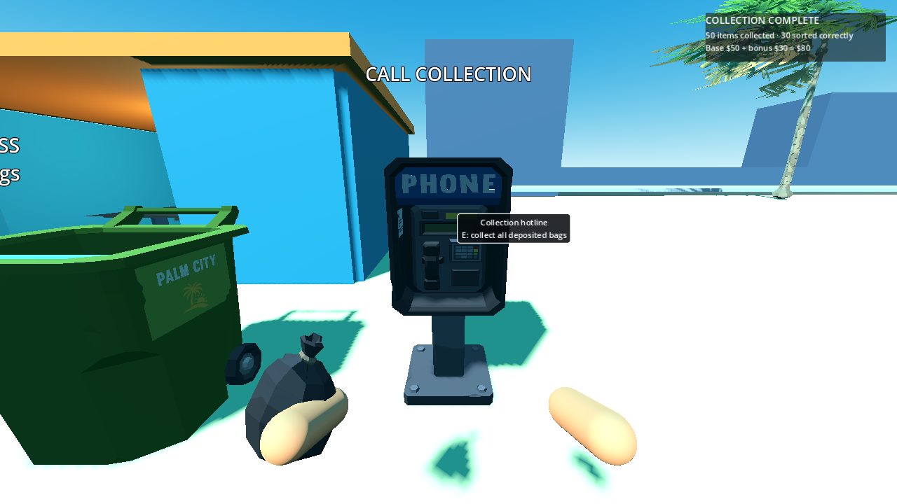

# P14 — Collection call and exact payouts

Status: implemented and exercised in the playable full beach on 22 September 2026.

Each of the three service stations has a clearly labelled Synty payphone (`SM_Prop_Pay_Phone_01`) that is an E interaction target. A call collects deposited bags from **all** station containers, not only the phone's own station. Empty calls show “Nothing to collect” without a revision or save request. Rack, world and held bags remain ineligible. The phone and its caption are visible in the normal first-person scene; the collection receipt animates away after three seconds, while collection itself completes synchronously.

`CollectionService.try_collect_containers(player_id)` sorts container IDs, validates each eligible bag and every original sealed item ID against authoritative owner/category/definition data, then checks run ownership invariants before mutation. Any invalid reference refuses the entire batch and logs a developer diagnostic. A successful call assigns `collection:000001`, moves the waste records to COLLECTED, marks each bag COLLECTED with `collection_receipt_id`, removes its container reference, credits `N+C` integer dollars once, appends a durable receipt and passes changed IDs/bags plus wallet owner to `RunSession.finalize_action`. That single boundary increments revision and requests save after all payment state is committed. The receipt records player, bag/item IDs, item count, correct count, base/bonus/total pay, home-section counts and revision. Original `home_section_id` stays on every collected item. A repeated call has no eligible bag and cannot pay again. P20 will compute progress/restoration in this same finalization boundary before publication; P24 will make the existing save request persistent.

Playable setup: generated `payment-fixture` full beach, real S1 sorting station and PMD container, player and E-targeted payphone. Fifty existing manifest waste IDs from two home sections were staged into the station's real table, sorted via `try_sort` as 30 correct PMD and 20 incorrect PMD, auto-sealed by item 50, carried through hands and deposited into the physical Synty container. Deposit left money at $0. E on the phone produced a receipt of 50 items, 30 correct, $50 base + $30 bonus = **$80**, wallet $80, 50 terminal COLLECTED records and an empty container. The first `items_changed` listener snapshot already held the complete receipt/payment; `save_requested` saw the committed revision. The receipt UI showed $80. A second E call showed “Nothing to collect” with no money/revision change. Run invariants and snapshot round-trip remained valid. Visible run and headless run both printed `P14_PAYMENT count=50 correct=30 base=50 bonus=30 total=80 collected=50 sections=2 failures=0`; `tests/run_checks.gd` passed boot, staged-asset closure, ownership, inputs and manifest.

Commands:

```powershell
$beachGodot = 'C:\Users\Home\Downloads\Godot_v4.6.1-stable_mono_win64\Godot_v4.6.1-stable_mono_win64_console.exe'
& $beachGodot --headless --path 'C:\Users\Home\Documents\beach' --script res://tests/validate_payment.gd
& $beachGodot --path 'C:\Users\Home\Documents\beach' --resolution 1280x720 --script res://tests/validate_payment.gd -- --capture
& $beachGodot --headless --path 'C:\Users\Home\Documents\beach' --script res://tests/run_checks.gd
```



Next: P15 connects earnings to shop tools and booklet skills. P20 owns completion/restoration publication; P24 owns on-disk save/restore. No truck AI was added because the approved packet calls for a brief event only.
