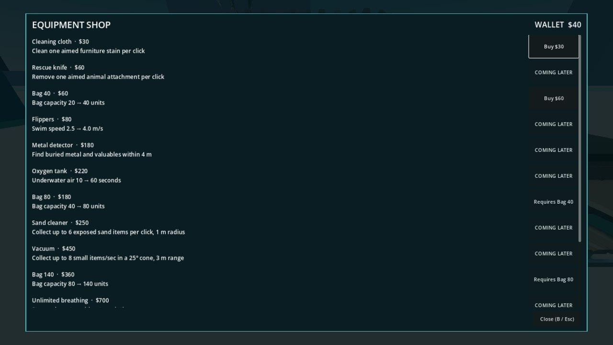
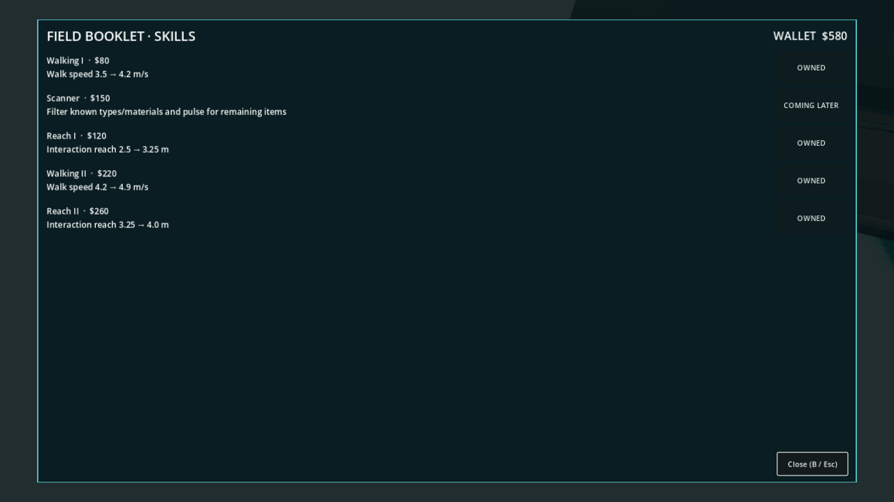

# P15 — Shop, owned equipment and booklet skills

Status: implemented and exercised in the playable full beach on 22 September 2026.

The three-station beach now includes a physical equipment shop near S2: a staged Synty `SM_Prop_Counter_02` purchase counter and a separate Synty table used as the owned-tool rack. The shop building itself was already staged from the supplied pack. E at the counter opens purchases; E at the rack opens the two-slot loadout. Tab/View opens the booklet anywhere. These screens pause the singleplayer world and air timer, show wallet/price/effect/prerequisite or “COMING LATER,” expose focusable controller buttons, and restore world input on close. Purchased handhelds appear with labels at the rack, remain owned when replaced, and can be re-equipped without cost. World tool switching alternates only the two equipped slots. The permanent bag is separate.

Nineteen Resource offers reproduce the initial $5,300 price table in `data/tools` and `data/upgrades`. Prices and exact effects live in Resources, not UI arithmetic. `ProgressionService.try_purchase` validates source, physical shop proximity, implementation availability, prerequisite, ownership and wallet before one money/ownership mutation and `RunSession.finalize_action`. `try_equip` validates owned handheld, rack proximity, available slot, duplicate slot and carried-object state. Bag capacity, walk speed, reach and swim speed are recalculated from base values and saved ownership/levels, not multiplied on each load. Cloth is functional now. Knife, detector, flippers/tank, scanner, sand cleaner and vacuum are listed with correct future prices/effects but cannot be bought until their gameplay packets work; a player cannot spend money on an inert advertised tool. P16–P23 will enable them as they are implemented. The missing cloth model remains the approved marked fallback; counter, rack, knife model and surrounding shop are Synty assets.

Playable setup/actions/observed: generated `purchases-fixture` full beach and real S1 table/container/collection, S2 shop counter/rack, player and dirty furniture. A $0 attempt to buy cloth displayed “Need $30 more” and changed nothing. Twenty existing starter PMD IDs went through `ItemStore.try_collect`, the full 20-unit bag, table sorting, a manually sealed partial bag, physical deposit and P14 collection for $40. The visible shop Buy spent $30 once, leaving $10 and a rack cloth; a duplicate purchase spent nothing. E at the rack equipped cloth beside the stick, world switch toggled slots, and LMB with cloth cleaned one aimed chair stain in the full beach. Purchase attempts out of shop range and before prerequisites were rejected. A fixture wallet top-up then exercised Bag 40→80, Walking I→II, Reach I→II, explicit replacement of a full two-slot loadout and save-snapshot recomputation. The saved purchase set reproduced 80 capacity, 4.9 m/s walk and 4.0 m reach without stacking. Live visible and headless runs printed `P15_PURCHASE earned=40 cloth=30 bag=80 walk=4.9 reach=4.0 clean=true offers=19 failures=0`.

Commands:

```powershell
$beachGodot = 'C:\Users\Home\Downloads\Godot_v4.6.1-stable_mono_win64\Godot_v4.6.1-stable_mono_win64_console.exe'
& $beachGodot --headless --path 'C:\Users\Home\Documents\beach' --script res://tests/validate_purchases.gd
& $beachGodot --path 'C:\Users\Home\Documents\beach' --resolution 1280x720 --script res://tests/validate_purchases.gd -- --capture
```





P16 subsequently implemented and enabled sand cleaner/vacuum at their listed prices; the “COMING LATER” screenshot above records the state at the P15 boundary, before that unlock.

Next: P17 detector; P18 passive swim gear; P19 rescue knife; P23 scanner. P22 polishes the complete HUD/menu theme and responsive scale, while P24 persists the existing purchase records.
