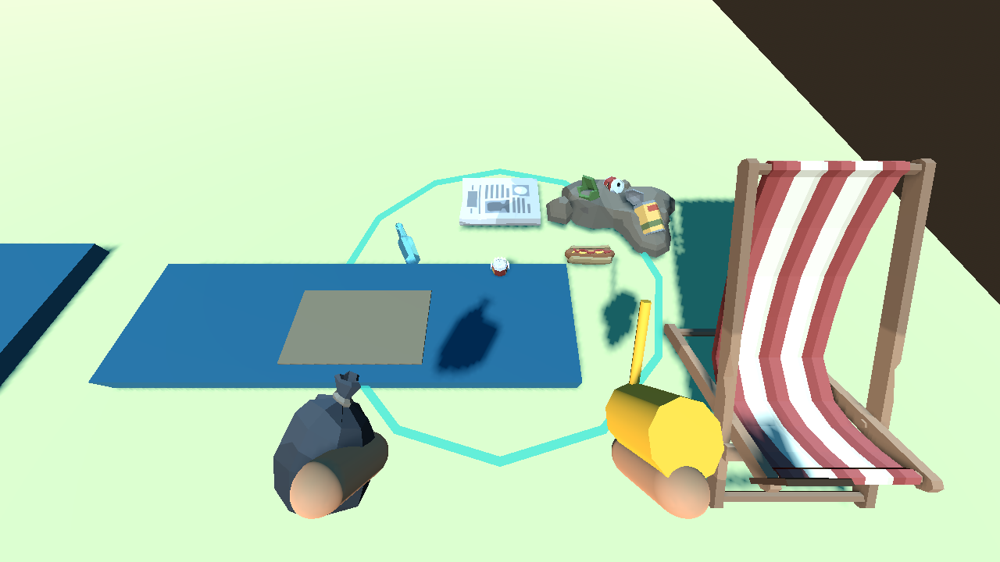
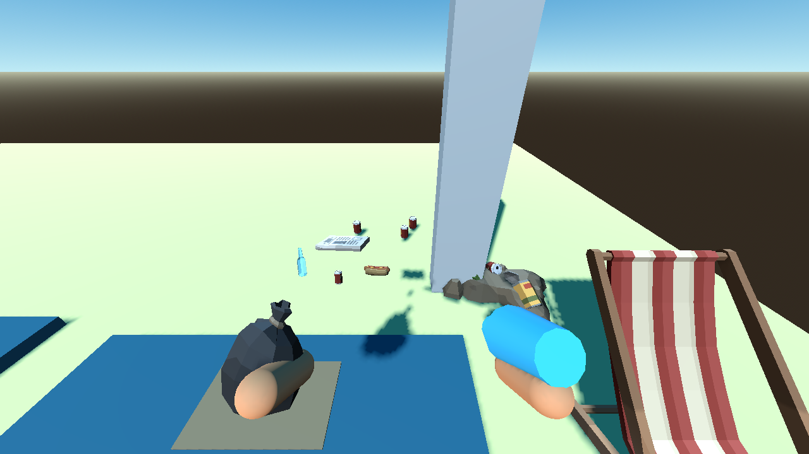

# P16 — Sand cleaner and vacuum

Status: implemented and exercised in the existing playable placement lab on 22 September 2026; P15 full-beach purchase regression also passes with both tools enabled.

The sand cleaner is a fresh-click-only ground tool. It rays to a tagged sand surface within its 2.5 m reach, shows a cyan radius ring, queries nearby real physics bodies, and collects at most six exposed small/flat/floating waste IDs within 1.0 m and free bag capacity. It rejects hidden, attached, large, valuable, reusable, cloth-only residue and obscured targets. Invalid surface and full bag give explicit feedback. Sand cleaner II reads its tuned Resource values of 12 items and 1.5 m radius.

The vacuum processes the held primary input at the Resource's 0.125 s interval (8 items/sec), choosing the closest visible eligible small waste in a 25° forward cone within 3 m. Release, menu pause, tool change, carried-object mode and full bag stop it; a full bag cannot continue silently. Vacuum II reads 16 items/sec and 4 m range from its Resource. Neither tool adds fuel, battery, durability or a separate bag. `CleanupTargetQuery` performs bounded physics-shape queries, deterministic distance/ID ordering and camera-to-item occlusion checks; there is no per-item scanning process. Each accepted pickup goes through `ItemStore.try_collect`, then the shared `PlayerCarry.present_collected` visual path. Presentation is capped at 12 concurrent trails, and reduced-motion removes the travel animation without changing ownership. The normal stick remains edge-triggered.

Both tools are now functional $250/$450 offers at the physical shop; their upgraded values are Resource-owned. The supplied Synty pack has no matching cleaner/vacuum mesh, so the handheld shapes are visibly provisional low-poly drums/nozzles rather than substituting unrelated weapons. Synty litter, props and shop/rack remain in use. A07 in the asset request register remains open.

Playable setup: reused `tests/scenes/placement_lab.tscn` with a real player, ItemStore, ItemViewManager, ToolDefinition Resources, equipment state and Synty item views. The sand patch included four collectible waste forms (can, plastic bottle, food scrap, paper), a nearby valuable, dirty chair, large scrap, residue, hidden buried waste and attached rescue waste. With one free bag unit, a click collected only the nearest original ID; expanding capacity and clicking again collected exactly the other three. A second click with the full bag neither duplicated the animating item nor changed ownership. The test then added three visible cone items, a target behind a real collision wall and one behind the player. A manual vacuum tick took the nearest; holding primary collected the next two over successive rate-limited ticks, stopped at capacity, and left the blocked/behind IDs in WORLD. Release stopped all further pickup. The 12/1.5 and 16/sec/4.0 upgrades were checked from the live progression Resources, and `RunState.validate_invariants` passed. The visible and headless runs printed `P16_TOOL_FILTERS sand=s1+s2+s3+s4 vacuum=v1+v2+v3 blocked=wall/behind capacity=held upgrades=12/16 failures=0`. P15's full-beach collect/pay/shop/cloth loop passed after the tool unlocks and bought both new offers at their exact prices; P14 payment and P11 dirt regressions also passed.

Commands:

```powershell
$beachGodot = 'C:\Users\Home\Downloads\Godot_v4.6.1-stable_mono_win64\Godot_v4.6.1-stable_mono_win64_console.exe'
& $beachGodot --headless --path 'C:\Users\Home\Documents\beach' --script res://tests/validate_tool_filters.gd
& $beachGodot --path 'C:\Users\Home\Documents\beach' --resolution 1280x720 --script res://tests/validate_tool_filters.gd -- --capture
& $beachGodot --headless --path 'C:\Users\Home\Documents\beach' --script res://tests/validate_purchases.gd
```





Next: P17 detector/revelation of buried original waste and valuables. The placeholder cleaner/vacuum handheld meshes should be replaced only if suitable art is supplied or authored under P25.
