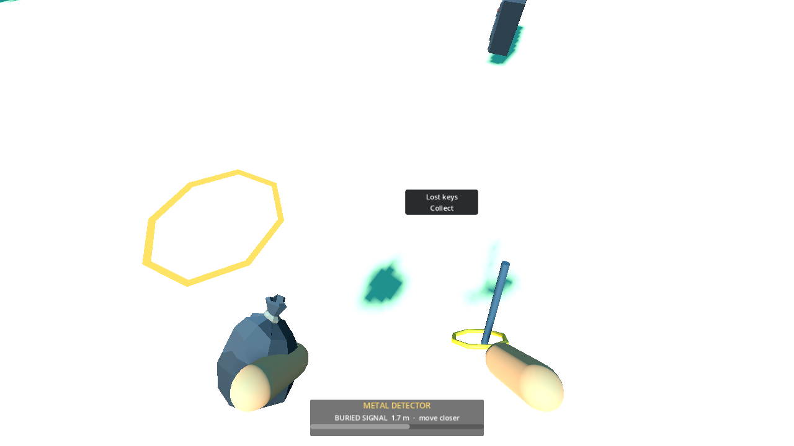
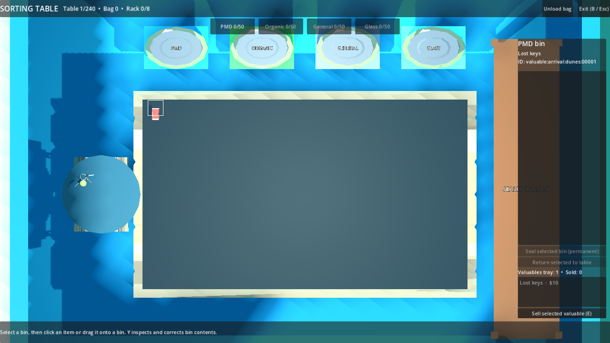

# P17 — Detector, buried finds and valuables

Status: implemented and exercised in the playable full beach on 23 September 2026. No user input required to proceed to P18.

The $180 detector is now purchasable at the physical Synty shop and equipable at its rack. Held detector art is a deliberately provisional coil/shaft because the supplied pack contains no detector model (asset request A08). With the tool active, the HUD shows the nearest buried signal within 4 m and its strength/distance; a pulsing amber ring marks the actual sand or seabed surface. LMB within 1.5 m while aiming at that surface uncovers the original manifest ID. A wall/rock between camera and dig point blocks the action; the covering terrain is accepted. Revealed items lift visually unless reduced motion is enabled. No item type, price or pose is rolled at click time.

The generator's fixed buried `reveal_position_mm` now enters `ItemRecord` and the snapshot as a dig-surface and reveal pose. On run start, all 340 buried records are matched to tagged physical sand/seabed and checked for a clear pose. All 340 passed in the full-beach fixture. Buried views stay absent from `ItemViewManager` and cannot be collected before revelation. Buried PMD metal packaging uses the staged Synty drink can; buried general scrap now uses the supplied damaged Synty spray can instead of a square fallback. Lost keys use the supplied Synty keys model.

Revealed waste takes the normal bag→table→bin route. Collected optional keys enter the valuable bag and `optional_finds` once, not the 5,700 required denominator. Unloading places keys on a physical round tray supported by a Synty side table, plus an identified, priced list in the station UI. The focusable Sell action makes one validated transition from tray to SOLD, credits the authored $10 value and records a sale receipt in the same state revision. A second sale is rejected. Throwing before sale preserves the key's ID and value; recovery from outside world bounds also preserves it. Snapshot fields include hidden/revealed poses, bagged valuables and sale receipts.

Playable setup/actions/observed: generated the `buried-fixture` full beach twice and observed identical content/manifest hashes and all 340 fixed buried rows. Started the full beach with real player, physics, shop, S1 station, item views and UI. Hidden waste had no view and refused collection or unowned revelation. A fixture wallet of $180 purchased the detector at the physical counter; it was equipped at the rack. At a reachable dune surface, a real collision wall blocked digging without mutation; removing it revealed the same waste ID and a second reveal failed. The waste was bagged/unloaded normally. A valuable was revealed, collected, thrown, recovered and collected again with the same ID/$10 value; the Synty key appeared on the station tray, and UI Sell paid exactly once. Another valuable remained bagged and a third waste remained revealed in WORLD, so the snapshot round-trip covered hidden, revealed, bagged and sold states. `RunState.validate_invariants` passed for both live and restored state. A separate detector-click pass exercised the player tool flow. Visible and headless runs printed `P17_BURIED waste=item:arrival:dunes:00049 valuable=valuable:arrival:dunes:00001 sold=1 required=5700 failures=0`.

Regression commands and results:

```powershell
$beachGodot = 'C:\Users\Home\Downloads\Godot_v4.6.1-stable_mono_win64\Godot_v4.6.1-stable_mono_win64_console.exe'
& $beachGodot --headless --path 'C:\Users\Home\Documents\beach' --script res://tests/validate_buried.gd
& $beachGodot --path 'C:\Users\Home\Documents\beach' --resolution 1280x720 --script res://tests/validate_buried.gd -- --capture
& $beachGodot --headless --path 'C:\Users\Home\Documents\beach' --script res://tests/validate_tool_filters.gd
& $beachGodot --headless --path 'C:\Users\Home\Documents\beach' --script res://tests/validate_payment.gd
& $beachGodot --headless --path 'C:\Users\Home\Documents\beach' --script res://tests/validate_sealing.gd
& $beachGodot --headless --path 'C:\Users\Home\Documents\beach' --script res://tests/run_checks.gd
```

P16, P14 and P13 passes remained green. The broader boot/asset/ownership/input/manifest check passed after updating the pinned content hash for the new Synty scrap visual and guarding a repeated-run UI signal connection.





Next: P18 swimming and oxygen/faint recovery. P22 will refine HUD scale/contrast and P25 water/sand art; the current pale beach screenshot is not final art.
