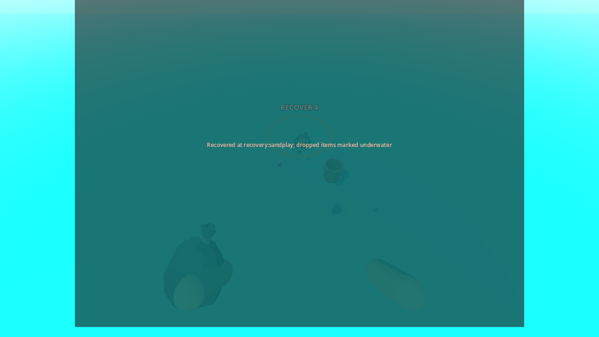

# P18 — Swimming, oxygen and recoverable faint drops

Status: implemented and exercised in the playable full beach on 23 September 2026.

The existing water area is now an authored `WaterVolume` scene with a stable 0.08 m gameplay surface, seabed convention, bounded footprint and 0.55 m swim-depth threshold. Feet at shallow shore depth wade; deeper feet use the existing swim movement, with Jump rising and Crouch diving. Camera depth, not a visual wave crest, controls breath. A 0.20 m entry/exit hysteresis avoids flicker near the surface. Starter air lasts 10 seconds underwater, the $220 tank raises this to 60 seconds, and the $700 tank-dependent upgrade makes breathing unlimited. The $80 flippers raise swim speed from 2.5 to 4.0 m/s. These three physical-shop offers are now enabled. They have no suitable supplied Synty wearable models yet (asset request A09); their actual gameplay effects are active. After one continuous second above the surface, air refills; a dive interrupts that timer. Pause and booklet freeze air. A legible oxygen panel appears in water or until refill and warns at 3 seconds.

At zero air, `SwimService` validates live ownership and constructs safe underwater poses before touching state. A brief blackout covers one commit that empties the loose trash/valuable bag and hands, makes those exact item IDs WORLD, turns a carried sealed disposal bag into a WORLD bag without changing its SEALED contents, creates a recovery pile record and marker, and moves the player to the nearest clear authored dry anchor with air restored. Tools, upgrades, money, discoveries, dirt and home IDs are retained. A recovering guard prevents a second faint during the fade. `RunState.recovery_piles` and its next serial are in snapshots. Item/bag pickups prune old pile membership before the same save revision, so an ID recovered and dropped in a later faint belongs only to the new pile; an empty marker disappears. Active loose items use their existing native rigid-body buoyancy/sink behavior and world-bound recovery. A full 200-small-item spill plus a large prop found distinct clear poses even near the water boundary.

Playable setup/actions/observed: generated `faint-fixture` full beach with real water, player, S1 station, Synty cans/bucket, disposal bag, item views, shop and UI. At the shoreline, standing/crouching remained wading; underwater feet entered swim and consumed air; Jump/Crouch moved vertically. Camera motion through the surface hysteresis band did not flicker. A brief interrupted surfacing did not refill; one continuous above-water second did. Pause and booklet held a 0.4-second air balance unchanged. Two original PMD cans were sorted/sealed into a partial bag, then the player held that bag and a Synty bucket while carrying two more loose cans. With air exhausted underwater, one faint dropped exactly the two cans, bucket and sealed bag into `recovery:000001`, preserved the two SEALED contents, kept wallet/equipment, selected `recovery:sandplay`, restored 10 seconds of air and showed the marker. A repeated request could not drop again. After buying flippers and tank at the physical shop, the player recovered one original can, saw it removed from pile 1, then an automatic zero-air faint put it in pile 2 and restored 60 seconds. A concurrent request during fade was rejected. The tank-dependent unlimited upgrade allowed a long underwater step without finite air loss. Live and snapshot invariants passed with distinct piles and a 5,700 required denominator. Visible and headless runs printed `P18_FAINT drops=3+bag piles=2 air=10/60/infinite money=0 required=5700 failures=0`.

Commands:

```powershell
$beachGodot = 'C:\Users\Home\Downloads\Godot_v4.6.1-stable_mono_win64\Godot_v4.6.1-stable_mono_win64_console.exe'
& $beachGodot --headless --path 'C:\Users\Home\Documents\beach' --script res://tests/validate_faint.gd
& $beachGodot --path 'C:\Users\Home\Documents\beach' --resolution 1280x720 --script res://tests/validate_faint.gd -- --capture
```

P17 buried finds, P16 cleanup filters, P14 payment, P13 sealing and the broader boot/asset/ownership/input/manifest checks passed after integration.



Next: P19 rescue knife, then P20 completion/progress. Final ocean/sand rendering and wearable art remain P25 work; the recovery screenshot reflects the current prototype water look.
