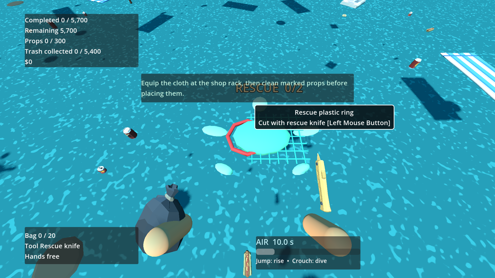
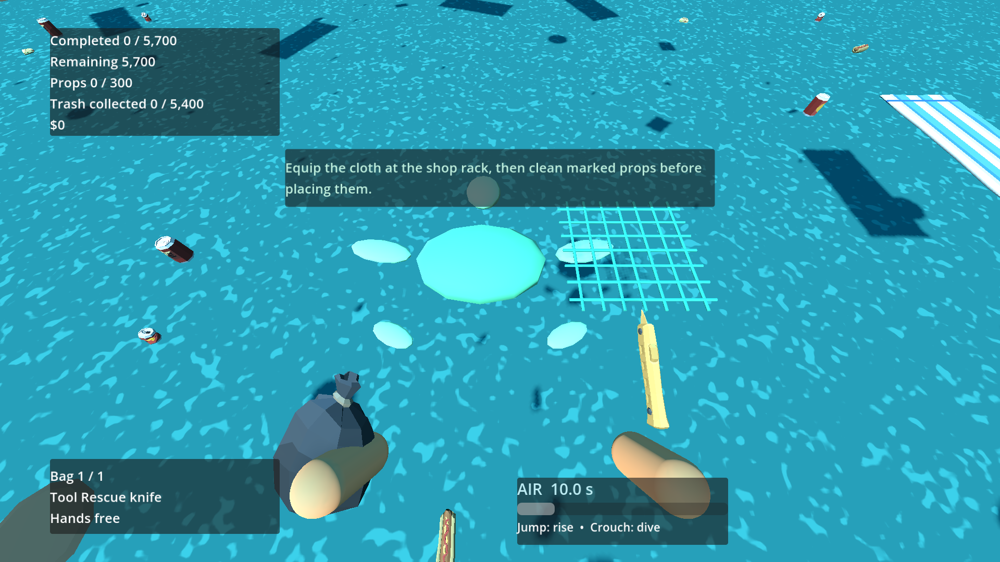

# P19 — Safe animal rescues

Status: implemented and exercised in the playable full beach on 23 September 2026.

The manifest now selects 24 existing required waste rows as 12 two-piece rescue sites: two sites each in `pier:moorings`, `shallows:west`, `shallows:east`, `reef_west:outer`, and `reef_west:coral`, plus one each in `reef_east:outer` and `reef_east:coral`. Both pieces of a site are in the same home section and within 0.35 m. Site IDs are `rescue:01` through `rescue:12`; attachment IDs are `rescue:NN/piece:1` and `rescue:NN/piece:2`, stored on original item records. The animals are not objectives and the combined required count remains 5,700. The P19 content-version change intentionally re-seeded fixture layouts; its new content, manifest and Unicode stream hashes are pinned in `run_checks.gd`.

The $60 knife is the supplied Synty model, bought at the physical shop and equipped at its rack. Primary action requires that knife, its original ATTACHED ID, close range and a clear camera ray to the attachment; rock/wall occlusion rejects it. First and second cuts each detach precisely one ID. A free bag slot takes the piece into the ordinary waste bag and discovers its definition; a full bag drops it nearby as a physics object instead of preventing the rescue. The final cut latches `rescue_states[site].released` and starts the animal's authored looping local route. Save snapshots retain the latch and original attachment IDs; returning or reloading does not re-entangle detached waste. Truck collection of both IDs, not merely freeing the animal, remains necessary for the home-section cleanup objective in P20.

Playable setup/actions/observed: generated `rescue-fixture` twice and loaded the full beach with player, water, world collision, shop, 12 rescue-site scenes, sorting station and truck service. All 12 sites were above terrain inside swimmable water; both attachments of every site were aimable. An unowned knife, an eight-metre click and a collision wall each rejected a cut without changing state. The $60 Synty knife, $80 flippers and $220 oxygen tank were purchased at the shop; the knife was equipped at the rack. The first cut bagged a ring without freeing the animal. With bag capacity set to one, the second cut dropped its net nearby and freed the animal exactly once; repeating the cut did nothing. The other 22 attachments were cut at their real sites, and all 12 animals latched as freed. A snapshot round-trip preserved all 12 latches and domain invariants. The bagged rescued ring then went through the physical sorting table, correct bin, sealed bag, matching container and truck collection as the *same ID*; required total stayed 5,700. Headless and visible runs passed with `failures=0`. The playable-scene probe is `tests/validate_rescue.gd`.

Commands:

```powershell
$beachGodot = 'C:\Users\Home\Downloads\Godot_v4.6.1-stable_mono_win64\Godot_v4.6.1-stable_mono_win64_console.exe'
& $beachGodot --headless --path 'C:\Users\Home\Documents\beach' --script res://tests/validate_rescue.gd
& $beachGodot --path 'C:\Users\Home\Documents\beach' --resolution 1280x720 --script res://tests/validate_rescue.gd -- --capture
& $beachGodot --headless --path 'C:\Users\Home\Documents\beach' --script res://tests/run_checks.gd
```

P17 buried finds and P18 faint recovery also passed after the manifest change. The animal is a project-owned non-cubic turtle silhouette; the ring and net are project-owned round/grid silhouettes, not verified Synty models. Requests A01 and A11 remain open. The screenshots show this honest interim art and the staged Synty knife. No animal damage or combat system was added.





Next: P20 synchronous progress and restoration. P25 will revisit underwater appearance.
