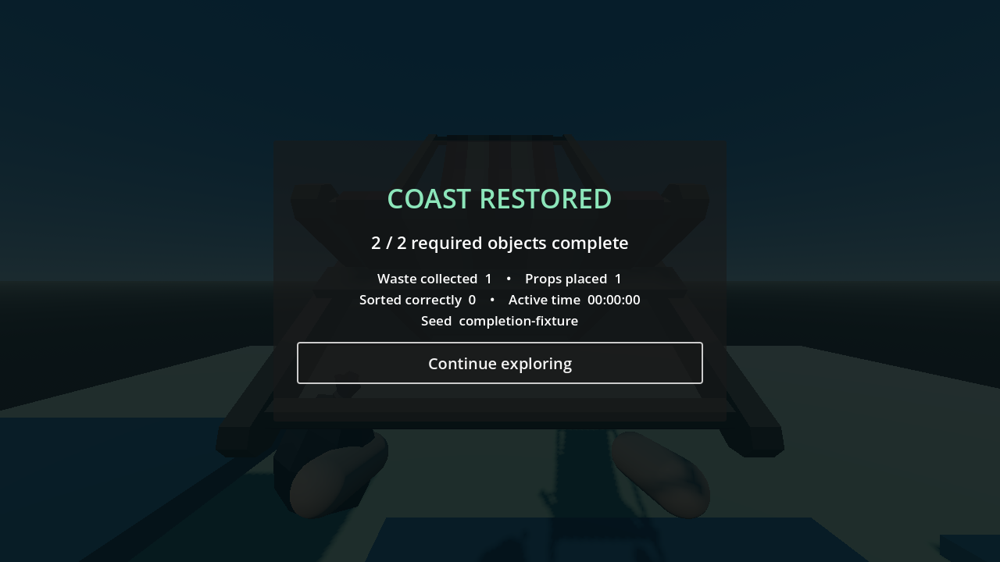
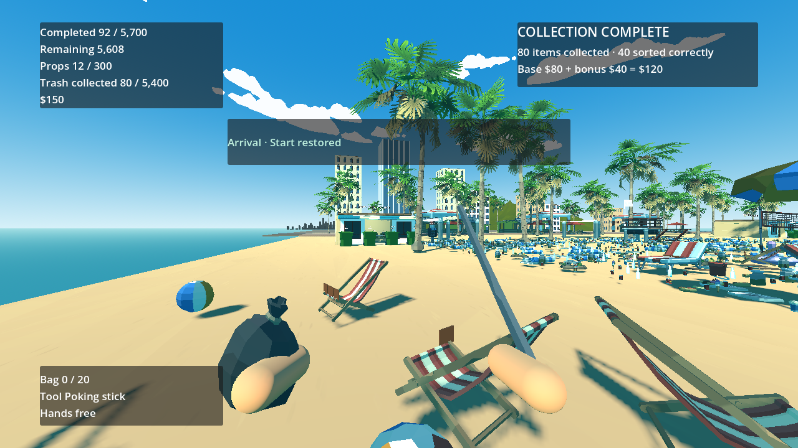

# P20 — Progress, restoration and finishing

Status: implemented and exercised in playable scenes on 23 September 2026. No user input is needed for P21.

`ProgressService` indexes immutable required IDs once by home section, logical prop-family group and zone. Waste counts only at `COLLECTED` (truck collection); props count only when clean and `SLOTTED`, regardless of where their compatible physical slot is. The denominator remains 5,700: 5,400 waste and 300 props. Optional keys, wildlife, tools, bags and individual dirt patches do not enter it. Each `RunSession.finalize_action` now prunes recovery markers, finalizes affected progress and first-time payments/restoration/result in memory, increments revision once, then emits `progress_changed`, `items_changed`, `bags_changed`, `hands_changed`, `wallet_changed`, `group_completed`, `section_restored`, `zone_restored`, `run_completed`, and `save_requested`. Signal listeners therefore see a complete commit in their first snapshot, and actions requested during publication remain deferred.

Each home-section/family group has `required_count`, `current_count`, `complete`, `completion_transitions`, `reward_claimed`, `reward_amount` and `reward_player_id`. A false→true transition emits a group event every time; the first pays exactly $15 and latches the flag before signals. Removing a prop reverses current counts but not its paid flag. `section_states` persist required/complete waste and prop counts, `rescues_released`, `complete` and `restored_once`. A section restores only after all original waste IDs—including rescue attachments—reach truck collection, every prop is clean/slotted, and its animal sites are released. `zone_states` latch after every section in that zone is complete. Later prop removal changes current section/zone completeness but never hides nature or revokes money.

`data/world/restoration_recipes.tres` dispatches the section and zone visual types into the already-authored `BeachSection.restoration_visual_root` nodes. Shore sections and completed shore zones reveal the supplied Synty palm; pier sections/zones use the supplied Synty lifebuoy. Shallows/reef sections reveal project-owned rounded coral clusters, and zone completion reveals a small nonblocking animated fish group. Coral/fish are functional interim art, not falsely labelled Synty; asset requests A02/A04 remain open. Reconstructing the controller from saved `restored_once` flags applies terminal visuals directly, without replaying rewards.

First global completion stores one receipt with run ID, seed, game/content/generator versions, initial manifest hash, finishing revision, active seconds, required/waste/prop counts, correct-sort and collection counts, wallet, owned tools/gear/upgrades and optional-find/sale counts. It is never recomputed after continued roaming. The first result signal opens a focusable paused Results view; Continue resumes the same run. A compact top-left HUD shows combined required progress, props, waste and money; P22 owns final wording, scale and controller/UI polish.

Playable setup/actions/observed: in the existing placement lab, a pre-collected waste ID and one dirty Synty chair were the final two required objects. Dirty placement was rejected; cleaning alone left prop completion at zero. The real slot placement produced exactly one revision: its **first** `progress_changed` snapshot already held the $15 group reward/flag, section and zone `restored_once`, and immutable two-object finish receipt. Results paused the scene; Continue resumed roaming. Removing the chair lowered current group/section/zone completeness without changing nature/receipt/money; re-placement emitted the second group transition but no second payment or receipt. Live and snapshot invariants passed. The actual cloth click path is separately exercised by `validate_dirt.gd`.

In the generated full beach (`restoration-fixture`), the fixture staged the starter section's ten original props into compatible physical slots and its 80 original waste IDs onto the real S1 table, then used the real sorting, 50-item auto-seal plus 30-item partial seal, carry, matching container and truck action. Table/bin/container stages left the section unrestored; the single truck revision raised starter progress to 80 waste + 10 props, revealed its Synty palm and left the wider arrival zone locked until its dunes section is also complete. Domain invariants passed. The screenshot shows the actual Synty palm and 90/5,700 HUD. This is a fast setup fixture, not a human-paced full-run claim.

The P19 manifest re-seed exposed a large Synty bundled-scrap body directly on the authored walking route. Generation now relocates large WORLD objects out of a 1.8 m route corridor within their section, and manifest validation rejects a blocker; the route and clearance rule are included in the content hash. The 13-waypoint controller traversal completed 631.1 m again. Content/manifest/Unicode-stream pins were updated; the new fixed fixture manifest hash is `95667b568d8d3ec7ca8d18aa520f4ecbf1341248e329b05723d1b59c2ca33f32`.

Commands:

```powershell
$beachGodot = 'C:\Users\Home\Downloads\Godot_v4.6.1-stable_mono_win64\Godot_v4.6.1-stable_mono_win64_console.exe'
& $beachGodot --headless --path 'C:\Users\Home\Documents\beach' --script res://tests/validate_completion.gd
& $beachGodot --path 'C:\Users\Home\Documents\beach' --resolution 1280x720 --script res://tests/validate_completion.gd -- --capture
& $beachGodot --headless --path 'C:\Users\Home\Documents\beach' --script res://tests/validate_world_traversal.gd
& $beachGodot --headless --path 'C:\Users\Home\Documents\beach' --script res://tests/run_checks.gd
```

Headless/visible completion, full-beach restoration, 13-waypoint traversal and broad boot/asset/ownership/input/manifest checks all passed. P10 placement, P14 payment, P16 tool filters, P17 buried finds, P18 faint, P19 rescues, P12 sorting, P13 sealing, P15 purchases, P11 dirt, P09 carry, P08 interaction, P04 movement, P07 physics and P05 world checks passed with the new finalization path. The P14 probe confirms that table, sorted/sealed bag and container deposit still leave waste completion at zero; truck collection raises it to 50 across two original home sections. No complete 5,700-object human-paced run or final art performance claim is made here.





Next: P21 returning wildlife and stronger per-section visual change; then P22 final HUD/results clarity and P24 save/load integration. P25 owns the overbright sand/water and final art comparison.
