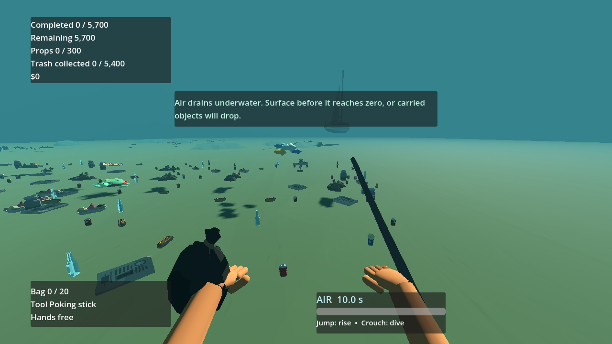
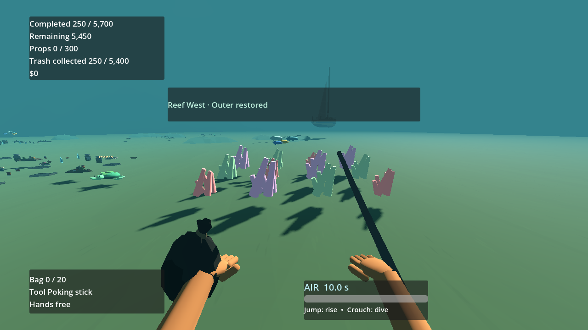
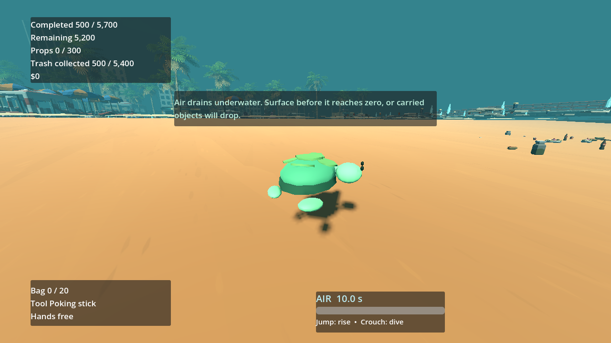

# P21 — Returning wildlife and reef life

Status: implemented and exercised in the playable full beach on 23 September 2026. No user decision is needed to proceed to P22.

The source `Assets/Synty/POLYGON_Palm_City` was searched again for turtle, reef fish, coral, seaweed and starfish names; none is present. The gameplay therefore keeps clearly provisional, non-cubic project-owned silhouettes for A01–A04. The shared turtle scene now serves both the 12 knife-rescue sites and the restoration route, so replacement art has one scene target. Synty palms and lifebuoys from P20 remain the authored shore/pier restoration props. No human visitors or wildlife combat/colliders were added.

Wildlife populations have stable keys and bounded counts: `ambient:reef_west` and `ambient:reef_east` are two four-fish schools present from start; each of shallows, reef west and reef east has two additional four-fish schools named `zone:<zone>:01/02`, visible only after that zone's `restored_once` flag. This caps fish at 32 mesh-based animals (8 ambient + 24 regional) with shared body/tail meshes and four shared color materials, no fish physics. `zone:sandplay:turtle` is one beach-to-water turtle. The 12 rescue turtles remain separate and start their local routes immediately after their last attachment is cut. Fish schools follow local authored loops; all small meshes cull beyond 55 m. Stable keys and signal guards prevent duplicate populations on repeated restoration events or load.

Each shallow/reef section owns a local 12-cluster coral field, two starfish silhouettes and an individually materialized clarity patch, hidden until its own section restores. On first reveal, independent section materials brighten over 1.2 seconds; loading a restored section applies the terminal colors immediately. Unrelated sections retain their dim/hidden state. These are conspicuous interim shapes, not a claim to match the dense reference reef or to resolve A02–A04. P25 still owns the overbright cyan water, underwater contrast, final coral/seaweed geometry and reference comparison.

The designated sandplay-zone turtle starts beside the cove, walks along a short local shore route to the swimmable water, then loops inside the water bounds without disappearing. `PathAnimal` uses a short introduction followed by a bounded loop; reduced-motion skips the introduction but retains the animal. Loading a restored zone starts directly in the water loop rather than replaying the beach flourish. The route ID is `zone:sandplay:turtle`. Both turtle and fish presentation are nonblocking for movement and item rays.

Playable setup/actions/observed: loaded `wildlife-fixture` in the full beach with real world, player camera, water, rescue sites, progress state and restoration roots. Two ambient schools moved while reef restoration schools and coral were hidden. A fast late-run fixture transitioned the 250 original `reef_west:outer` IDs to completed state, revealing only that section's coral/starfish/clarity at the same fixed underwater viewpoint; the other section and regional fish stayed locked. Completing the neighboring 250 IDs released the two regional schools. Replayed section/zone signals left the 24 coral clusters, four starfish and fish count unchanged. A snapshot rebuilt into a fresh beach applied restored colors/populations immediately with valid domain invariants. The turtle route ran to a looping point inside `WaterVolume`; a reduced-motion route skipped the flourish but kept its loop. No visitor nodes or wildlife colliders appeared. Headless and visible runs printed `P21_WILDLIFE ambient=2 regional=6 turtle=1 reef_clusters=24 starfish=4 failures=0`. This fixture directly stages late-game item terminal states to exercise presentation; P20 separately demonstrates real S1 sorting, container and truck collection as the production restoration trigger.

Commands:

```powershell
$beachGodot = 'C:\Users\Home\Downloads\Godot_v4.6.3-stable_win64\Godot_v4.6.3-stable_win64_console.exe'
& $beachGodot --headless --path 'C:\Users\Home\Documents\beach' --script res://tests/validate_wildlife.gd
& $beachGodot --path 'C:\Users\Home\Documents\beach' --resolution 1280x720 --script res://tests/validate_wildlife.gd -- --capture
& $beachGodot --headless --path 'C:\Users\Home\Documents\beach' --script res://tests/validate_rescue.gd
& $beachGodot --headless --path 'C:\Users\Home\Documents\beach' --script res://tests/run_checks.gd
```

The shared-turtle P19 rescue probe, P20 completion/restoration probe and broader boot/asset/ownership/input/manifest checks passed after integration. The paired images use the same camera transform and show a real visibility change, while also documenting the remaining water/reef fidelity gap.







Next: P22 final HUD/booklet/results guidance and controller legibility. P25 owns visual fidelity; P28 measures restored-scene performance.

Reef and turtle follow-on, 23 September 2026: the old paired reef capture placed the first-person camera at the waterline while player input was disabled, so it neither showed the actual underwater environment nor waited reliably for the coral-brightening tween. The existing `wildlife-fixture` check now uses a real submerged player pose, calls the swim environment service, waits for the reveal, and captures [before](images/P21-reef-before.png) and [after](images/P21-reef-after.png) from that same pose. The rectangular cyan seabed overlay was replaced with a vertex-faded local sand tint; restored coral is visible without a hard patch edge. The shared turtle scene gained a darker shell rim, low-poly scutes, eyes and connected head/flippers. The late-run route had previously passed only horizontal water containment while its body was below the sloping sand. Its loop now lies farther offshore, and the existing wildlife check ray-tests every loop point against the authored seabed collision and water surface. The [close turtle view](images/P21-turtle-route.png) shows it swimming above sand. Rendered and headless P21, P19 rescue, P20 completion/P26 reef, P25 pier/art and core checks pass. This remains project-owned provisional wildlife art, not an exact model from the Synty pack.

Motion follow-on, 23 September 2026: the shared `PathAnimal` now turns toward its measured route movement instead of letting fish and the returning turtle slide sideways. Fish instances are oriented so their modeled head-to-tail axis agrees with the route's forward axis; the turtle scene retains its existing forward-axis adjustment. Setup/actions/observed: in the same full-beach `wildlife-fixture`, the ambient school moved at least 1 cm over 20 rendered frames and its heading followed that movement; the turtle completed its beach-to-water route and the refreshed [route capture](images/P21-turtle-route.png) shows its head in the travel direction above the seabed. Rendered/headless P21, P19 rescue, P20 completion/P26 reef, core checks, packed P21, packed new-run/Synty-content, accelerated 5,700-item completion/reload, and EXE boot all exited 0. Beach length and required count were not changed.
