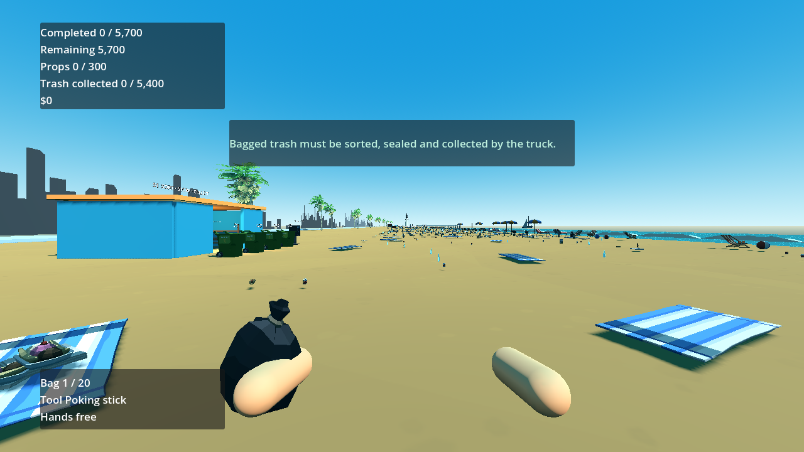
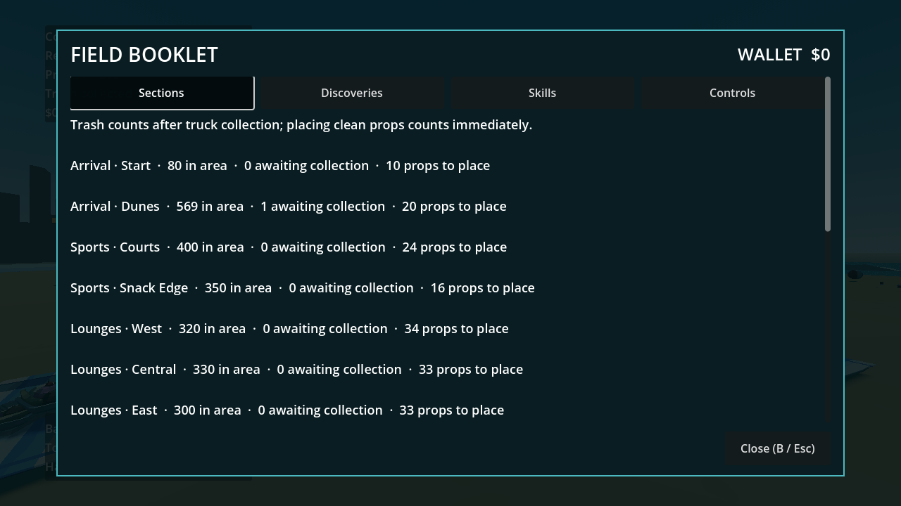
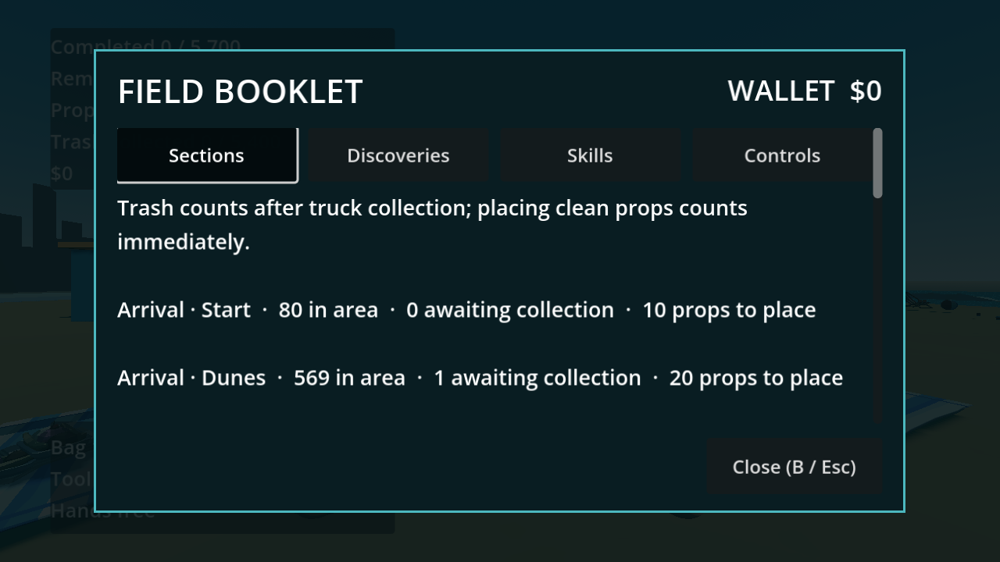
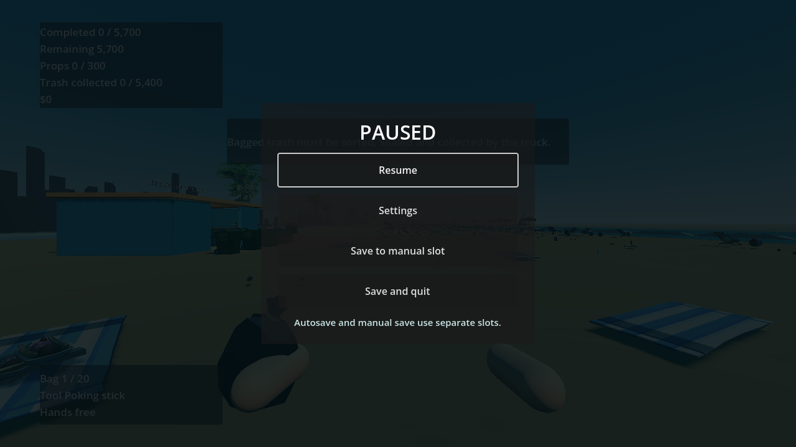

# P22 — HUD, booklet, menus and guidance

Status: implemented and exercised in the playable full beach on 23 September 2026. No user decision is needed for P23.

The top-left HUD now reads `Completed 0 / 5,700`, `Remaining 5,700`, `Props 0 / 300`, `Trash collected 0 / 5,400`, then money. Trash only advances after the real truck action. Bag used/capacity, active tool and selected held object have a separate bottom-left panel. Existing oxygen, detector, target-near-object, receipt and results overlays remain. Short top guidance is acknowledged once per run and included in `RunState.to_snapshot()`/`from_snapshot()`. Tips cover first pickup, full bag, sorting correction, sealing, sealed-bag carrying, collection, cloth, oxygen and rescue.

The existing field booklet now has controller-focusable Sections, Discoveries, Skills and Controls tabs. Section tasks distinguish items still in the area from picked items awaiting truck collection and unplaced props, in authored route order. Discoveries show collected object definitions and material tags; the scanner filter area explicitly says it is not available yet. Skills retain their existing purchase controls, and physical equipment points to the beach shop. Controls use the current keyboard/controller bindings. The menu has seed entry and New run. Continue/Load, pause Save, and Save and quit are disabled with clear language until P24 supplies real persistence; no fake save occurs. Pause opens with Resume focus, D-pad can reach Settings, and closing Settings restores focus to its originating button. Results/Continue-roaming remains backed by the immutable P20 finish receipt.

Playable setup/actions/observed: started the full `ui-fixture` beach through the real main menu and collected one eligible WORLD waste item through `ItemStore`. Bag changed from `0 / 20` to `1 / 20`; completed stayed `0 / 5,700`, and the pickup guidance appeared. Opening the booklet showed one item awaiting collection in its home section, one actual discovered object, the skill offers and live controls. Controller D-pad/A events switched tabs and opened pause Settings; Escape closed Settings back to the paused Settings button, and Resume returned gameplay. Guidance survived a run snapshot, and domain invariants held. `P22_UI hud=1 booklet=4 pause=1 guidance=1 failures=0` passed headless and in a visible 720p scene. The P20 final-action lab separately verified first results presentation, Continue-roaming and unchanged finish receipt.

Layout: the project canvas base is now 1280×720 so 17–20 px UI text stays legible at 720p and scales naturally to 1080p. Captures were reviewed at 1280×720, 1920×1080 and the host's largest allowed 3444×1410 window, plus 150% UI scale at 720p; booklet content scrolls and focus remains visible. A requested 3840×2160 window was capped by the host to 3444×1410, so a literal 4K visual claim is not made. The bright beach/water and unfinished wildlife art visible behind these overlays remain P25 work; Synty props in the playable beach are unchanged.

Validation commands:

```powershell
$beachGodot = 'C:\Users\Home\Downloads\Godot_v4.6.1-stable_mono_win64\Godot_v4.6.1-stable_mono_win64_console.exe'
& $beachGodot --headless --path 'C:\Users\Home\Documents\beach' --script res://tests/validate_ui.gd
& $beachGodot --path 'C:\Users\Home\Documents\beach' --resolution 1280x720 --script res://tests/validate_ui.gd -- --capture
& $beachGodot --headless --path 'C:\Users\Home\Documents\beach' --script res://tests/validate_payment.gd
& $beachGodot --headless --path 'C:\Users\Home\Documents\beach' --script res://tests/validate_completion.gd
& $beachGodot --headless --path 'C:\Users\Home\Documents\beach' --script res://tests/validate_world_traversal.gd
& $beachGodot --headless --path 'C:\Users\Home\Documents\beach' --script res://tests/run_checks.gd
```

Payment fixture exposed a seed-specific large-item route blocker. The manifest generator now falls back to a deterministic free grid cell in the same section when local sideways displacement cannot clear the route. The actual payment path passed (`50` collected; `$50` base + `$30` bonus), 13-waypoint route passed, completion/result passed, and the broad boot/asset/ownership/input/manifest checks passed after that change.









Next: P23 adds the discovery-based scanner and its filter controls; P24 connects Continue/Load/Save/Save and quit to real files. P25 owns world-art contrast/fidelity.
