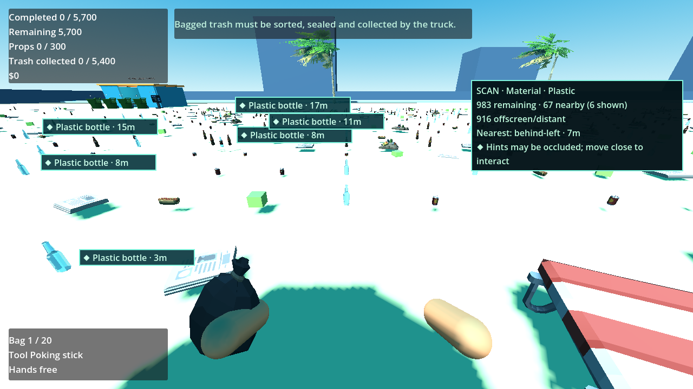

# P23 — Discovery-based scanner

Status: implemented and exercised in the full playable beach on 23 September 2026. No user decision is needed to proceed to P24.

Scanner is now the $150 booklet skill from the existing Resource offer, with no handheld slot or battery. Collection or prop pickup unlocks its exact definition and material tags. A dropped rescue attachment from a full bag does **not** unlock its type until later collected; the actual rescue flow verifies this. The booklet's Discoveries tab shows the type/material distinctions (for example Plastic bottle versus Glass bottle) and focusable filter buttons. Unknown type filters are rejected. The selected filter is in the local player record as `scanner_filter`; both it and the already-existing player/global discoveries round-trip through `RunState` snapshots. Filter changes use one normal run revision/save request and invalid saved filter ownership is rejected by state validation.

F/right-stick pulse uses the live player's input action, not a handheld tool. `ScannerService.query_matches` reads authoritative item state and a selected discovered filter. It excludes collected/sold items, clean slotted props, still-hidden buried items and contents of the player's ordinary bag/hands. A revealed buried find becomes eligible under its original ID. WORLD targets use their current physics view; a moved prop is located where it was dropped, not at its home zone. TABLE/BIN/SEALED/VALUABLE_TRAY matches group at their station, bag or container with the remaining action. A sealed bag held by the player contributes a carry/deposit hint but no marker at the player's feet. Nearby on-screen targets are ordered by distance then stable key; returned IDs are sorted. The global summary reports remaining, nearby, offscreen/distant count and nearest relative direction. Markers are explicitly scan hints (diamond icon, possible occlusion), never interaction targets or pickup-through-wall shortcuts.

The overlay reuses at most eight marker nodes, selects separated screen cells outside HUD/guidance/summary/crosshair rectangles, refreshes every 0.5 seconds or on an item-state change, and expires after six seconds. Repeated pulses extend the same overlay without accumulating nodes. Its summary has an opaque backing so the currently overbright beach does not wash out text. P25 still owns the world lighting, water and interim wildlife art; scanner UI does not claim to solve those visual gaps.

Playable setup/actions/observed: loaded `scanner-fixture` into the full beach. Before purchase, pulse and an unknown-type filter failed without state mutation. Picked up a real Synty plastic bottle, unlocking its exact type and Plastic material; paid $150 in the booklet, kept the same single handheld slot, selected Plastic in Discoveries, then pulsed while facing other actual Synty bottles. The first bottle in the ordinary bag was absent, 983 remaining Plastic matches were found in the captured state, and at most eight pooled hints were shown. Repeating pulses did not allocate more markers. A hidden buried metal can was absent until its state was transitioned to the revealed WORLD terminal state (P17 separately verifies the real detector reveal action), then appeared under the same ID. The bottle moved through the real S1 table, bin, sealed rack, carried bag, matching Synty container and truck: the scanner's owner hint changed from sort to seal to carry/deposit to call truck, and the item disappeared only after truck collection. A real Synty chair was held, placed clean in a compatible slot, removed and dropped in another zone; it was absent while clean-slotted/held and then reappeared at its current drop pose. Snapshot reconstruction retained the chosen filter and domain ownership invariants passed. A one-item check reused the existing placement lab and verified zero matches after its terminal collection. Headless `P23_SCANNER purchase=1 filters=3 buried=1 owners=3 chair=1 zero=1 markers=7 failures=0`; visible 720p capture passed with the full-beach path.

The P19 playable rescue probe was extended with three focused assertions: bagged cut unlocks its type, full-bag dropped cut does not, and collecting that dropped attachment later unlocks it. The 12-site/24-attachment rescue flow still ends with valid ownership and `failures=0`.

Validation commands:

```powershell
$beachGodot = 'C:\Users\Home\Downloads\Godot_v4.6.1-stable_mono_win64\Godot_v4.6.1-stable_mono_win64_console.exe'
& $beachGodot --headless --path 'C:\Users\Home\Documents\beach' --script res://tests/validate_scanner.gd
& $beachGodot --path 'C:\Users\Home\Documents\beach' --resolution 1280x720 --script res://tests/validate_scanner.gd -- --capture
& $beachGodot --headless --path 'C:\Users\Home\Documents\beach' --script res://tests/validate_rescue.gd
& $beachGodot --headless --path 'C:\Users\Home\Documents\beach' --script res://tests/validate_purchases.gd
& $beachGodot --headless --path 'C:\Users\Home\Documents\beach' --script res://tests/validate_payment.gd
& $beachGodot --headless --path 'C:\Users\Home\Documents\beach' --script res://tests/validate_completion.gd
& $beachGodot --headless --path 'C:\Users\Home\Documents\beach' --script res://tests/validate_ui.gd
& $beachGodot --headless --path 'C:\Users\Home\Documents\beach' --script res://tests/run_checks.gd
```

The purchase, payment, completion/results, HUD/booklet and broad boot/asset/ownership/input/manifest checks passed after scanner integration. The selected-filter and discovery fields are ready for P24's disk-save backend. P27 still owns a human controller-only launch-to-results pass with remapped bindings.



Next: P24 real save/load/continue and crash-safe persistence.
