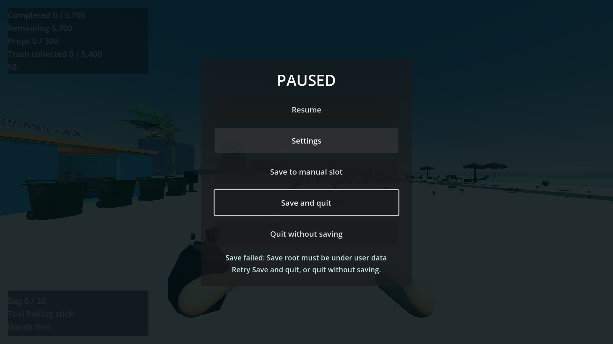
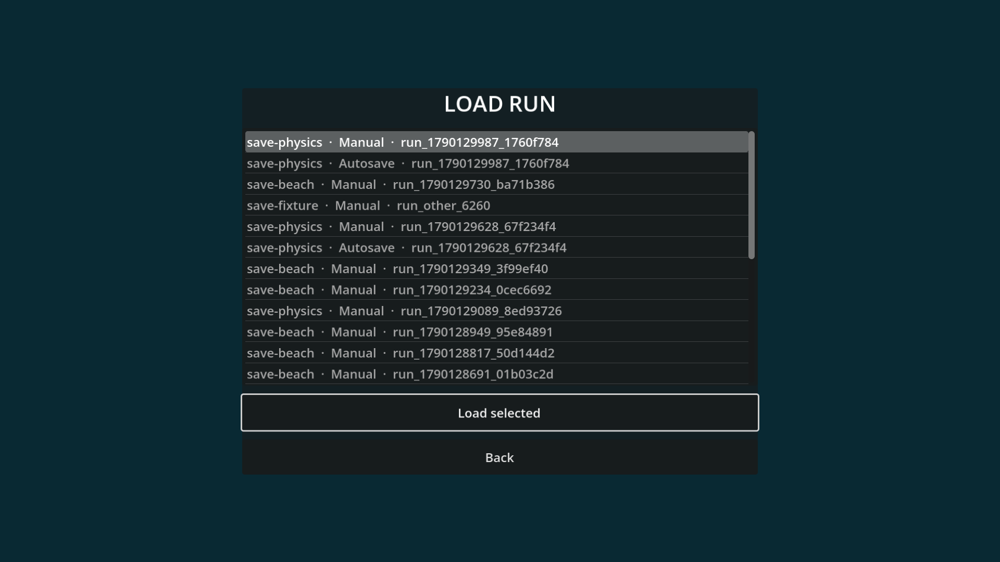

# P24 — Persistent runs, autosave and recovery

Status: implemented and exercised in the full playable beach on 23 September 2026. No user decision is needed for the next packet.

Schema 1 is a complete `RunState` snapshot. It includes the authored initial manifest/hash, every item owner and physics record, player world transform/velocity and air, table cells/bins, sealed-bag contents and WORLD physics, placement claims, partial dirt, rescues and recovery piles, discoveries/scanner filter, equipment, upgrades, wallet, receipts, restoration flags, elapsed active time and completion receipt. Transient drag/tweens/modal camera are not serialized. Loading returns to world view, closes sorting UI and reconstructs item/bag bodies and recovery markers before input resumes. A paused save captures the player's body pose, not the overhead table camera.

File layout is `user://saves/<beach_id>/<run_id>/<slot_id>/A.json` and `B.json`; only validated `[A-Za-z0-9_-]` IDs up to 64 characters enter paths. Autosave and manual are independent slots. New same-seed runs receive distinct `run_<timestamp>_<random>` IDs and fresh wallet/upgrades. Each generation stores sequence, schema, content hash, timestamp and a JSON snapshot string; its checksum covers all five. A write uses a temporary file, flushes and reads it back, validates the full candidate, then replaces only the inactive generation. The currently valid generation remains available across a failed write. Load validates file size/checksum, schema/content/manifest identity, bounded shape/finite numbers, authored item IDs and definitions, and `RunState` ownership/progress invariants before replacing the live `RunRoot`. A damaged latest generation falls back with a notice; if both are invalid, Load shows an error and leaves the files and current run untouched. Schema/content mismatch is rejected with an explanation. No migration is shipped for schema 1, and editable local saves are not treated as anti-cheat.

Autosave coalesces the 60-active-second interval and important wallet, collection, restoration, faint and completion transactions. It is deferred until the action's final state is published, then captures current WORLD item/bag bodies and the player. Autosave failures are surfaced and retried on the next interval or important transaction, not every frame. Pause offers Save, synchronous Save and quit, and on failure an explicit retry or Quit without saving. The title offers Continue and a scrollable Load list. Save and quit always creates its own generation, even when the run revision has not changed.

Playable setup/actions/observed: started `save-beach` in the full scene, picked up a real Synty bottle, sorted it at the real S1 table and sealed a bag. Paused, saved twice after moving only the player; the later world pose restored and the second generation incremented without a gameplay revision. Opened the sorting table with another Synty can in a cell, saved, then loaded: the transient overhead UI closed while the can remained in its committed cell. Forced a Save and quit error, saw Retry/quit-without-saving choices, restored the test root, retried, returned to title and confirmed the later pose/time persisted at unchanged revision. Separately threw a sealed bag and Synty chair, captured their live mid-flight poses, reloaded the physical bodies, then saved and reloaded their settled sleep states. Recovered the bag, deposited it in the matching container and called the truck: an autosave contained the collection receipt, money and terminal item. Carried a can underwater, fainted, saved and reloaded: its recovery marker rebuilt and retired when the original can was recovered. Both generations corrupt left the live beach intact with a visible error. A second same-seed run used a different ID and clean state.

The save checks use only `user://test_runs/p24`; older playable validation scripts now point their autosaves to `user://test_runs/legacy`, never player slots. One expected Godot directory error is generated deliberately by the failed-write fixture. Results: `P24_SAVE initial=1 recovery=1 rack=1 pose=1 table=1 quit=1 failures=0` and `P24_SAVE_PHYSICS flight=1 settled=1 collection=1 faint=1 failures=0`. The existing scanner, faint, purchase, payment, completion, HUD and broad boot/asset/ownership checks also passed after integration. A visible run captured the failure and Load UI below.

Next: P25 world art, lighting and water polish. The persistence backend does not change the Synty mesh selections; bottle, chair, table and bin visuals remain the pack assets used in the playable scene.
