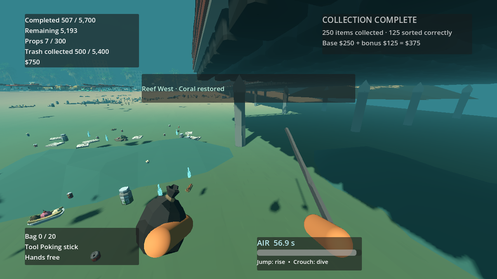
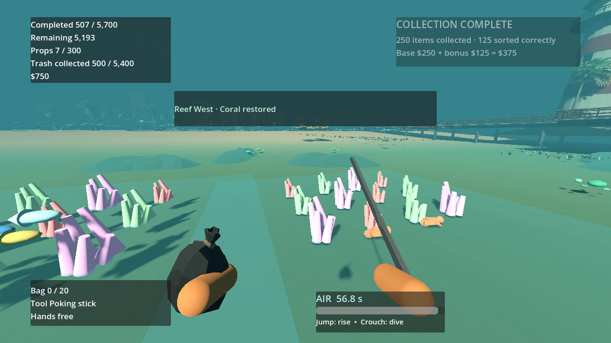

# P26 — Content population and economy validation

Status: functional content and economy pass completed on 23 September 2026. Exact-model art gaps remain in `docs/asset_requests.md`; this is not a claim of final visual readiness. No user decision is needed to start P27.

The machine-readable quota source remains `data/world/section_quotas.tres` (full readable matrix also in `docs/handoffs/P06.md`). Its 18 section rows reconcile to 2,700 PMD, 900 organic, 1,200 general and 600 glass waste, plus 300 props across 15 families: 5,700 required IDs. The 300 buried waste, 24 rescue attachments, 120 residue patches and 60 dirty props are subsets, never added objectives. Forty buried valuables remain optional. The 20 six-slot shared-shelf sections hold the 96 small-family props with 24 spare slots; dedicated destinations have at least the stated family demand. The ten-seed build validates quotas, family/destination capacity, unique IDs, clear route metadata, special subsets and 5,740 total records without a separate quota source.

The logical catalog now has 34 definitions: 18 waste, 15 reusable prop and one valuable. Six additional waste definitions use actual staged Synty crushed-can, drink-cup, ice-cream, panini, towel and jar meshes. The hotdog, banana food, bottle, chair, table and other P25 selections remain. Thirty-one definitions use Synty meshes/compositions; rescue ring/net and residue stain are project-owned non-cube shapes. The coffee-cup mesh is an authored PMD composite, not a category inferred from appearance. Exact fries, burger, straw/wrap and oil-container meshes were not found in the supplied converted pack and remain listed, rather than being mislabeled Synty props. The 60 selected wrappers stage a 170-file dependency closure (`f3b2b448a592a9f4cc4e962275274ad79035144ad21e02717a00e9482d11a88f`).

The 19 resource-priced purchases still total $5,300. The four required access purchases cost $490: cloth $30 → knife $60 → detector $180 → oxygen tank $220. Sand cleaner and vacuum now require the tank; their upgrades inherit that gate. All other optional purchases available before the tank total $2,160, so the conservative 3,321 exposed dry waste IDs leave $671 after buying every such option and the full access chain, even at $1 per waste and without valuables, group bonuses or correct-sorting bonuses. Water and reef waste is conservatively treated as tank-gated despite short 10-second dives being possible; free rack re-equipping has no purchase cost. The purchase-set check explored 3,960 reachable offer sets for each of three seeded manifests and found every reachable state had an affordable route to all access tools. A deliberately ungated fixture with only $1,000 accessible income reaches the documented $990 optional sequence and is correctly reported as a dead end. This is a resource-graph proof, not a measured human travel-time claim.

Playable setup/actions/observed: began a $0 run, collected a full 20-unit starter bag of original-ID waste, sorted it at S1, deposited the sealed bag and called the truck for $40, then bought cloth at the physical shop; the $10 remainder correctly rejected the $60 knife. A later test-funded shop flow bought the required chain, sand cleaner and vacuum, then equipped the knife at the real rack. The detector test bought the access chain and revealed actual buried waste and a valuable; rescue and fainting tests exercised purchased gear at underwater sites. The full-beach starter section restored after 80 waste and 10 Synty props passed the real sorting/placement/truck components. For a late-state reef check, the real shop sold all four access tools using an explicit $490 test grant. Pickup and travel of the 500 reef IDs were accelerated in the validation; the detector and knife pickup flows are separately exercised. All 500 original IDs then passed through the live S3 table, bin, ten sealed bags, container and two truck collections. Both `reef_west` sections restored, its zone fish reward appeared, and ownership/save invariants remained valid. This does **not** substitute for a human-paced 5,700-object run, which remains a P29 gate.

Observed checks after the final catalog/version change: `P26_CONTENT_ECONOMY seeds=3 dry_min=3321 optional_before_tank=2160 access=490 total=5400 prices=5300 reachable_sets=3960 optional_fixture=dead_end failures=0`; `P26_REEF waste=500 bags=10 sections=2 zone=reef_west fish=1 failures=0`; `PASS: boot, asset_closure, ownership, input_bindings, manifest`; buried-find, purchases, scanner, save-physics, world-traversal and P25/P20 visual/restoration checks also passed. OpenGL Compatibility 3.3 was used for captures. The seabed wildlife/coral shown here is functional project-owned placeholder art until exact assets are supplied.

The deliberate catalog finalization advances authored content to `beach-content-2` / beach version `2`; the generator algorithm stays `manifest-1`. Golden fixture `manifest-fixture-v1`: content hash `bdeae6dcc6b109621f4c026a9fc08e33d16ce237dce15618dff11991f6e37865`, manifest hash `d30494e873db64b7b6c9620e8520a7ab47b12dd6e003bbcf09b1033c459ea978`, 5,740 rows. The Unicode stream hash is `16e1c5830c2f443462b14e668fe65e8bdcd9bd73ee0b08f5c5229e163415d14c`, seed `103051006576882755`. P24 rejects older content-hash saves cleanly; no migration is shipped. Next: P27 interaction/accessibility polish and P28 measurement of the fully dressed world.

Subsequent P27 shore-collision correction moved two underwater spawn areas seaward and superseded these version-2 hashes with `beach-content-3`; see `docs/handoffs/P27.md`. The P26 economy and 5,700-item quota result still holds under version 3.
