# U-ui handoff — menus, HUD, prompts and text

Evidence record for the [UI/UX pass](../plan/14-ui-ux-pass.md), packets U00–U10. Following [AGENTS.md](../../AGENTS.md), each entry records what was shown working in the real game (`scenes/main.tscn` with real runs), not what exists in code.

**Status: U00–U10 done on this machine.** Physical-controller, GTX 980-class and exported-build checks remain open, as for J13/J14 and FIN-10.

- **Build:** `main` at `a8b7eea` plus this working tree. Godot 4.6.1 Mono, Compatibility renderer, `beach-content-8`, save schema 1. Presentation only: no ownership, payment, completion, save, content or generation code changed.
- **Device:** Windows 11, Ryzen 5 5600, RTX 3070, 1920×1080 window unless stated, FOV 85, UI scale 100 %, keyboard and mouse, High preset for every capture and measurement.
- **Probes:** temporary SceneTree scripts under the ignored `builds/ui_pass/probes/` drove the real main scene (capture, controller walk, performance, icon and burst sheets). They are not committed.

| Packet | Status | Evidence |
|---|---|---|
| U00 Asset staging and fonts | Done | [U00](#u00--asset-staging-and-fonts) |
| U01 Theme, sticker box, button motion | Done | [U01](#u01--theme-sticker-box-and-button-motion) |
| U02 Input glyphs and prompt chips | Done | [U02](#u02--input-glyphs-and-prompt-chips) |
| U03 Target prompt | Done | [U03](#u03--target-prompt) |
| U04 HUD | Done | [U04](#u04--hud) |
| U05 Title screen | Done | [U05](#u05--title-screen) |
| U06 Pause, settings, frosted shade | Done | [U06](#u06--pause-settings-and-the-frosted-shade) |
| U07 Booklet, shop, rack | Done | [U07](#u07--booklet-shop-and-rack) |
| U08 Sorting table and results | Done | [U08](#u08--sorting-table-and-results) |
| U09 Effects | Done | [U09](#u09--effects) |
| U10 Acceptance | Done on this machine | [U10](#u10--acceptance) |

## Before and after

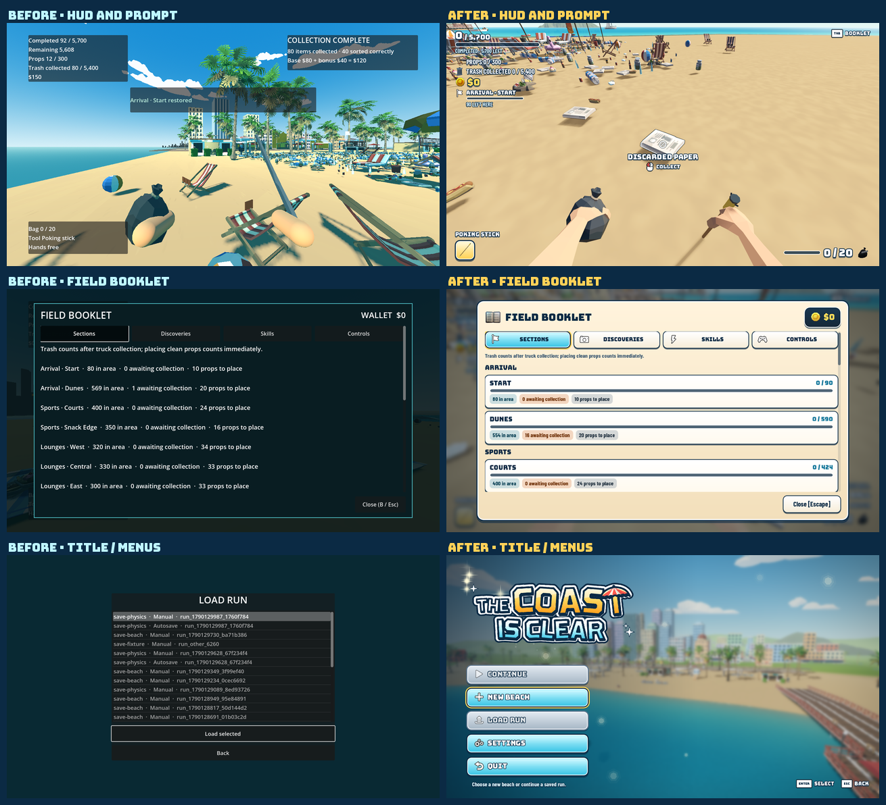

Left: the P22/P27 captures of the old HUD, booklet and load menu. Right: the same screens now.

## U00 — Asset staging and fonts

- **Setup:** the supplied `INTERFACE_Modern_Menus_SourceFiles_v1.zip`, `POLYGON_Icons_SourceFiles_v3.zip` and `POLYGON_Particle_FX_SourceFiles_v2.zip` in `Assets/Synty/`.
- **Actions:** ran `tools/stage_ui_assets.gd`, then `--editor --import`, then the tool again.
- **Observed:**
  - The first run wrote 429 files: 124 3D-rendered icons, 117 flat outlined icons, 88 input icons, 10 cursors, 10 glow sprites, 11 general sprites, 27 particle textures and 3 FX meshes, and 38 POLYGON Icons models with their palette.
  - The second run wrote 0 files and left 429 unchanged.
  - The import succeeded. Its only warnings are the FBX files naming their palette as a missing `.psd`; `IconStudio` supplies the palette itself.
  - Bungee and Barlow Condensed are the pack's OFL fonts, taken from its Unity package and committed with their licences.
  - The wordmark SVGs import as `DPITexture`, so the logo is re-rasterised at each UI scale.
- **Departures:** the Unity packages' prefabs, animations and scripts cannot be used in Godot and were not staged. `stage_assets.gd --imports-only` now skips `art/synty/ui/`, so it cannot re-import the 2D sprites as VRAM-compressed 3D textures.

## U01 — Theme, sticker box and button motion

- **Actions:** built `data/ui/beach_theme.tres` with `tools/build_ui_theme.gd` and set it as `gui/theme/custom`; added the `UiKit` autoload (`Ui`).
- **Observed:**
  - Every existing screen picked up the theme before any scene was edited.
  - `StickerBox` draws the navy rim, white line, gradient fill and drop as antialiased polygons. At 1280×720, 1920×1080, 3840×2160 offscreen and 150 % UI scale, the rims stay one crisp line.
  - Hover or controller focus leans a button in: it grows about 9 px, and narrow buttons tilt −1.5°. A press squashes to 0.93. A click springs to 1.08 and throws seven Synty sparkles from the click point.
  - Focus that a mouse click leaves behind does not stay lit; keyboard or controller focus shows the hover look.
  - The Modern Menus pointer and hand are the cursors, sized to the window.
- **Fixes found while validating:**
  - `CheckButton` inherited `Button`'s text outline and 30 px icon cap. That blurred the row text and shrank the switch to 28 px; both are now reset for toggles.
  - Barlow Condensed has no ◆ or arrow glyphs, which binding and upgrade texts use. The theme's body fonts are now `FontVariation`s with Bungee as fallback.
  - `UiKit` kept the `SettingsStore` of a freed main scene when a check created a second one (`validate_completion` reported it). `reduced()` now checks that the store is still valid.
- **Reduced motion:** no lean, squash, spring, stagger or particles; the colour changes remain.

## U02 — Input glyphs and prompt chips

- **Observed:**
  - Mouse buttons show the Synty mouse with the pressed button in red.
  - Keys show a keycap with the key's label, with wide caps for SPACE, SHIFT, CTRL, ESC and TAB.
  - The controller shows the coloured A/B/X/Y, LB/RB/LT/RT, the D-pad and the sticks.
  - Every glyph gets a navy rim (four offset copies and a drop), so the white icons read on sand and sea.
  - Switching `prompt_device` or remapping updates every visible glyph at once; `validate_interaction` drives both.
- **Fixes found while validating:**
  - The layout-aware key label call is not supported headless and printed an error for every glyph. Headless runs now use the US label.
  - Settings, the booklet and prompts showed bindings as "E - Physical", the engine's text for physical keys. They now read "E", "Space", "Shift".

## U03 — Target prompt

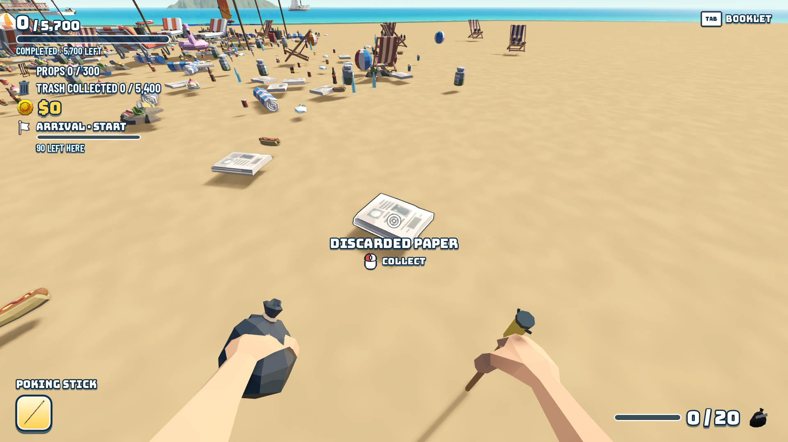

- **Setup:** seed `ui-fixture`; the player walked to the nearest clean litter and aimed at it.
- **Observed:**
  - Aiming at the paper shows `DISCARDED PAPER` in Bungee under the reticle, with a mouse-icon `COLLECT` chip.
  - A beach ball shows `PICK UP`.
  - A stain, without the cloth, shows `CARRY` (E) with "Needs cloth" in amber.
  - Stations show their own verb.
  - The block pops in (scale 0.9 → 1, 6 px rise) on a new target. When only the prompt changes, it swaps in place. A rejected press shakes it and flashes it amber.
  - It sits under the aim point at every resolution, clear of the notice lane.
- **Checks:** `validate_interaction` and `validate_c01_input` read `prompt_text()`, which keeps the old label's wording ("Collect [RT]").
- **Departure:** informational reasons, such as a sealed bag's "12 sealed items · 1 hand", now show as a caption under the chips. Before, they replaced the action.

## U04 — HUD

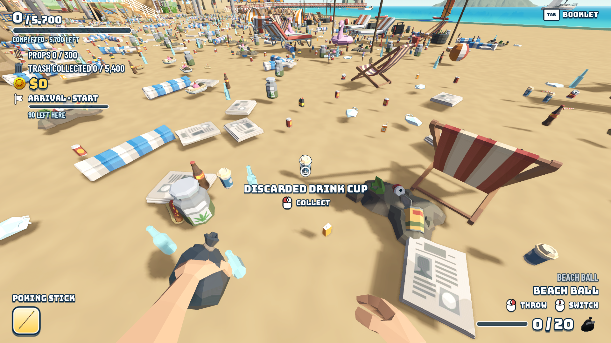

- **Observed:**
  - **Top-left, in R24 order:**
    - `0 / 5,700`, the completion bar and `COMPLETED · 5,700 LEFT`.
    - `PROPS`, with the rendered beach-chair icon.
    - `TRASH COLLECTED`, with the POLYGON Icons bin.
    - Money, with the 3D coin.
    - The area chip: `ARRIVAL · START`, a bar and `90 LEFT HERE`. It follows the nearest section with 3 m hysteresis, pops on entering a new area and bumps as the area's count grows.
  - **Top-right:** `[TAB] BOOKLET`, plus `[F] SCAN` once the scanner is learned. The collection receipt card sits below them.
  - **Top-centre:** notices are navy pills with the flat Info, Check or Star icon. Restorations add a gold rim and a star burst.
  - **Bottom-left:** the tool hotbar. The active tool is a gold card showing the rendered stick, with the tool name above it. A second tool adds a navy card and a `[Q] SWITCH` chip, and switching pops the newly active card.
  - **Bottom-right:**
    - Held objects, the selected one in Bungee and the others dimmer, with `[RMB] THROW` and `[MMB] SWITCH`.
    - The bag bar, `0 / 20` and the rendered bin bag. The count and bar turn amber near full and coral when full.
  - Model-rendered icons get a navy rim (`ui_icon_outline.gdshader`). Without it, the beach-chair icon disappeared against the real deck chairs behind it.
  - Oxygen sits bottom-centre; the detector readout sits above the tool hotbar; the scanner summary moved to the empty right-middle. The node paths that `swim.gd`, `metal_detector.gd` and `scanner.gd` use are unchanged.
  - The world HUD hides while the sorting table is open.
- **Checks:** `validate_ui` reads the new labels, with the same totals and wording. `validate_completion` confirms that the 720p notice lane stays clear of the receipt and the progress block.

## U05 — Title screen

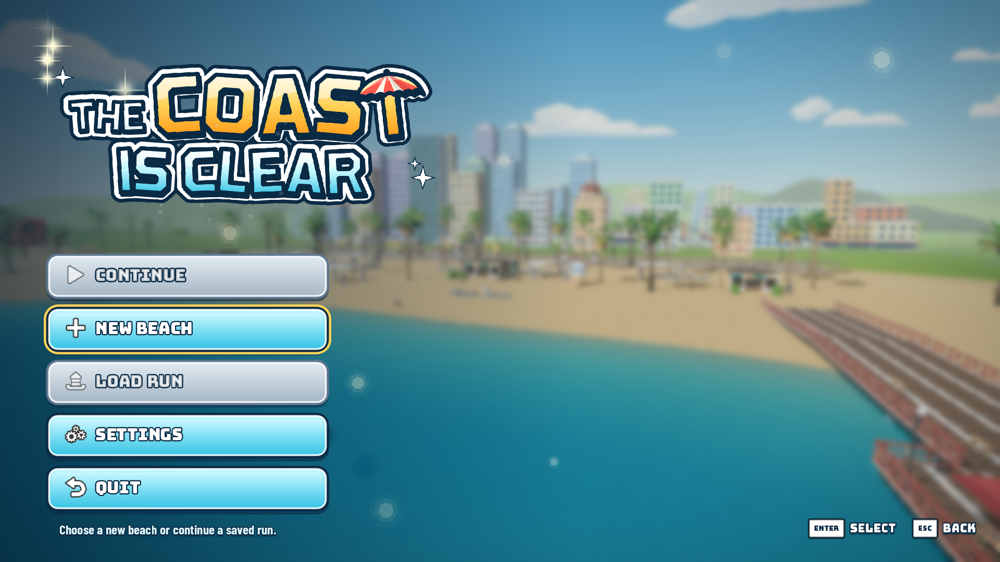

- **Observed:**
  - **Backdrop:** the real beach renders into its own half-resolution world, with no run and so no litter. The camera drifts through four slow shots: over the sea looking back at the city, towards the lighthouse, along the palms, and past the pier. The frosted shade blurs it, and each cut dips the blur up and back down.
  - **Wordmark:** it drops in with an elastic scale and a star burst, then bobs and twinkles. The buttons stagger in and bokeh drifts upwards.
  - **Focus:** it starts on Continue when a usable save exists, otherwise on New beach. A save adds a summary line with its seed, progress and date.
  - **New beach:** a seed field (the `first-shore` default is kept), a random-seed button ("sunny-gull-42"), Back and Start cleaning.
  - **Load:** the themed save list.
  - **Loading curtain:** Start, Continue and Load cover the screen before the blocking build (wordmark, spinning Modern Menus ring, a tip), then fade away to the beach.

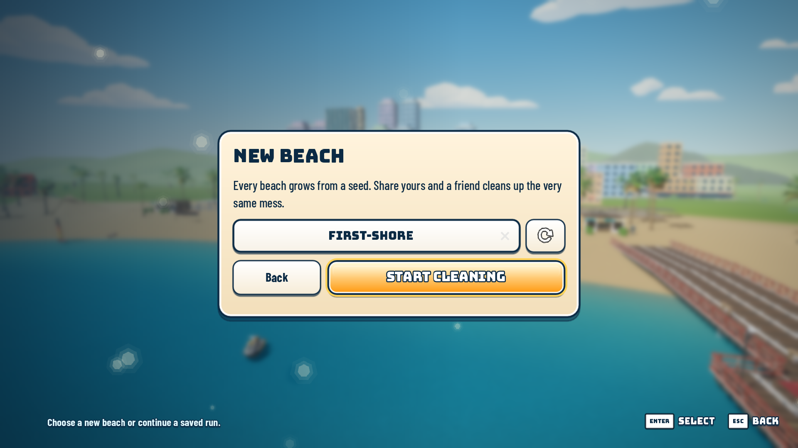 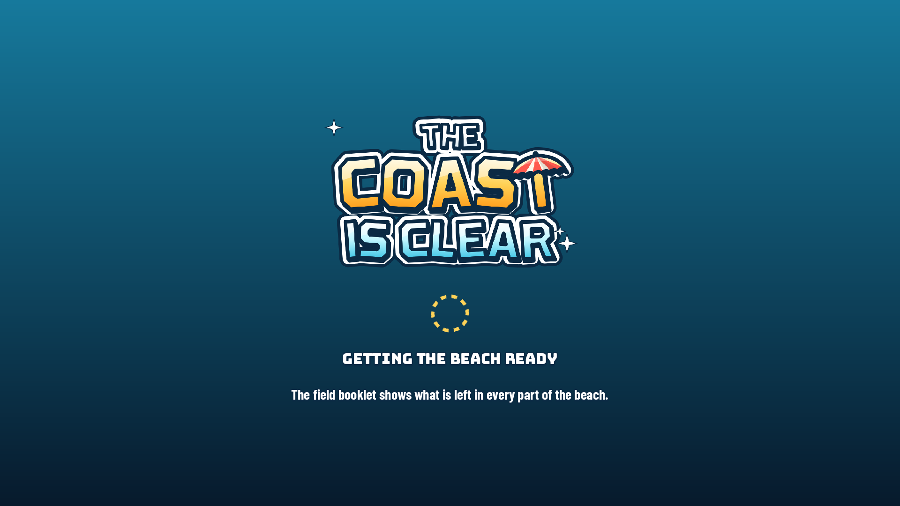

- **Departure:** the save list stays a themed `ItemList` rather than cards, because `validate_save` and `validate_sorting` read its rows.

## U06 — Pause, settings and the frosted shade

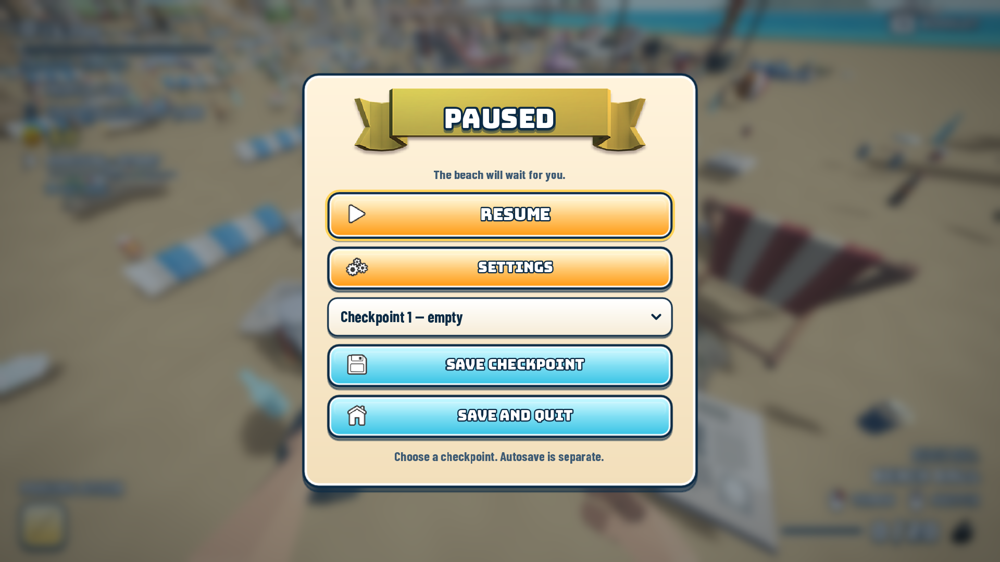 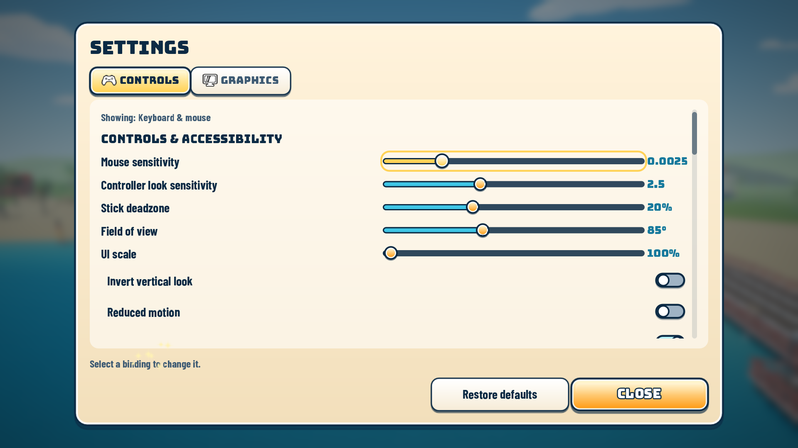

- **Observed:**
  - Pause, settings, the booklet, the shop and results blur and tint the live game. The blur samples the screen texture's mipmaps, which the Compatibility renderer provides.
  - Pause has the Modern Menus ribbon, a gold Resume and icon buttons, and scales in with a stagger.
  - Settings has icon tabs, value chips, sticker switches and a gold ring on the focused control. Bindings are grouped under Moving, On the beach, Sorting table and Menus, with plain action names and input icons.
- **Checks:** `validate_ui` (D-pad from Resume to Settings, Escape back to Settings), `run_checks` (settings focus and B) and `validate_sorting` (pause from the table).

## U07 — Booklet, shop and rack

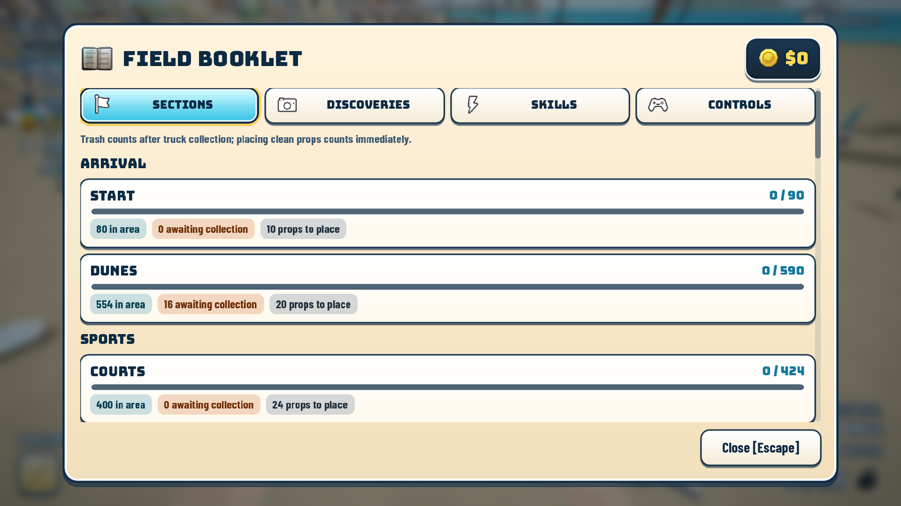 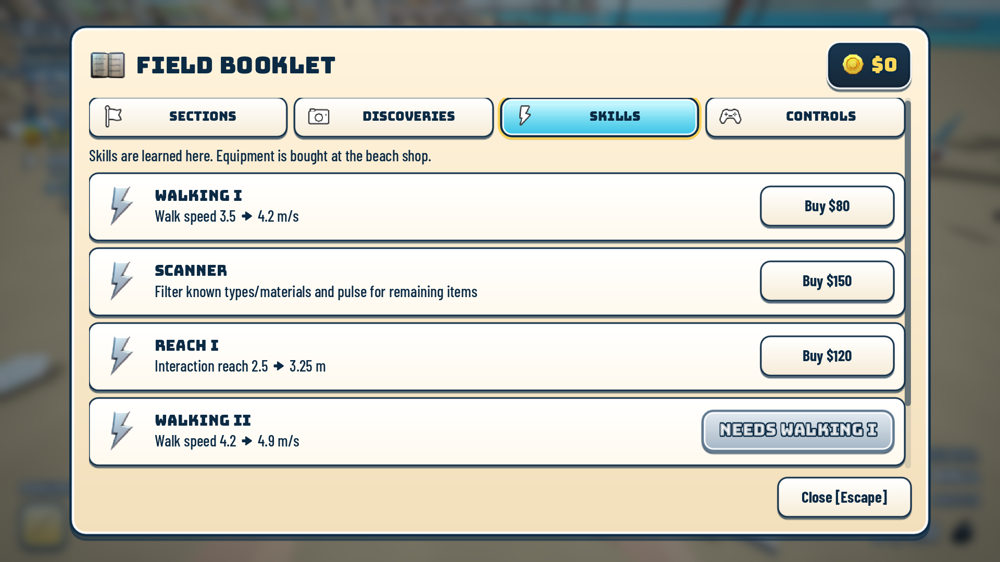 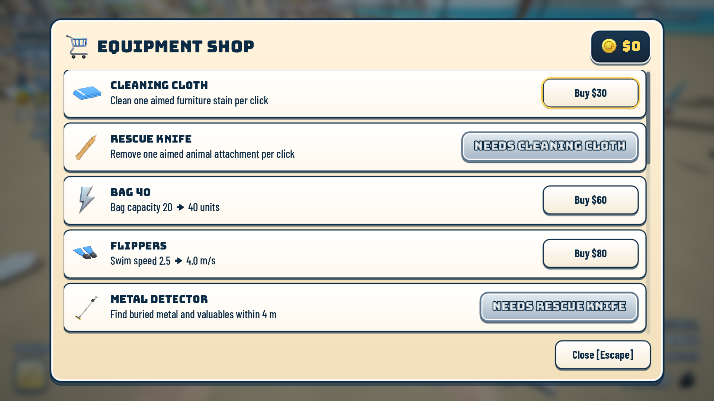

- **Observed:**
  - A sand card with the 3D book icon and a wallet chip.
  - **Sections:** zone headers, then one row per section with a bar, `done / total`, and chips for in area, awaiting collection and props to place. A restored section gets a check icon.
  - **Discoveries:** a grid of rendered item icons, then the known materials and the scanner filters.
  - **Skills and shop:** cards with the tool's rendered icon (skills use the Modern Menus lightning). Buy is gold when affordable, paper when not, and grey "Needs …" when locked.
  - Buying bursts coins and stars and pops the wallet. A refused purchase shakes the wallet and keeps focus on the row.
  - **Controls:** an input icon, the action name and the binding for each action.
- **Checks:** `validate_ui` (tabs by D-pad, the awaiting-collection text, Known objects, Interact), `validate_purchases` (refused and accepted cloth, rack equip) and `validate_scanner` (filter selection). They now read `page_text()` and `row_buttons()`.

## U08 — Sorting table and results

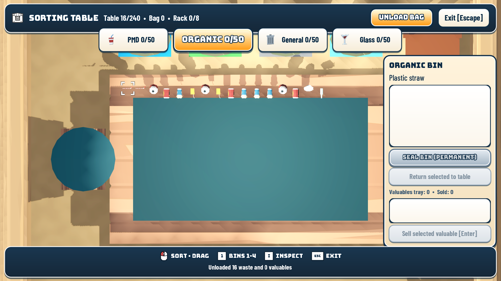 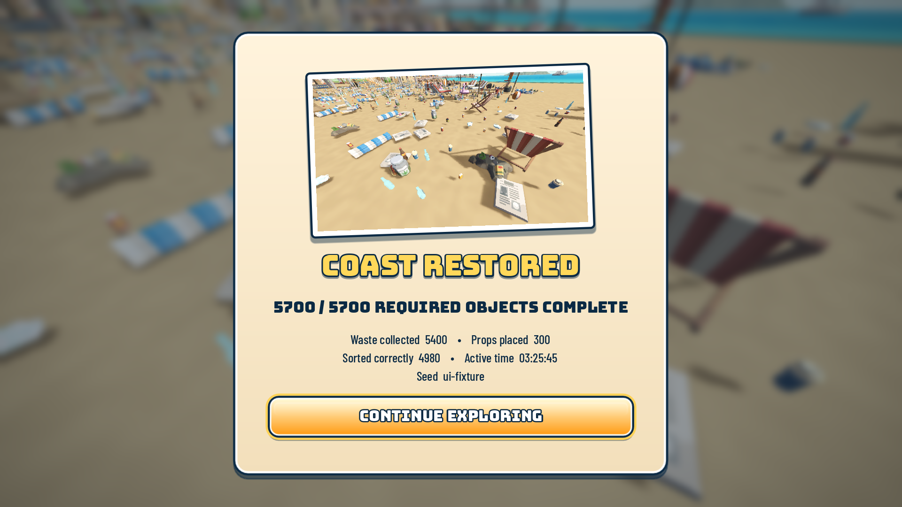

- **Observed:**
  - **Sorting:** a navy top bar and a sand side card. The bin buttons carry the POLYGON Icons soda cup, apple, bin and glass, turn gold when selected, have a fill bar along the inside of the bottom edge, and show Synty check and exclamation stamps. A bottom bar shows prompt chips for the active device.
  - **Results:** the J12 postcard in a navy-rimmed frame, a gold outlined "COAST RESTORED" and a gold Continue.
- **Fix found while validating:** the side card used `anchors_preset = 6` with only some anchors overridden. That left `anchor_top` at 0.5 and pushed the card under the bottom bar.
- **Checks:** `validate_sorting`, `validate_sealing` and `validate_buried`: the members are unchanged, the bin rects remain the drop targets, and focus behaves as before.

## U09 — Effects

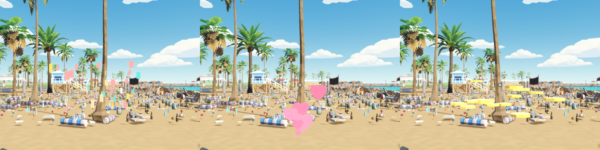

- **Observed:**
  - **UI:** click sparkles; a coin burst when the receipt total lands and on purchases; stars on set and restoration notices; a star burst on the wordmark.
  - **World (`FeelBurst`):** paper confetti over a finished set; pink hearts from the pack's heart mesh, billboarded, over a freed animal; gold coins from the pack's coin mesh at the truck hotline.
  - None plays under reduced motion, and at most six world bursts are live at once.
- **Departure:** there is no water ripple or drifting leaves; the bokeh and bursts covered those moments.

## U10 — Acceptance

### Checks

All run headless with `APPDATA` pointed at a scratch folder, after the last code change; every one exited 0 with `failures=0`:

`run_checks`, `validate_ui`, `validate_interaction`, `validate_c01_input`, `validate_purchases`, `validate_scanner`, `validate_payment`, `validate_completion`, `validate_sorting`, `validate_sealing`, `validate_buried`, `validate_save`, `validate_faint`, `validate_dirt`, `validate_carry`, `validate_rescue`, `validate_placement`, `validate_save_physics`, `validate_tool_filters`, `validate_world`, `validate_movement`, `validate_world_traversal` (147 m, 13 waypoints) and `validate_full_run` (5,400 waste, 300 props, results and receipt once, two reloads).

Checks changed with the UI, keeping each assertion's intent:
- `validate_ui` reads the new HUD labels, the title focus (Continue, or New beach without a save) and the booklet through `page_text()`.
- `validate_interaction` and `validate_c01_input` read `TargetLabel.prompt_text()`.
- `validate_purchases` presses buttons through `ProgressionView.row_buttons()`.

### Controller only

A probe sent only joypad events to the real main scene at 1280×720:
- **Title:** focus started on New beach. D-pad down reached Settings, skipping the disabled Load. A opened New beach with Start focused, and B came back to New beach.
- **Run:** A on Start built the run behind the curtain, which then lifted.
- **Pause:** Start paused with Resume focused. D-pad and A opened Settings, B came back to pause on Settings, and B resumed.

All ten steps passed. `validate_ui` and `validate_sorting` cover the booklet tabs, pause focus order and the sorting table by controller.

### Displays

| Display | Captures |
|---|---|
| 1920×1080, 100 % | all screens above |
| 1280×720, 150 % UI scale (853×480 canvas) | [title](images/U-ui/title_s150.png), [HUD](images/U-ui/hover_s150.png), [booklet](images/U-ui/booklet_s150.png), [pause](images/U-ui/pause_s150.png) |
| 3840×2160 offscreen (1280×720 UI base, as P27) | top-left quarters of the [title](images/U-ui/4k-title.png) and [HUD](images/U-ui/4k-hud.png) at full resolution; the whole [booklet](images/U-ui/4k-booklet.png) |

At 150 % the title's column gives the wordmark whatever height the menu leaves, and the buttons get slimmer. The pause card scales down to fit through its CenterContainer (containers reset their children's scale when they sort, as the results view already notes). Notices use the lane between the progress block and the hint column. At 4K, text, rims and SVG icons are sharp, and model icons render at 128 px.

### Performance

1920×1080, High, VSync off, 5 s per state:

| State | Mean | p95 |
|---|---|---|
| Title (half-resolution beach + frost) | 3.69 ms | 4.02 ms |
| Run, HUD shown | 6.83 ms | 7.53 ms |
| Run, UI layer hidden | 6.56 ms | 7.34 ms |
| Pause (frosted live game) | 6.64 ms | 7.06 ms |

The whole UI layer costs about 0.27 ms here. This is development-GPU evidence only; the GTX 980-class measurement stays with FIN-10.

### Other captures

[Model-rendered icons](images/U-ui/icons.png) from `IconStudio`: tools, the bin bag, litter, props and POLYGON Icons models. [Graphics settings](images/U-ui/settings_graphics.png). [Discoveries](images/U-ui/booklet1.png) and [controls](images/U-ui/booklet3.png) pages.

### Open issues

- A physical controller (J13), the GTX 980-class target and an exported build were not tested. The export preset exports all resources, so the staged `art/synty/ui|fx|icon_models` must exist when exporting.
- 124 3D-rendered Modern Menus icons are staged but only a few are used. Pruning the list in `stage_ui_assets.gd` would shrink the export.
- World `Label3D` signs now fall back to the theme's Barlow Condensed; only the reward floaters use Bungee.
- `FeelIcon` is no longer used by `main`, but other worktrees still use it, so it stays. `FeelTuning.bag_color_*` are no longer read, because the bag bar takes its colours from the palette.
- The save list is a themed `ItemList`, not one card per save.
